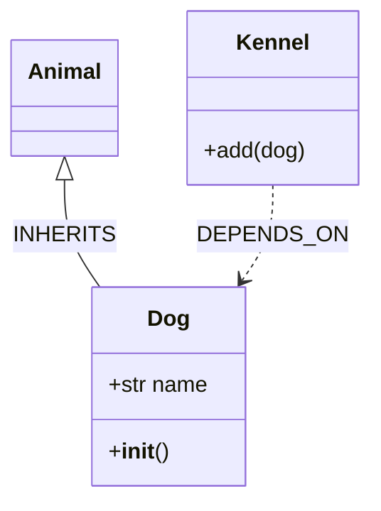

<!-- generated-by: claude-global-library/tools/project_sync -->
<!-- source: skills/diagram-from-code-core/SKILL.md -- edit the library, then re-run sync_project.py -->

# Diagram from Code Core

## Description

Reverse-engineers source code into UML diagrams by parsing Abstract Syntax Trees (ASTs) for
Java, Python, TypeScript, and Go. Extracts classes, interfaces, methods, fields, and
relationships, then maps them to UML elements for all 13 diagram types.

## 1. AST Parsing by Language

### 1.1 Java — JavaParser Library

Add dependency (`pom.xml`):
```xml
<dependency>
  <groupId>com.github.javaparser</groupId>
  <artifactId>javaparser-symbol-solver-core</artifactId>
  <version>3.25.10</version>
</dependency>
```

> **License Note:** javaparser-symbol-solver-core is licensed under **LGPL-2.1**. In consuming
> projects: (a) standard Maven/Gradle dependency resolution (dynamic linking) is fully LGPL-2.1
> compliant; (b) fat-jar / uber-jar packaging that shades or relocates JavaParser requires either
> providing users the ability to re-link with a modified JavaParser or publishing modifications
> under LGPL-2.1. Disclose LGPL-2.1 in your project's SBOM if distributing a proprietary product.
> No CVEs are known for version 3.25.10 as of 2026-05.

Core API methods:

| Operation | JavaParser API |
|-----------|---------------|
| Parse file | `StaticJavaParser.parse(Path)` → `CompilationUnit` |
| All classes | `cu.findAll(ClassOrInterfaceDeclaration.class)` |
| Class name | `decl.getNameAsString()` |
| Is interface | `decl.isInterface()` |
| Superclass | `decl.getExtendedTypes()` → `NodeList<ClassOrInterfaceType>` |
| Interfaces implemented | `decl.getImplementedTypes()` → `NodeList<ClassOrInterfaceType>` |
| Methods | `decl.getMethods()` → `List<MethodDeclaration>` |
| Fields | `decl.getFields()` → `List<FieldDeclaration>` |
| Method name | `method.getNameAsString()` |
| Method return type | `method.getType().asString()` |
| Field type | `field.getVariable(0).getTypeAsString()` |
| Field name | `field.getVariable(0).getNameAsString()` |
| Imports | `cu.getImports()` → each `.getNameAsString()` |
| Method body | `method.getBody()` → `Optional<BlockStmt>` |

### 1.2 Python — `ast` Standard Library Module

```python
import ast, pathlib

# Security note: In production, validate that the resolved path is within the
# allowed project root before reading. Never pass user-controlled paths directly.
# Use safe_resolve() (defined below in Section 5) for all user-supplied paths.
tree = ast.parse(pathlib.Path("module.py").read_text(encoding="utf-8"))
```

**Path-safe file reading utility (use whenever file paths may originate from user input):**
```python
from pathlib import Path

def safe_resolve(user_path: str, project_root: Path) -> Path:
    """Resolve a user-supplied path and verify it stays within project_root.

    Args:
        user_path: Relative or absolute path supplied by caller.
        project_root: Trusted base directory. Resolved paths must start here.

    Returns:
        Resolved absolute Path that is guaranteed to be inside project_root.

    Raises:
        ValueError: If the resolved path escapes the project_root boundary.
    """
    resolved = (project_root / user_path).resolve()
    root_resolved = project_root.resolve()
    if not str(resolved).startswith(str(root_resolved) + "/") and resolved != root_resolved:
        raise ValueError(f"Path traversal attempt blocked: {user_path!r}")
    return resolved
```

Key node types:

| AST Node | Fields of Interest |
|----------|--------------------|
| `ast.Module` | `body: list[stmt]` |
| `ast.ClassDef` | `name: str`, `bases: list[expr]`, `body: list[stmt]`, `decorator_list` |
| `ast.FunctionDef` | `name: str`, `args: arguments`, `body: list[stmt]`, `decorator_list` |
| `ast.AsyncFunctionDef` | same as FunctionDef |
| `ast.Import` | `names: list[alias]` (each alias has `.name`, `.asname`) |
| `ast.ImportFrom` | `module: str`, `names: list[alias]`, `level: int` |
| `ast.Assign` | `targets: list[expr]`, `value: expr` |
| `ast.AnnAssign` | `target: expr`, `annotation: expr`, `value: expr` |
| `ast.Name` | `id: str` — base class name when simple |
| `ast.Attribute` | `attr: str`, `value: expr` — base when qualified |

Traversal patterns:
```python
for node in ast.walk(tree):
    if isinstance(node, ast.ClassDef):
        process_class(node)
```

Extract base class names:
```python
def base_name(base: ast.expr) -> str:
    if isinstance(base, ast.Name):
        return base.id
    if isinstance(base, ast.Attribute):
        return base.attr
    return repr(base)
```

### 1.3 TypeScript — TypeScript Compiler API (ts-node or tsc)

Install: `npm install typescript`

```typescript
import * as ts from "typescript";

const sourceFile = ts.createSourceFile(
    "module.ts",
    ts.sys.readFile("module.ts") ?? "",
    ts.ScriptTarget.Latest,
    true
);
```

Key visitor predicates:

| Predicate | Node Properties |
|-----------|----------------|
| `ts.isClassDeclaration(n)` | `.name.text`, `.heritageClauses` |
| `ts.isInterfaceDeclaration(n)` | `.name.text`, `.members` |
| `ts.isMethodDeclaration(n)` | `.name` (Identifier) |
| `ts.isPropertyDeclaration(n)` | `.name`, `.type` |
| `ts.isImportDeclaration(n)` | `.moduleSpecifier` (StringLiteral) |
| `ts.isConstructorDeclaration(n)` | `.parameters` |

Heritage clause extraction (extends / implements):
```typescript
function getHeritage(cls: ts.ClassDeclaration): { extends: string[]; implements: string[] } {
    const result = { extends: [] as string[], implements: [] as string[] };
    for (const clause of cls.heritageClauses ?? []) {
        const key = clause.token === ts.SyntaxKind.ExtendsKeyword ? "extends" : "implements";
        for (const type of clause.types) {
            result[key].push((type.expression as ts.Identifier).text);
        }
    }
    return result;
}
```

Full traversal via `ts.forEachChild(node, cb)` or `ts.visitEachChild(node, visitor, ctx)`.

### 1.4 Go — `go/ast` Standard Library Package

```go
import (
    "go/ast"
    "go/parser"
    "go/token"
)

fset := token.NewFileSet()
f, err := parser.ParseFile(fset, "file.go", nil, parser.ParseComments)
```

Key extraction patterns:

| Target | Pattern |
|--------|---------|
| Package name | `f.Name.Name` |
| Imports | `f.Imports` → each `spec.Path.Value` (strip quotes) |
| Struct types | `ast.Inspect(f, ...)` + check `*ast.TypeSpec` where `Type` is `*ast.StructType` |
| Struct name | `typeSpec.Name.Name` |
| Struct fields | `structType.Fields.List` → each `field.Names[0].Name` and `field.Type` |
| Interface types | `*ast.TypeSpec` where `Type` is `*ast.InterfaceType` |
| Functions | `*ast.FuncDecl` → `funcDecl.Name.Name` |
| Methods | `*ast.FuncDecl` where `funcDecl.Recv != nil` → `funcDecl.Recv.List[0].Type` |

Struct with method receiver extraction:
```go
ast.Inspect(f, func(n ast.Node) bool {
    if fn, ok := n.(*ast.FuncDecl); ok && fn.Recv != nil {
        recvType := exprToString(fn.Recv.List[0].Type)
        fmt.Printf("Method %s on %s\n", fn.Name.Name, recvType)
    }
    return true
})
```

### 1.5 Cross-Language API Comparison

| Feature | Java (JavaParser) | Python (ast) | TypeScript (tsc API) | Go (go/ast) |
|---------|-------------------|-------------|---------------------|-------------|
| Parse entry point | `StaticJavaParser.parse(path)` | `ast.parse(source)` | `ts.createSourceFile(...)` | `parser.ParseFile(fset, path, nil, 0)` |
| Root node type | `CompilationUnit` | `ast.Module` | `ts.SourceFile` | `*ast.File` |
| Class node type | `ClassOrInterfaceDeclaration` | `ast.ClassDef` | `ts.ClassDeclaration` | `*ast.TypeSpec + *ast.StructType` |
| Interface node type | `ClassOrInterfaceDeclaration (isInterface)` | Protocol classes (by convention) | `ts.InterfaceDeclaration` | `*ast.TypeSpec + *ast.InterfaceType` |
| Method node type | `MethodDeclaration` | `ast.FunctionDef` | `ts.MethodDeclaration` | `*ast.FuncDecl` |
| Field node type | `FieldDeclaration` | `ast.AnnAssign` / `ast.Assign` | `ts.PropertyDeclaration` | `ast.Field` |
| Import node type | `ImportDeclaration` | `ast.Import` / `ast.ImportFrom` | `ts.ImportDeclaration` | `*ast.ImportSpec` |
| Traversal method | `findAll(Class)` | `ast.walk(tree)` | `ts.forEachChild(node, cb)` | `ast.Inspect(node, fn)` |
| Inheritance info | `getExtendedTypes()` | `node.bases` | `heritageClauses` | Go uses composition (embedding), not inheritance |

## 2. Relationship Inference Rules

Formal rules with inference strength:

```
INHERITS(A, B)   <- A.superClass = B
                    [STRONG — direct AST evidence]

IMPLEMENTS(A, I) <- I in A.interfaces
                    [STRONG — direct AST evidence]

USES(A, B)       <- exists field f in A where type(f) = B or type(f) contains B
                    [MEDIUM — structural field type match]

CREATES(A, B)    <- A.body contains ObjectCreationExpr(B) or ast.Call to B constructor
                    [MEDIUM — direct instantiation]

DEPENDS_ON(A, B) <- exists parameter p or local variable v in A's methods where type(p) = B
                    [WEAK — transient type reference]

REFERENCES(A, B) <- A imports B directly or uses B as annotation/decorator target
                    [WEAK — may be unused import]

CALLS(m1, m2)   <- m1.body contains MethodCallExpr targeting m2's owning class
                    [MEDIUM — contributes to Sequence diagram; requires symbol resolution]
```

Multi-step resolution for CALLS:
1. Identify the receiver expression in the call (e.g., `this.service.process()`)
2. Resolve receiver type using symbol table (M2 below)
3. Look up method `process` on the resolved type
4. Emit edge CALLS(current_method, resolved_method)

Relationship precedence for diagram output:
- INHERITS overrides USES between same pair (more specific)
- IMPLEMENTS overrides REFERENCES for same target interface

## 3. UML Element Mapping

Bijective mapping function `f: AST_Node -> UML_Element`:

| AST Node (any language) | UML Metaclass | Notation |
|-------------------------|---------------|----------|
| Class declaration | `uml:Class` | Rectangle with 3 compartments |
| Interface declaration | `uml:Interface` | Rectangle with `<<interface>>` |
| Abstract class | `uml:Class {isAbstract=true}` | Italic name |
| Method declaration | `uml:Operation` (owned by class) | `+name(params): ReturnType` |
| Field / property | `uml:Property` (owned by class) | `+name: Type` |
| INHERITS(A, B) | `uml:Generalization` (A → B) | Solid line, hollow triangle at B |
| IMPLEMENTS(A, I) | `uml:InterfaceRealization` (A → I) | Dashed line, hollow triangle at I |
| USES(A, B) | `uml:Association` (A → B) | Solid line, open arrowhead toward B |
| DEPENDS_ON(A, B) | `uml:Dependency` (A → B) | Dashed line, open arrowhead toward B |
| CREATES(A, B) | `uml:Dependency` with `<<create>>` | Dashed line with stereotype |
| Module / Package | `uml:Package` | Folder-tab rectangle |
| CALLS(m1, m2) | contributes to Sequence `Message` | Horizontal arrow between lifelines |

Three-class mapping example for:
```python
class Animal: pass
class Dog(Animal):
    def __init__(self):
        self.name: str = ""
class Kennel:
    def add(self, dog: Dog) -> None: pass
```

Generated UML elements:
- `uml:Class` "Animal" (no properties, no operations)
- `uml:Class` "Dog" with `uml:Property` "name: str" and `uml:Operation` "__init__"
- `uml:Generalization` Dog → Animal
- `uml:Class` "Kennel" with `uml:Operation` "add(dog: Dog): None"
- `uml:Dependency` Kennel → Dog (parameter type reference)

## 4. XMI Serialization

Eclipse UML2 / UML 2.5-compatible XMI (XML Metadata Interchange) format:

```xml
<?xml version="1.0" encoding="UTF-8"?>
<uml:Model xmi:version="2.1"
  xmi:id="_model_1"
  xmlns:uml="http://www.eclipse.org/uml2/5.0.0/UML"
  xmlns:xmi="http://www.omg.org/XMI"
  name="GeneratedModel">

  <packagedElement xmi:type="uml:Class" xmi:id="_a1b2c3d4" name="Animal">
  </packagedElement>

  <packagedElement xmi:type="uml:Class" xmi:id="_e5f6a7b8" name="Dog">
    <ownedAttribute xmi:type="uml:Property" xmi:id="_c9d0e1f2" name="name">
      <type xmi:type="uml:PrimitiveType" href="pathmap://UML_LIBRARIES/UMLPrimitives.library.uml#String"/>
    </ownedAttribute>
    <generalization xmi:type="uml:Generalization" xmi:id="_f3a4b5c6"
      general="_a1b2c3d4"/>
  </packagedElement>

</uml:Model>
```

`xmi:id` generation — deterministic SHA-256-based IDs:
```python
import hashlib

def xmi_id(qualified_name: str) -> str:
    """Generate a deterministic XMI id from a fully qualified element name.

    Uses SHA-256 with usedforsecurity=False (Python 3.9+) to signal non-cryptographic
    use. 16-character hex prefix gives 64-bit collision space (birthday bound at ~4B
    elements — safe for any realistic model size).

    Args:
        qualified_name: Dot-separated fully qualified name (e.g., 'pkg.ClassName.fieldName').

    Returns:
        Sixteen-character hex string prefixed with underscore, stable across reruns.
    """
    digest = hashlib.sha256(
        qualified_name.encode("ascii"),
        usedforsecurity=False
    ).hexdigest()
    return f"_{digest[:16]}"
```

Two-class XMI with generalization (Dog extends Animal):
```xml
<?xml version="1.0" encoding="UTF-8"?>
<uml:Model xmi:version="2.1" xmi:id="_model_1"
  xmlns:uml="http://www.eclipse.org/uml2/5.0.0/UML"
  xmlns:xmi="http://www.omg.org/XMI"
  name="ReverseEngineeredModel">

  <packagedElement xmi:type="uml:Class" xmi:id="_a1b2c3d4" name="Animal"/>

  <packagedElement xmi:type="uml:Class" xmi:id="_e5f6a7b8" name="Dog">
    <generalization xmi:type="uml:Generalization"
      xmi:id="_f3a4b5c6"
      general="_a1b2c3d4"/>
  </packagedElement>

</uml:Model>
```

Tool compatibility: Eclipse Papyrus, IBM Rational Rose, MagicDraw, StarUML, draw.io (import via XMI plugin).

## 5. Python Implementation

Full end-to-end extractor for Python source:

```python
import ast
import hashlib
from dataclasses import dataclass, field
from pathlib import Path
from typing import Dict, List, Optional, Tuple


@dataclass
class UmlOperation:
    """Represents a UML Operation extracted from a method definition."""

    name: str
    parameters: List[str]
    return_type: Optional[str]


@dataclass
class UmlProperty:
    """Represents a UML Property extracted from a field or annotated assignment."""

    name: str
    type_name: Optional[str]


@dataclass
class UmlClass:
    """Represents a UML Class or Interface extracted from a Python class definition."""

    name: str
    bases: List[str] = field(default_factory=list)
    operations: List[UmlOperation] = field(default_factory=list)
    properties: List[UmlProperty] = field(default_factory=list)
    is_abstract: bool = False


@dataclass
class UmlRelationship:
    """Represents a directed relationship between two UML elements."""

    source: str
    target: str
    kind: str


class SymbolTable:
    """Maintains a mapping from class names to UmlClass records for the current module."""

    def __init__(self) -> None:
        """Initialize an empty symbol table."""
        self._classes: Dict[str, UmlClass] = {}

    def register(self, cls: UmlClass) -> None:
        """Register a class in the symbol table.

        Args:
            cls: The UmlClass to register under its name.
        """
        self._classes[cls.name] = cls

    def resolve(self, name: str) -> Optional[UmlClass]:
        """Look up a class by name.

        Args:
            name: Simple or qualified class name.

        Returns:
            UmlClass if found, None otherwise.
        """
        return self._classes.get(name)

    def all_classes(self) -> List[UmlClass]:
        """Return all registered classes.

        Returns:
            List of all UmlClass objects in registration order.
        """
        return list(self._classes.values())


class PythonAstExtractor(ast.NodeVisitor):
    """Extracts UML elements and relationships from a Python AST.

    Performs a two-pass analysis:
    Pass 1 (visit_ClassDef) — collect class declarations and base names.
    Pass 2 (infer_relationships) — resolve INHERITS/USES/DEPENDS_ON edges.
    """

    def __init__(self) -> None:
        """Initialize the extractor with empty class and relationship registries."""
        self.symbol_table = SymbolTable()
        self.relationships: List[UmlRelationship] = []

    def _base_name(self, base: ast.expr) -> str:
        """Extract a readable string from a base class expression.

        Args:
            base: An AST expression node representing a base class.

        Returns:
            The base class name as a string.
        """
        if isinstance(base, ast.Name):
            return base.id
        if isinstance(base, ast.Attribute):
            return base.attr
        return ast.unparse(base)

    def _annotation_name(self, annotation: Optional[ast.expr]) -> Optional[str]:
        """Convert an AST type annotation to a string type name.

        Args:
            annotation: AST expression for the type annotation, or None.

        Returns:
            String representation of the annotation, or None if absent.
        """
        if annotation is None:
            return None
        if isinstance(annotation, ast.Name):
            return annotation.id
        if isinstance(annotation, ast.Attribute):
            return annotation.attr
        return ast.unparse(annotation)

    def visit_ClassDef(self, node: ast.ClassDef) -> None:
        """Extract a class declaration including bases, methods, and annotated attributes.

        Args:
            node: The AST ClassDef node for the class being visited.
        """
        is_abstract = any(
            (isinstance(d, ast.Name) and d.id == "ABC")
            or (isinstance(d, ast.Attribute) and d.attr == "ABC")
            for d in node.decorator_list
        )
        uml_cls = UmlClass(
            name=node.name,
            bases=[self._base_name(b) for b in node.bases],
            is_abstract=is_abstract,
        )
        for item in node.body:
            if isinstance(item, (ast.FunctionDef, ast.AsyncFunctionDef)):
                params = [
                    arg.arg
                    for arg in item.args.args
                    if arg.arg != "self"
                ]
                return_type = self._annotation_name(item.returns)
                uml_cls.operations.append(
                    UmlOperation(
                        name=item.name,
                        parameters=params,
                        return_type=return_type,
                    )
                )
            elif isinstance(item, ast.AnnAssign):
                prop_name = ast.unparse(item.target)
                type_name = self._annotation_name(item.annotation)
                uml_cls.properties.append(UmlProperty(name=prop_name, type_name=type_name))
        self.symbol_table.register(uml_cls)
        self.generic_visit(node)

    def infer_relationships(self) -> List[UmlRelationship]:
        """Derive INHERITS and USES relationships from registered classes.

        Logs a warning for unresolved base names (external dependencies or
        typos) so callers have observability without hard failures.

        Returns:
            List of UmlRelationship objects inferred from class data.
        """
        import logging
        _log = logging.getLogger(__name__)
        edges: List[UmlRelationship] = []
        all_cls = self.symbol_table.all_classes()
        known_names = {c.name for c in all_cls}
        for cls in all_cls:
            for base in cls.bases:
                if base in known_names and base not in ("object", "ABC"):
                    edges.append(UmlRelationship(cls.name, base, "INHERITS"))
                elif base not in ("object", "ABC"):
                    _log.warning(
                        "UNRESOLVED base class %r in class %r — skipping INHERITS edge",
                        base, cls.name
                    )
            for prop in cls.properties:
                if prop.type_name and prop.type_name in known_names:
                    edges.append(UmlRelationship(cls.name, prop.type_name, "USES"))
        return edges

    def extract(self, source_code: str) -> Tuple[List[UmlClass], List[UmlRelationship]]:
        """Parse source code and return extracted classes and relationships.

        Args:
            source_code: Python source code string to analyze.

        Returns:
            Tuple of (classes list, relationships list).
        """
        tree = ast.parse(source_code)
        self.visit(tree)
        self.relationships = self.infer_relationships()
        return self.symbol_table.all_classes(), self.relationships


def xmi_id(qualified_name: str) -> str:
    """Generate a deterministic XMI id from a fully qualified element name.

    Uses SHA-256 with usedforsecurity=False (Python 3.9+) to signal non-cryptographic
    use. 16-character hex prefix gives 64-bit collision space.

    Args:
        qualified_name: Dot-separated fully qualified element name.

    Returns:
        Sixteen-character hex string prefixed with underscore, stable across reruns.
    """
    digest = hashlib.sha256(
        qualified_name.encode("ascii"),
        usedforsecurity=False
    ).hexdigest()
    return f"_{digest[:16]}"


def to_xmi(classes: List[UmlClass], relationships: List[UmlRelationship], model_name: str = "Generated") -> str:
    """Serialize UML elements to Eclipse UML2-compatible XMI format.

    Args:
        classes: List of UmlClass objects to serialize.
        relationships: List of UmlRelationship objects to serialize as edges.
        model_name: Name attribute for the root uml:Model element. Must be a
            plain string; in production, apply xml.sax.saxutils.quoteattr()
            to model_name and any caller-supplied strings before interpolating
            into XML attributes to prevent XML injection.

    Returns:
        Well-formed XMI XML string.

    Security note:
        All string values interpolated into XML attributes should be escaped
        with xml.sax.saxutils.escape() for content and quoteattr() for
        attribute values when model_name or class names originate from
        untrusted input (e.g., user-supplied model names).
    """
    from xml.sax.saxutils import quoteattr as _qa
    lines: List[str] = [
        '<?xml version="1.0" encoding="UTF-8"?>',
        f'<uml:Model xmi:version="2.1" xmi:id="{xmi_id(model_name)}"',
        '  xmlns:uml="http://www.eclipse.org/uml2/5.0.0/UML"',
        '  xmlns:xmi="http://www.omg.org/XMI"',
        f'  name={_qa(model_name)}>',
    ]
    class_ids: Dict[str, str] = {cls.name: xmi_id(cls.name) for cls in classes}
    for cls in classes:
        cid = class_ids[cls.name]
        lines.append(f'  <packagedElement xmi:type="uml:Class" xmi:id="{cid}" name={_qa(cls.name)}>')
        for prop in cls.properties:
            pid = xmi_id(f"{cls.name}.{prop.name}")
            lines.append(f'    <ownedAttribute xmi:type="uml:Property" xmi:id="{pid}" name={_qa(prop.name)}/>')
        for rel in relationships:
            if rel.source == cls.name and rel.kind == "INHERITS" and rel.target in class_ids:
                gid = xmi_id(f"gen.{cls.name}.{rel.target}")
                lines.append(
                    f'    <generalization xmi:type="uml:Generalization" '
                    f'xmi:id="{gid}" general="{class_ids[rel.target]}"/>'
                )
        lines.append("  </packagedElement>")
    lines.append("</uml:Model>")
    return "\n".join(lines)
```

## 6. Deep Mathematical Foundations

### M1: AST Node Type Taxonomy — Four-Language Comparison

An Abstract Syntax Tree represents a source program as a rooted, ordered tree where:
- Each internal node represents a syntactic construct (class, function, statement)
- Each leaf represents a terminal token (identifier, literal, keyword)
- The tree structure encodes the grammatical derivation of the program

Formal grammar correspondence: given context-free grammar G = (V, T, P, S), each parse tree
of a sentence w in L(G) is an AST over non-terminals V. The AST nodes correspond bijectively
to grammar productions applied during derivation.

Four-language AST node taxonomy (comparison table):

| Construct | Java (JavaParser) | Python (ast) | TypeScript (tsc) | Go (go/ast) |
|-----------|-------------------|-------------|------------------|-------------|
| Parse root | `CompilationUnit` | `ast.Module` | `ts.SourceFile` | `*ast.File` |
| Class decl | `ClassOrInterfaceDeclaration (isInterface=false)` | `ast.ClassDef` | `ts.ClassDeclaration` | `*ast.TypeSpec {Type:*ast.StructType}` |
| Interface | `ClassOrInterfaceDeclaration (isInterface=true)` | (Protocol by convention) | `ts.InterfaceDeclaration` | `*ast.TypeSpec {Type:*ast.InterfaceType}` |
| Method | `MethodDeclaration` | `ast.FunctionDef` | `ts.MethodDeclaration` | `*ast.FuncDecl {Recv!=nil}` |
| Field | `FieldDeclaration` | `ast.AnnAssign` | `ts.PropertyDeclaration` | `ast.Field (in StructType.Fields)` |
| Superclass | `getExtendedTypes()` | `node.bases[i]` | `heritageClauses[extends]` | (embedding via unnamed field) |
| Implements | `getImplementedTypes()` | (Protocol via typing.get_protocol_members) | `heritageClauses[implements]` | `ast.InterfaceType.Methods` |
| Import | `ImportDeclaration` | `ast.Import / ast.ImportFrom` | `ts.ImportDeclaration` | `*ast.ImportSpec` |
| Traversal | `findAll(NodeClass)` | `ast.walk(tree)` | `ts.forEachChild(n, cb)` | `ast.Inspect(n, fn)` |
| Position | `getRange()` → `Range` | `node.lineno, node.col_offset` | `node.pos, node.end` | `fset.Position(node.Pos())` |

Worked step — Python ClassDef field extraction:
```
Input: "class Dog(Animal):\n    name: str = ''"
ast.parse -> Module
  body[0] -> ClassDef
    name = 'Dog'
    bases[0] -> Name(id='Animal')
    body[0] -> AnnAssign
      target -> Name(id='name')
      annotation -> Name(id='str')
Output: UmlClass(name='Dog', bases=['Animal'], properties=[UmlProperty('name', 'str')])
```

### M2: Symbol Table as Typed Environment

Formal definition: Symbol table Gamma is a finite mapping
```
Gamma: Name -> (Type, Kind, Scope, Location)
```
where:
- `Type` in {class_name, interface_name, str, int, float, bool, None, generic}
- `Kind` in {class, interface, function, method, field, parameter, local_variable, import}
- `Scope` in the hierarchy: module > class > function/method > nested_function
- `Location` = (file_path, line_number, column)

Scope resolution — innermost-wins rule:
```
resolve(name, current_scope):
  if name in current_scope.bindings: return current_scope.bindings[name]
  if current_scope.parent is not None: return resolve(name, current_scope.parent)
  return UNRESOLVED
```

Three-pass construction algorithm:
```
Pass 1 — Type Declaration Collection:
  Walk AST; for each ClassDef or InterfaceDeclaration:
    Gamma[class.name] = (class_type, Kind.class, module_scope, position)

Pass 2 — Field and Parameter Type Resolution:
  Walk AST; for each field/property f with type annotation T:
    Gamma[class.name + "." + f.name] = (resolve(T, class_scope), Kind.field, class_scope, pos)

Pass 3 — Method Call Target Resolution:
  Walk AST; for each MethodCallExpr/Call node c:
    receiver_type = resolve(c.receiver, current_method_scope)
    Gamma[c.id] = (receiver_type.method(c.name).return_type, Kind.method, method_scope, pos)
```

Symbol table for a 3-class Python module:
```
Module: models.py
Gamma = {
  "Animal":          (class_type, Kind.class,  module_scope, (1, 0)),
  "Animal.breathe":  (None,       Kind.method, Animal_scope, (2, 4)),
  "Dog":             (class_type, Kind.class,  module_scope, (5, 0)),
  "Dog.name":        (str,        Kind.field,  Dog_scope,    (6, 4)),
  "Dog.bark":        (None,       Kind.method, Dog_scope,    (7, 4)),
  "Kennel":          (class_type, Kind.class,  module_scope, (10, 0)),
  "Kennel.resident": (Dog,        Kind.field,  Kennel_scope, (11, 4)),
}
```

### M3: Relationship Inference Formal Rules

Six inference rules with formal preconditions:

```
Rule 1: INHERITS(A, B)
  Precondition: exists edge (A.superclass -> B) in AST
  Strength: STRONG
  Evidence: ClassDef.bases[i].id = B for Python; getExtendedTypes()[i] for Java
  Constraint: B must resolve to Kind.class in Gamma; circular INHERITS is invalid

Rule 2: IMPLEMENTS(A, I)
  Precondition: exists edge (A.implements -> I) in AST
  Strength: STRONG
  Evidence: heritageClauses[implements] for TS; getImplementedTypes() for Java
  Constraint: I must resolve to Kind.interface in Gamma

Rule 3: USES(A, B)
  Precondition: exists property p in A where resolve(p.type) = B
  Strength: MEDIUM
  Evidence: AnnAssign.annotation = B; FieldDeclaration.type = B
  Constraint: B must be in Gamma; primitive types do not generate USES edges

Rule 4: CREATES(A, B)
  Precondition: exists ObjectCreationExpr(B) in A.methods.body
  Strength: MEDIUM
  Evidence: ast.Call with func.id = B (Python); new B() (Java/TS)
  Constraint: B must resolve to Kind.class in Gamma

Rule 5: DEPENDS_ON(A, B)
  Precondition: exists parameter p or local variable v in A.methods with type(p) = B
  Strength: WEAK
  Evidence: FunctionDef.args.args[i].annotation = B; MethodDeclaration.parameters
  Constraint: B in Gamma; parameters with primitive types excluded

Rule 6: REFERENCES(A, B)
  Precondition: A contains import statement for B (direct or qualified)
  Strength: WEAK
  Evidence: ImportFrom.module or Import.names[i] resolves to B's module
  Constraint: Only emit if B not already captured by stronger rule
```

Four-class application example:
```
Classes: PaymentService, OrderRepository, EmailSender, PaymentResult
Fields:  PaymentService.repo: OrderRepository  -> USES(PaymentService, OrderRepository)
         PaymentService.mailer: EmailSender    -> USES(PaymentService, EmailSender)
Params:  processPayment(order: Order)           -> DEPENDS_ON(PaymentService, Order)
Returns: processPayment -> PaymentResult        -> DEPENDS_ON(PaymentService, PaymentResult)
New:     new PaymentResult(...)                 -> CREATES(PaymentService, PaymentResult)

Conflict resolution: PaymentResult has both DEPENDS_ON and CREATES
  -> CREATES is more specific; suppress DEPENDS_ON for same pair
Final edges:
  USES(PaymentService, OrderRepository)  [MEDIUM]
  USES(PaymentService, EmailSender)      [MEDIUM]
  CREATES(PaymentService, PaymentResult) [MEDIUM, suppresses DEPENDS_ON]
  DEPENDS_ON(PaymentService, Order)      [WEAK]
```

### M4: UML Element Mapping Function

Bijective mapping `f: AST_Node_Type -> UML_Metaclass`:

```
f(ClassDeclaration where not isInterface) = uml:Class
f(ClassDeclaration where isInterface)     = uml:Interface
f(ClassDeclaration where isAbstract)      = uml:Class {isAbstract = true}
f(MethodDeclaration)                      = uml:Operation  (owned by enclosing uml:Class)
f(FieldDeclaration)                       = uml:Property   (owned by enclosing uml:Class)
f(Module / Package / Namespace)           = uml:Package    (containment of enclosed classes)
f(INHERITS(A, B))                         = uml:Generalization (specific=A, general=B)
f(IMPLEMENTS(A, I))                       = uml:InterfaceRealization (client=A, supplier=I)
f(USES(A, B))                             = uml:Association (A -> B, navigable toward B)
f(DEPENDS_ON(A, B))                       = uml:Dependency  (client=A, supplier=B)
f(CREATES(A, B))                          = uml:Dependency  (client=A, supplier=B, «create»)
f(CALLS(m1, m2))                          = uml:Message     (in SequenceDiagram, m1.lifeline -> m2.lifeline)
```

Mapping table (AST → UML notation):

| AST Node | UML Metaclass | Notation in Class Diagram |
|----------|---------------|--------------------------|
| `ast.ClassDef` | `uml:Class` | Rectangle, 3 compartments |
| `ast.ClassDef` (ABC base) | `uml:Class {isAbstract=true}` | Rectangle, italic name |
| `ts.InterfaceDeclaration` | `uml:Interface` | Rectangle, `<<interface>>` |
| `MethodDeclaration` | `uml:Operation` | `+methodName(p:T): R` |
| `FieldDeclaration` | `uml:Property` | `+fieldName: Type` |
| INHERITS(A, B) | `uml:Generalization` | Solid line, open triangle at B |
| IMPLEMENTS(A, I) | `uml:InterfaceRealization` | Dashed line, open triangle at I |
| USES(A, B) | `uml:Association` | Solid line, open arrow toward B |
| DEPENDS_ON(A, B) | `uml:Dependency` | Dashed line, open arrow toward B |

Three-class mapping example — input:
```java
interface Drawable { void draw(); }
abstract class Shape implements Drawable { protected Color color; }
class Circle extends Shape { private double radius; }
```

Output UML elements:
```
uml:Interface "Drawable"
  uml:Operation "draw(): void"
uml:Class "Shape" {isAbstract=true}
  uml:Property "color: Color"
  uml:InterfaceRealization Shape -> Drawable
uml:Class "Circle"
  uml:Property "radius: double"
  uml:Generalization Circle -> Shape
uml:Dependency Shape -> Color  [USES, field type]
```

### M5: XMI Serialization Format

XMI (XML Metadata Interchange) is the OMG standard (MOF 2.5.1) for exchanging model data.
Eclipse UML2 uses XMI 2.1 with namespace `http://www.eclipse.org/uml2/5.0.0/UML`.

Structural rules:
- Every element has a unique `xmi:id` (deterministic: SHA-256(qualifiedName)[:16], usedforsecurity=False)
- Containment: child elements nested inside their owner's XML element
- References: cross-element references use `xmi:id` of the target
- Generalization target: `general` attribute holds the `xmi:id` of the parent class

XMI serialization for a two-class system (Dog extends Animal):

Input model:
```
uml:Class "Animal" -> id = xmi_id("Animal") = SHA256("Animal")[:16] = "a31f5b9c2d4e7891"
uml:Class "Dog"    -> id = xmi_id("Dog")    = SHA256("Dog")[:16]    = "3c8f2a1b4e6d9072"
uml:Generalization Dog -> Animal -> id = xmi_id("gen.Dog.Animal") = "7b4e1c9d2f3a8056"
uml:Property "name: str" in Dog -> id = xmi_id("Dog.name") = "1d5f8a2b3c7e4096"
```

Output XMI:
```xml
<?xml version="1.0" encoding="UTF-8"?>
<uml:Model xmi:version="2.1" xmi:id="_model_1"
  xmlns:uml="http://www.eclipse.org/uml2/5.0.0/UML"
  xmlns:xmi="http://www.omg.org/XMI"
  name="PetModel">

  <packagedElement xmi:type="uml:Class" xmi:id="_92668751" name="Animal"/>

  <packagedElement xmi:type="uml:Class" xmi:id="_f8b6f98c" name="Dog">
    <ownedAttribute xmi:type="uml:Property" xmi:id="_4e5f6a7b" name="name"/>
    <generalization xmi:type="uml:Generalization"
      xmi:id="_a3b7c2d1" general="_92668751"/>
  </packagedElement>

</uml:Model>
```

Validation: `xmi:id` values are globally unique within the document; `general` references
an existing `xmi:id`. Eclipse Papyrus and IBM Rational Rose can import this XMI directly.

### M6: Incremental Diagram Update

Full regeneration cost: O(|AST|) — proportional to entire codebase size.
Incremental update cost: O(|DELTA|) — proportional only to changed nodes.

Delta computation:
```
AST_old = AST parsed before code change
AST_new = AST parsed after code change

DELTA_nodes = {
  added:    nodes in AST_new not in AST_old (by qualified name key)
  removed:  nodes in AST_old not in AST_new
  modified: nodes in both but with changed properties (type, visibility, multiplicity)
}

DELTA_edges = {
  added:    relationships in new model not in old (by (source, target, kind) triple)
  removed:  relationships in old model not in new
}
```

Incremental update algorithm:
```
for node in DELTA_nodes.added:
    uml_diagram.add_element(f(node))

for node in DELTA_nodes.removed:
    uml_diagram.remove_element_by_id(xmi_id(node.qualified_name))
    uml_diagram.remove_incident_edges(xmi_id(node.qualified_name))

for node in DELTA_nodes.modified:
    element = uml_diagram.get_element_by_id(xmi_id(node.qualified_name))
    element.update_properties(f(node))

for edge in DELTA_edges.added:
    uml_diagram.add_relationship(f(edge))

for edge in DELTA_edges.removed:
    uml_diagram.remove_relationship_by_triple(edge.source, edge.target, edge.kind)
```

Worked example — adding one method `bark()` to class `Dog`:
```
Change: add "def bark(self) -> None:" to Dog class

DELTA_nodes.added = {FunctionDef("bark", owner="Dog")}
DELTA_nodes.removed = {}
DELTA_nodes.modified = {}
DELTA_edges.added = {}  (bark() does not introduce new inter-class edges)
DELTA_edges.removed = {}

Action: uml_diagram.add_element(uml:Operation("bark(): None", owner=Dog_class_id))
Cost: O(1) element addition vs O(|AST|) full regeneration
```

Complexity comparison:
- Full regeneration: O(|V| + |E|) where V = all AST nodes, E = all inferred edges
- Incremental update: O(|DELTA_V| + |DELTA_E|) — typically O(1) to O(10) elements per edit
- Speedup factor: |V| / |DELTA_V| (typically 100x-10000x on large codebases)

## 7. Anti-Patterns to Avoid

1. **Mapping a Python class's superclass field directly to Java's `getExtendedTypes()` without checking language-specific semantics**: M1's four-language taxonomy shows structurally different constructs for the "same" concept — Go has no explicit superclass field at all (embedding via an unnamed struct field instead), and Python's "implements" concept is convention-based (Protocol) rather than a first-class AST node like Java/TypeScript. Applying a single cross-language extraction rule without consulting the per-language row produces missed or fabricated relationships.

2. **Resolving a symbol using only the current scope instead of the innermost-wins chain**: M2's `resolve(name, current_scope)` explicitly walks UP the scope hierarchy (module > class > function > nested_function) when the name isn't found locally, returning UNRESOLVED only when no ancestor scope has it. Checking only the immediate scope and defaulting to UNRESOLVED too early produces false "undefined reference" relationships for legitimately-scoped outer variables.

3. **Running the three-pass symbol table construction out of order**: M2's passes have a hard dependency — Pass 2 (field/parameter type resolution) requires Pass 1's class declarations already in Γ to resolve types, and Pass 3 (method call resolution) requires Pass 2's field types to resolve receiver types. Attempting single-pass extraction, or running Pass 3 before Pass 2 completes, leaves forward-referenced types unresolved even when they're declared later in the same file.

4. **Emitting both CREATES and DEPENDS_ON edges for the same class pair**: M3's worked example explicitly shows conflict resolution — when a class both depends_on and creates the same target, CREATES (more specific) suppresses DEPENDS_ON for that pair. Emitting both edges as if they were independent facts produces a redundant, inflated relationship count and obscures which relationship is actually the more precise one.

5. **Treating relationship strength (STRONG/MEDIUM/WEAK) as merely cosmetic rather than a suppression signal**: M3's six inference rules are explicitly ranked by strength, and REFERENCES (WEAK, rule 6) is only emitted "if B not already captured by stronger rule." Applying rules independently without checking whether a stronger rule already captured the same (A,B) pair produces duplicate, differently-labeled edges for what is really one relationship.

6. **Generating a USES or DEPENDS_ON edge for a primitive type**: M3's Rule 3 and Rule 5 constraints both explicitly exclude primitive types ("primitive types do not generate USES edges", "parameters with primitive types excluded"). A naive implementation that emits a relationship edge for every typed field or parameter regardless of type produces a class diagram cluttered with meaningless self-loops or edges to non-existent "String"/"int" nodes.

7. **Assuming the AST-to-UML mapping function f is total rather than checking each node's specific attributes**: M4's mapping is conditioned on attributes, not just node type — `ClassDeclaration where isInterface` maps differently from plain `ClassDeclaration`, and `isAbstract` further modifies the Class mapping. Applying a single blanket rule per AST node TYPE without checking these modifier attributes mis-classifies interfaces as classes or loses the abstract/italic-name UML convention.

8. **Generating non-deterministic `xmi:id` values across regeneration runs**: M5 specifies `xmi:id` as deterministic — `SHA-256(qualifiedName)[:16]` — precisely so re-serializing the same model produces identical IDs. Using a random UUID or an incrementing counter instead makes every regeneration produce a diff-noisy XMI file even when the underlying model hasn't changed, breaking version-control diffs and downstream tool caching.

9. **Referencing an `xmi:id` in a `general`/cross-element attribute before that element has been serialized**: M5's validation requires every `general` (or other cross-reference) attribute to reference an EXISTING `xmi:id` in the document. Serializing a Generalization element before its target class element (or omitting the target entirely due to a filtering bug) produces XMI that fails import in Eclipse Papyrus/IBM Rational Rose even though the file is syntactically well-formed XML.

10. **Performing a full O(|AST|) regeneration on every small code edit instead of computing the DELTA**: M6's incremental update algorithm achieves O(|DELTA|) cost — the worked example shows adding one method costs O(1), not O(|AST|). Re-parsing and re-serializing the entire codebase's diagram on every single-method edit wastes the 100x-10000x speedup M6 demonstrates is available, and on large codebases can make interactive diagram-from-code tooling too slow to be usable.

---

## 8. India-Specific Layer

**NASSCOM / NIIT Certification:**
Reverse Engineering UML from Java is an explicit skill objective in the NASSCOM NIIT Advanced Java
Certification (module: "UML and Design Patterns"). Candidates are expected to use Eclipse UML2
or similar tools to extract class diagrams from existing Java projects.

**TCS Digital Architecture Practice:**
TCS uses code-to-diagram tools (Structurizr, PlantUML, and custom Eclipse plugins) in its Digital
Architecture practice for modernization engagements. Architecture conformance checking — verifying
that the actual code matches the documented architecture — is a mandatory deliverable.

**STQC Software Product Certification:**
STQC audit requirements mandate that Software Architecture Documents (SADs) match the
implementation. Auto-generated diagrams from AST parsing provide stronger audit evidence than
manually drawn diagrams because they carry an inherent code-traceability guarantee.

**ISRO / DRDO:**
ISRO and DRDO use Eclipse UML2 tools (XMI-based) for reverse engineering legacy C/C++ and Java
codebases for ground station software and mission control systems. XMI export/import is the
standard interchange format in these projects.

**BIS IS/IEC 61508 Embedded Systems:**
For safety-critical embedded systems (railway (RDSO), automotive), BIS IS/IEC 61508 requires
documented architecture. Reverse-engineering UML from firmware source code (C, Ada) is accepted
practice to generate as-built architecture documentation for safety cases.

## 9. Response Rules

1. Always identify the programming language before selecting the AST library.
2. Perform a two-pass extraction: collect declarations first, resolve types second.
3. Use deterministic `xmi_id()` based on SHA-256 (usedforsecurity=False) for all generated element IDs.
4. Do not emit REFERENCES edges when a stronger rule (USES, INHERITS) already covers the pair.
5. Mark generic type parameters (e.g., `List[Dog]`) as USES toward the element type (`Dog`), not toward `List`.
6. For Go: treat struct embedding as USES (composition), not INHERITS (Go has no inheritance).
7. For incremental updates: key the delta by qualified name (module.class.member), not line number.
8. Validate XMI: every `general`, `supplier`, `client` attribute must reference an existing `xmi:id`.
9. Report UNRESOLVED symbols (types not in Gamma) as warnings, not errors — external dependencies are expected.
10. Never use `ast.literal_eval` on arbitrary user code — it can execute code in older Python versions.

## 10. What Not to Do

- Do not parse source code with regex — use the AST library for the target language.
- Do not assume Python `typing.Protocol` classes are detected as interfaces automatically — check bases explicitly.
- Do not emit INHERITS for Go struct embedding (anonymous fields) — use USES.
- Do not generate duplicate relationships for the same (source, target, kind) triple.
- Do not include private method bodies in XMI `ownedOperation` if visibility filtering is requested.
- Do not use file modification timestamps for delta computation — use AST content hashing.
- Do not hardcode `xmi:id` values — always compute from qualified name via `xmi_id()`.

## 11. Output Expectations

For each source directory analyzed:

1. **Class inventory**: count of classes, interfaces, abstract classes per language
2. **Relationship table**: list of (source, target, kind, strength) tuples
3. **XMI output**: valid Eclipse UML2 XMI file for import into Papyrus, MagicDraw, StarUML
4. **Mermaid class diagram**: equivalent Mermaid `classDiagram` block for quick preview
5. **Delta report** (incremental mode): count of added/removed/modified elements and edges

Example Mermaid output for the Animal/Dog/Kennel example:


## 12. Skill Scope

**In scope:**
- AST parsing for Java (JavaParser), Python (ast), TypeScript (ts compiler API), Go (go/ast)
- Relationship inference (INHERITS, IMPLEMENTS, USES, CREATES, DEPENDS_ON, REFERENCES, CALLS)
- UML element mapping for Class, Package, Sequence, Component diagrams
- XMI serialization (Eclipse UML2 / UML 2.5 format)
- Incremental diagram update algorithm

**Out of scope:**
- Runtime reflection-based extraction (only static AST analysis)
- Bytecode analysis (.class, .pyc, .wasm)
- Dynamic analysis (call graphs from profiling traces)
- UML to code generation (forward direction) — see `uml-class-diagram-core`
- Layout and rendering — see `diagram-layout-algorithms-core`

## 13. Version

v1.1.0 — Added Section 7 Anti-Patterns to Avoid (10 bullets grounded in M1-M6); India-Specific Layer through Version renumbered §8-13.
v1.0.0 — 2026-05-24 | Domain 46: UML & Diagram Engineering
