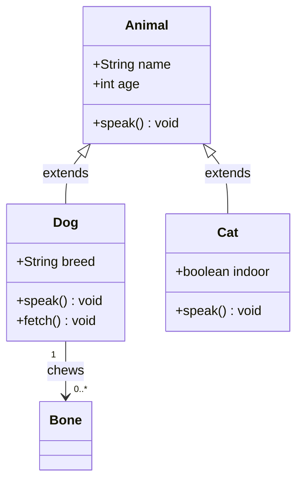
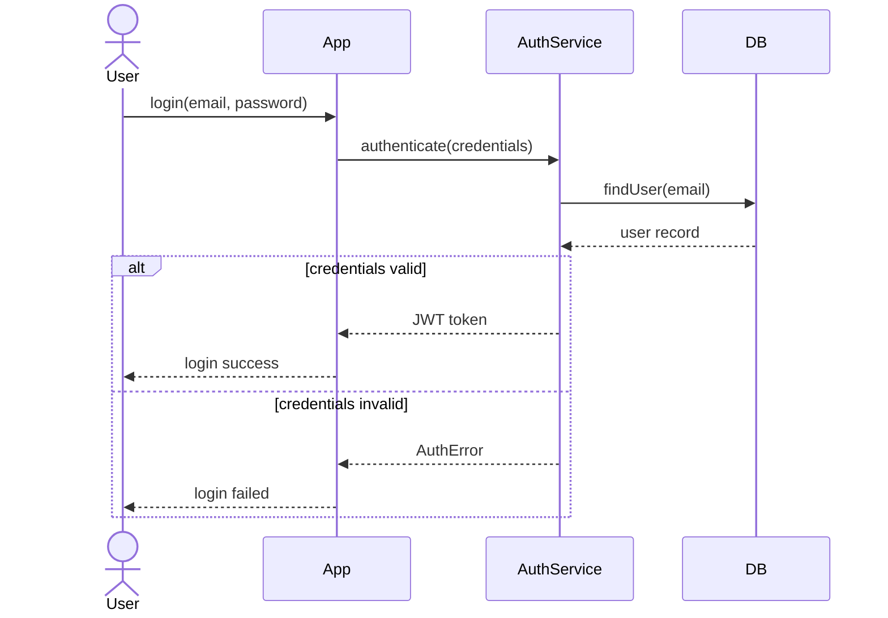
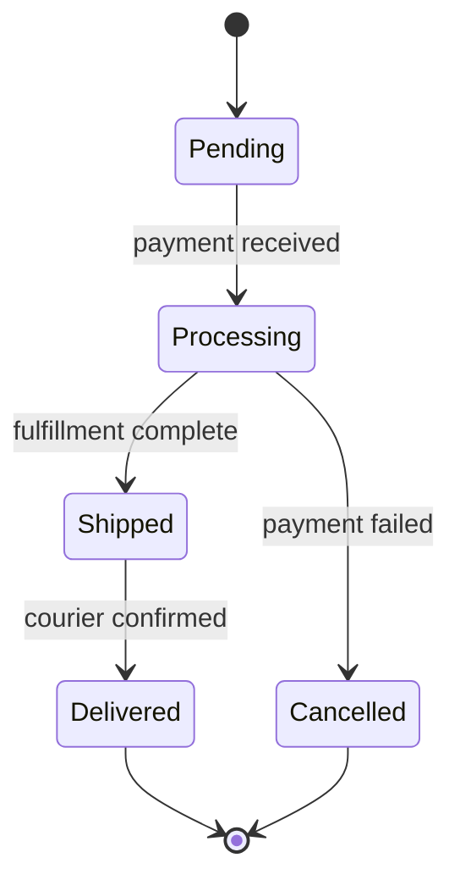
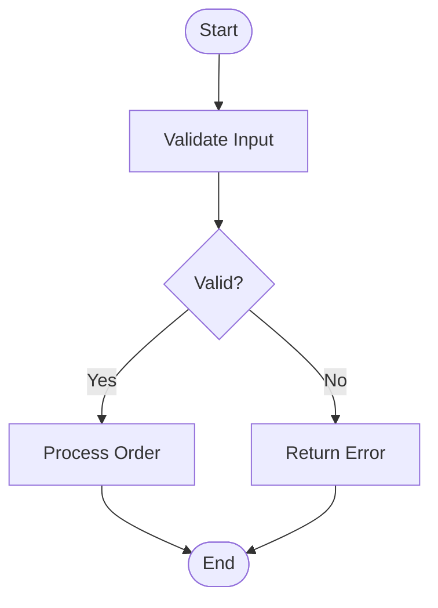
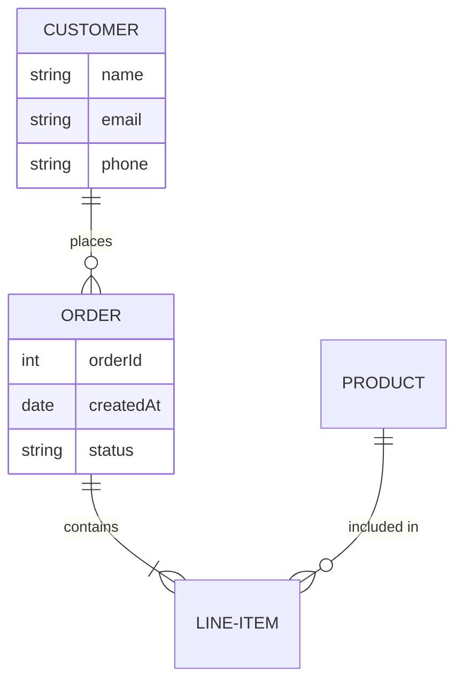
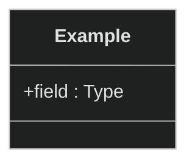
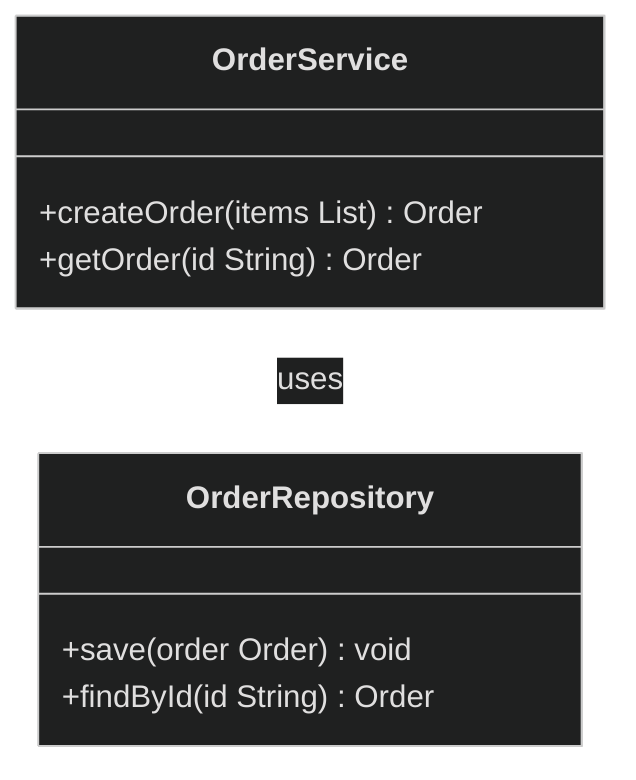

<!-- generated-by: claude-global-library/tools/project_sync -->
<!-- source: skills/mermaid-syntax-engine-core/SKILL.md -- edit the library, then re-run sync_project.py -->

# Mermaid Syntax Engine Core

## Description

This skill provides the complete technical specification for generating syntactically correct Mermaid diagram definitions for all UML diagram types supported by Mermaid.js v10+. It covers keyword syntax for every diagram category (classDiagram, sequenceDiagram, stateDiagram-v2, flowchart, erDiagram, gantt, and more), direction/layout directives, relationship notation, theming with %%{init}%% blocks, and GitHub/GitLab markdown compatibility rules. It enables producing diagram-as-code artifacts that render natively in markdown documentation systems without any external tooling, supporting the diagram-as-code pipeline for SDLC documentation, READMEs, wikis, and automated diagram generation workflows.

## 1. Supported Diagram Types

Mermaid.js (v10+) supports the following diagram types natively rendered in GitHub, GitLab, and Confluence:

| Diagram Type | Keyword | UML Equivalent | Notes |
|-------------|---------|----------------|-------|
| Flowchart | `flowchart` or `graph` | Activity (partial) | LR/RL/TD/BT direction |
| Class Diagram | `classDiagram` | Class Diagram | UML 2.x notation |
| Sequence Diagram | `sequenceDiagram` | Sequence Diagram | Actors, activations, loops |
| State Diagram | `stateDiagram-v2` | State Machine | Composite, fork/join |
| Entity Relationship | `erDiagram` | Data model | Crow's foot notation |
| Gantt Chart | `gantt` | Schedule | Project management |
| Pie Chart | `pie` | — | Statistics visualization |
| Git Graph | `gitGraph` | — | Branch/commit history |
| C4 Context | `C4Context` | Component (C4 level) | Requires C4 plugin |
| Journey | `journey` | — | User journey mapping |
| Timeline | `timeline` | — | Milestone visualization |
| Mindmap | `mindmap` | — | Hierarchical notes |
| Quadrant Chart | `quadrantChart` | — | 2x2 analysis |

---

## 2. classDiagram Syntax

### 2.1 Class Declaration

```
classDiagram
    class ClassName {
        +publicAttribute : Type
        -privateAttribute : Type
        #protectedAttribute : Type
        ~packageAttribute : Type
        +publicMethod() ReturnType
        -privateMethod(param Type) ReturnType
        <<interface>>
    }
```

Visibility prefix symbols:
- `+` = public
- `-` = private
- `#` = protected
- `~` = package (default)

Type annotations come after the attribute name, separated by a colon. Method signatures use parentheses; return type follows the closing parenthesis.

Annotations (stereotypes) using double angle brackets:
- `<<interface>>`, `<<abstract>>`, `<<enumeration>>`, `<<service>>`, `<<repository>>`

### 2.2 Relationship Notation

| Relationship | Mermaid Syntax | UML Meaning |
|-------------|----------------|-------------|
| Inheritance | `Animal <|-- Dog` | Dog extends Animal |
| Realization | `Shape <|.. Circle` | Circle implements Shape |
| Composition | `Car *-- Engine` | Car owns Engine (filled diamond at Car) |
| Aggregation | `Company o-- Employee` | Company has Employee (open diamond) |
| Association | `Customer --> Order` | Customer has association to Order |
| Dependency | `ClassA ..> ClassB` | ClassA depends on ClassB |
| Link (plain) | `ClassA -- ClassB` | Undirected association |

Relationship labels are added after a colon:

```
Customer "1" --> "0..*" Order : places
```

Multiplicity strings go inside double quotes immediately after the class name on each end.

### 2.3 Complete classDiagram Example



---

## 3. sequenceDiagram Syntax

### 3.1 Participants and Actors

```
sequenceDiagram
    actor User
    participant App
    participant Server
    participant DB as Database
```

`actor` renders a stick figure; `participant` renders a box. Alias with `as`.

### 3.2 Message Types

| Syntax | Meaning |
|--------|---------|
| `A->>B: message` | Solid arrow (sync call) |
| `A-->>B: message` | Dashed arrow (async reply) |
| `A-)B: message` | Open arrowhead (async signal) |
| `A-xB: message` | X arrowhead (lost message) |
| `A->>+B: message` | Solid arrow with activation |
| `A-->>-B: message` | Dashed reply with deactivation |

### 3.3 Control Structures

```
alt Condition A
    A->>B: do X
else Condition B
    A->>B: do Y
end

opt Optional block
    A->>B: optional action
end

loop Every 5 seconds
    A->>B: heartbeat
end

par Parallel group 1
    A->>B: action1
and Parallel group 2
    A->>C: action2
end

critical Resource lock
    A->>B: acquire
option Timeout
    A->>A: retry
end
```

### 3.4 Notes and Activations

```
Note over A,B: This spans two lifelines
Note right of A: Right side note
activate Server
    App->>Server: request
    Server-->>App: response
deactivate Server
```

### 3.5 Complete sequenceDiagram Example



---

## 4. stateDiagram-v2 Syntax

### 4.1 Basic Syntax

```
stateDiagram-v2
    [*] --> StateA
    StateA --> StateB : event
    StateB --> [*]
```

`[*]` represents the initial pseudostate (at diagram start) and the final state (at diagram end).

### 4.2 Composite States and Parallel Regions

```
stateDiagram-v2
    state "Processing Order" as Processing {
        [*] --> Validating
        Validating --> Charging
        Charging --> Fulfilling
        Fulfilling --> [*]
    }
    [*] --> Processing
    Processing --> Shipped : fulfilled
    Processing --> Cancelled : payment failed

    state Parallel {
        [*] --> Task1
        --
        [*] --> Task2
    }
```

The `--` separator creates parallel regions (orthogonal states) within a composite state.

### 4.3 Notes and Direction

```
stateDiagram-v2
    direction LR
    StateA: This is state A
    note right of StateA
        State A has this note
    end note
    StateA --> StateB
```

### 4.4 Complete stateDiagram-v2 Example



---

## 5. Flowchart and Other Diagram Examples

### 5.1 Flowchart (Activity-like)



Node shape syntax:
- `[text]` = rectangle
- `(text)` = rounded rectangle
- `([text])` = stadium (pill)
- `{text}` = diamond (decision)
- `((text))` = circle
- `>text]` = asymmetric
- `[[text]]` = subroutine

### 5.2 erDiagram Example



Cardinality notation: `||` = one, `o{` = zero or many, `|{` = one or many.

### 5.3 Directive Syntax (Theme and Config)



The `%%{init: ...}%%` directive must appear on the first line of the diagram definition.

---

## 6. Deep Mathematical Foundations

### M1: Mermaid PEG Grammar (classDiagram Subset)

Mermaid parsers are generated from PEG (Parsing Expression Grammar) definitions. The classDiagram grammar is a subset of the full Mermaid PEG.

**Formal PEG grammar for classDiagram (simplified):**

```
diagram       <- "classDiagram" NEWLINE statement*
statement     <- class_decl / relationship / directive / note / NEWLINE
class_decl    <- "class" SPACE id (SPACE "{" NEWLINE member* "}")? NEWLINE
member        <- SPACE+ visibility? (method / attribute / annotation) NEWLINE
visibility    <- "+" / "-" / "#" / "~"
method        <- id "()" (":" SPACE type)? annotation?
attribute     <- type? SPACE id annotation?
annotation    <- SPACE "<<" id ">>"
type          <- [a-zA-Z][a-zA-Z0-9_<>,]*
id            <- [a-zA-Z][a-zA-Z0-9_]*
relationship  <- id SPACE rel_type SPACE id (":" SPACE label)? NEWLINE
rel_type      <- "<|--" / "<|.." / "--*" / "--o" / "-->" / ".." / "--" / "..|>" / "<--"
label         <- [^\n]+
directive     <- "%%{" [^}]+ "}%%" NEWLINE
note          <- "note" SPACE [^\n]+ NEWLINE
NEWLINE       <- "\n" / "\r\n"
SPACE         <- " "
```

**PEG derivation for a 3-class diagram string:**

Input string (simplified):
```
classDiagram\n    class Animal\n    class Dog\n    class Cat\n    Animal <|-- Dog\n    Animal <|-- Cat\n
```

Parse trace:
```
diagram    <- "classDiagram" NEWLINE statement*
               |
               +-- statement[1] <- class_decl <- "class" "Animal" NEWLINE
               +-- statement[2] <- class_decl <- "class" "Dog" NEWLINE
               +-- statement[3] <- class_decl <- "class" "Cat" NEWLINE
               +-- statement[4] <- relationship <- "Animal" "<|--" "Dog" NEWLINE
               +-- statement[5] <- relationship <- "Animal" "<|--" "Cat" NEWLINE
```

The PEG parser uses ordered choice (`/`) which means `<|--` is tried before `<|..` before `--*` before `--o`, etc. The first matching alternative consumes the input.

**PEG vs CFG distinction:** PEG parsers are deterministic (no ambiguity) because ordered choice resolves all conflicts. Mermaid's parser uses Jison (LALR-inspired) for some diagram types and custom PEG-style parsers for others (classDiagram uses a handwritten recursive-descent parser in mermaid-js source).

---

### M2: DAGRE Layout Algorithm

Mermaid uses the Dagre.js library for layout of classDiagram, flowchart, stateDiagram, and erDiagram. Dagre implements a Sugiyama-style algorithm optimized for DAGs.

**DAGRE 4-phase algorithm (Sugiyama variant):**

**Phase 1 — Rank Assignment (Layer Assignment):**

For a DAG G = (V, E) with topological order:

```
rank(source) = 0  for all sources (in-degree = 0)

For each v in topological order:
  rank(v) = max{ rank(u) + 1 : (u, v) in E }
```

**Worked example — 4-node DAG:**

```
Nodes: A, B, C, D
Edges: A->B, A->C, B->D, C->D

Topological order: A, B, C, D

rank(A) = 0  (source)
rank(B) = max(rank(A)+1) = 1
rank(C) = max(rank(A)+1) = 1
rank(D) = max(rank(B)+1, rank(C)+1) = max(2, 2) = 2

Layer 0: {A}
Layer 1: {B, C}
Layer 2: {D}
```

**Phase 2 — Crossing Minimization (Barycenter heuristic):**

For each pair of adjacent layers (L_k, L_{k+1}), sort nodes in L_{k+1} by barycenter:

```
bc(v) = (1 / |N(v)|) * SUM_{u in N(v)} pos(u)

where N(v) = neighbors of v in the fixed layer L_k
      pos(u) = current position index of u in L_k
```

Sort nodes in L_{k+1} ascending by bc(v). Sweep forward (k=0 to L) then backward (k=L to 0). Keep best ordering found.

**Phase 3 — Coordinate Assignment (simplified Brandes-Kopf):**

For each node v in layer i, assign:

```
x(v) = rank(v) * horizontal_separation  [for LR layout]
y(v) = position_in_layer * vertical_separation  [within layer]
```

Dagre's actual implementation uses the 4-alignment Brandes-Kopf method for x-coordinate assignment within each layer (full derivation in `diagram-layout-algorithms-core`).

**Phase 4 — Edge Routing:**

Long edges (spanning more than one rank) have intermediate dummy nodes placed at each intermediate layer. After coordinate assignment, dummy nodes are removed and edges are routed through their positions as waypoints.

**Dagre configuration options (exposed via Mermaid):**

```
rankDir: TB | BT | LR | RL   (direction of rank progression)
ranksep: int                  (pixels between rank layers, default 50)
nodesep: int                  (pixels between nodes in same layer, default 50)
edgesep: int                  (pixels between parallel edges)
```

---

### M3: SVG Rendering Pipeline

Mermaid converts diagram text to SVG through a multi-stage pipeline.

**Pipeline stages:**

```
Stage 1: LEXER
  Input:  Mermaid diagram string
  Output: Token stream
  Method: Regex-based tokenizer per diagram type
  Tokens: keyword, identifier, arrow, string, number, newline, comment

Stage 2: PARSER
  Input:  Token stream
  Output: Abstract Syntax Tree (AST)
  Method: Recursive-descent or Jison-generated LALR parser
  AST nodes: DiagramNode, ClassNode, RelationshipNode, MemberNode, ...

Stage 3: SEMANTIC MODEL
  Input:  AST
  Output: Graph model (entity list + relationship list)
  For classDiagram: { classes: Map<id, ClassDef>, relations: Relation[] }
  For sequenceDiagram: { actors: Actor[], messages: Message[], fragments: Fragment[] }

Stage 4: LAYOUT
  Input:  Graph model
  Output: Graph model with (x, y, width, height) per node + edge waypoints
  Engine: Dagre.js (most types) | Elk.js (complex flowcharts) | Cytoscape (mindmap)

Stage 5: SVG GENERATION
  Input:  Laid-out graph model
  Output: SVG string
  Method: d3.js selection API + dagre-d3 (older) or Mermaid renderer (newer)
  SVG elements:
    <g class="node"> -> contains <rect>/<circle>/<text> for shapes
    <g class="edgePath"> -> contains <path d="..."> for edges
    <g class="edgeLabel"> -> contains <text> for edge labels
    <marker> -> SVG marker definitions for arrowheads
```

**Pipeline trace for `classDiagram\n    A--|>B`:**

```
Lexer:   [DIAGRAM_TYPE="classDiagram", NEWLINE, SPACES, ID="A", REL_TYPE="--|>", ID="B"]
Parser:  DiagramNode { type: "classDiagram", statements: [
           RelationshipNode { source: "A", rel: "--|>", target: "B" }
         ]}
Semantic: { classes: { A: {members:[]}, B: {members:[]} },
            relations: [{ source:"A", type:"inheritance", target:"B" }] }
Layout:  A -> (x=100, y=100, w=150, h=60), B -> (x=100, y=250, w=150, h=60),
         edge waypoints: [(175,160), (175,250)]
SVG:     <g class="node" id="A"><rect .../><text ...>A</text></g>
         <g class="node" id="B"><rect .../><text ...>B</text></g>
         <g class="edgePath"><path d="M 175 160 L 175 250" .../></g>
         <marker id="inherit-arrow"><path d="M 0 0 L 10 5 L 0 10 Z" fill="none" .../></marker>
```

**GitHub rendering path:** GitHub's Markdown pipeline passes Mermaid fenced code blocks to a server-side renderer (uses `@mermaid-js/mermaid-js` with jsdom or Puppeteer), outputs SVG, and inlines the SVG into the rendered HTML page.

---

### M4: Configuration Override Algebra

Mermaid configuration follows a strict precedence order from lowest to highest priority.

**Precedence (lowest to highest):**

```
1. Built-in defaults (hardcoded in mermaid source)
2. mermaid.initialize(config) call (global initialization)
3. %%{init: {...}}%% directive (per-diagram inline override)
```

**Configuration object structure:**

```javascript
{
  theme: "default" | "forest" | "dark" | "neutral" | "base",
  themeVariables: {
    primaryColor: "#RRGGBB",
    primaryTextColor: "#RRGGBB",
    primaryBorderColor: "#RRGGBB",
    lineColor: "#RRGGBB",
    secondaryColor: "#RRGGBB",
    tertiaryColor: "#RRGGBB",
    background: "#RRGGBB",
    mainBkg: "#RRGGBB",
    nodeBorder: "#RRGGBB",
    clusterBkg: "#RRGGBB",
    titleColor: "#RRGGBB",
    edgeLabelBackground: "#RRGGBB",
    fontFamily: "string",
    fontSize: "Npx"
  },
  startOnLoad: true | false,
  securityLevel: "strict" | "loose" | "antiscript" | "sandbox",
  flowchart: { htmlLabels: bool, curve: "linear"|"basis"|"cardinal" },
  sequence: { diagramMarginX: int, actorMargin: int, boxWidth: int },
  classDiagram: { defaultRenderer: "dagre-d3"|"elk" }
}
```

> **Security Rule — securityLevel:** ALWAYS use `securityLevel: "strict"` in production web contexts.
> `"loose"` and `"antiscript"` are UNSAFE for user-provided diagram content and have caused XSS CVEs
> (CVE-2021-43861, CVE-2023-46975). `htmlLabels: true` is UNSAFE if node label content originates
> from untrusted input. Only use `"sandbox"` (iframe isolation) when `"strict"` is incompatible
> with your renderer. Never set `securityLevel: "loose"` in any production or shared wiki environment.

**CSS custom properties (lowest priority — overridden by themeVariables):**

```css
--mermaid-font-family: "Helvetica Neue";
--mermaid-font-size: 16px;
```

**Directive syntax (inline — highest priority):**

The directive `%%{init: {...}}%%` applies only to the diagram it precedes. It must be the first non-whitespace content in the diagram block. Multiple directives are merged left-to-right.

**Algebra of overrides (formal):**

```
effective_config = merge(built_in_defaults,
                         merge(initialize_config,
                               directive_config))

merge(A, B) = { k: B[k] if k in B else A[k] for k in keys(A) U keys(B) }
```

`merge` is a shallow merge at each nesting level. Nested objects (`themeVariables`) are shallow-merged one level deep.

**Worked example — dark-themed class diagram:**



---

### M5: Mermaid Live URL Encoding

Mermaid.live (and the Mermaid editor at mermaid.live/edit) encodes diagram state into the URL fragment using a pako-deflate based encoding (v9+ default).

**State object structure:**

```javascript
state = {
  code: diagramText,             // the Mermaid diagram string
  mermaid: JSON.stringify(config) // stringified config object
}
```

**Encoding pipeline (pako variant, v9+):**

```
Step 1: JSON.stringify(state)  -> UTF-8 JSON string
Step 2: UTF-8 encode           -> bytes
Step 3: pako.deflate(bytes)    -> raw DEFLATE compressed bytes
         (pako uses wbits=15 + raw = -15, equivalent to Python zlib level 6)
Step 4: base64url encode       -> URL-safe base64 string (no padding)
Step 5: URL: "https://mermaid.live/edit#pako:" + encoded
```

**Python equivalent:**

```python
import base64
import json
import zlib


def encode_mermaid_live_url(diagram_code: str, config: dict = None) -> str:
    """Encode a Mermaid diagram into a mermaid.live shareable URL.

    Uses pako-compatible raw DEFLATE encoding as expected by mermaid.live.
    The state object contains both the diagram code and the configuration.

    Args:
        diagram_code: Mermaid diagram syntax string (e.g., "classDiagram\\n...").
        config: Optional Mermaid configuration dict. Defaults to default theme.

    Returns:
        Complete mermaid.live URL with the #pako: encoded state fragment.
    """
    if config is None:
        config = {"theme": "default", "securityLevel": "strict"}
    state = {"code": diagram_code, "mermaid": json.dumps(config)}
    state_json = json.dumps(state).encode("utf-8")
    compressed = zlib.compress(state_json)[2:-4]
    encoded = base64.urlsafe_b64encode(compressed).decode("ascii").rstrip("=")
    return f"https://mermaid.live/edit#pako:{encoded}"


def encode_mermaid_view_url(diagram_code: str, config: dict = None) -> str:
    """Encode a Mermaid diagram into a read-only mermaid.live view URL.

    Args:
        diagram_code: Mermaid diagram syntax string.
        config: Optional Mermaid configuration dict. Defaults to strict security level.

    Returns:
        Complete mermaid.live view URL (no editor controls).
    """
    if config is None:
        config = {"theme": "default", "securityLevel": "strict"}
    state = {"code": diagram_code, "mermaid": json.dumps(config)}
    state_json = json.dumps(state).encode("utf-8")
    compressed = zlib.compress(state_json)[2:-4]
    encoded = base64.urlsafe_b64encode(compressed).decode("ascii").rstrip("=")
    return f"https://mermaid.live/view#pako:{encoded}"
```

**Legacy btoa encoding (pre-v9, for older tools):**

```javascript
encoded = btoa(unescape(encodeURIComponent(JSON.stringify(state))))
url = "https://mermaid.live/edit#" + encoded
```

The pako variant produces smaller URLs for large diagrams due to compression. Both variants are decoded by current mermaid.live (it auto-detects the encoding).

> **Privacy Note — mermaid.live URLs:** mermaid.live is operated by the Mermaid maintainers (a
> third-party service). The URL fragment contains the full diagram code including class names,
> method names, and system topology. For internal or confidential diagrams:
> - Use GitHub/GitLab native Mermaid rendering (no external URL required)
> - Use self-hosted Kroki.io or a local Mermaid server
> - Use `mermaid-cli` (`npm install @mermaid-js/mermaid-cli`) for local PNG/SVG output
> Do NOT generate mermaid.live URLs for diagrams containing internal hostnames, authentication
> flows, or confidential architecture details.

---

### M6: Diagram Complexity vs Render Time Model

Mermaid rendering time scales with diagram complexity. Exceeding browser time budgets produces blank output or partial diagrams.

**Empirical render time model for classDiagram (browser JS engine):**

```
T_render(ms) = alpha * N_classes + beta * N_relationships

where:
  alpha = 0.05 ms per class   (Dagre node processing + SVG element creation)
  beta  = 0.02 ms per relation (edge routing + SVG path generation)

Browser threshold: T_render > 12,000 ms (12 seconds) -> browser terminates script
GitHub threshold:  N_classes > 200 -> GitHub drops Mermaid rendering (reports "too many nodes")
```

**Worked example — render time for a 150-class system:**

```
N_classes = 150, N_relationships = 200 (typical density for 150 classes)

T_render = 0.05 * 150 + 0.02 * 200
         = 7.5 + 4.0
         = 11.5 ms

Result: within 12-second threshold, but close to GitHub's 200-node limit.
Recommendation: split into per-package diagrams of 10-15 classes each.
```

**Chunking strategy for large systems:**

```
Total classes N:    split into ceil(N / K) diagrams of K classes each
Recommended K:      10-15 per package diagram
Selection criterion: one Mermaid block per Java/Python/TypeScript package
Diagram title:      add %%{init: {"theme":"default"}}%%\n%% Package: com.example.order %%
```

**stateDiagram-v2 complexity:**

```
T_render increases with:
  - State nesting depth d:   O(d^2) due to nested layout computation
  - Number of transitions:   O(N_transitions) linearly

Threshold: nesting depth > 5 -> split into linked sub-diagrams
```

**sequenceDiagram complexity:**

```
T_render = O(N_messages)   (linear: each message is one SVG path element)
Threshold: N_messages > 50 -> paginate into multiple diagrams
           N_actors > 10   -> activate/deactivate overlap becomes visually unreadable
```

**Mermaid node count limits by GitHub renderer (as of 2025):**

| Diagram Type | Safe Limit | Hard Limit |
|-------------|-----------|-----------|
| classDiagram | 50 classes | 200 nodes |
| flowchart | 100 nodes | 500 nodes |
| sequenceDiagram | 10 actors, 50 messages | 20 actors |
| stateDiagram-v2 | 30 states | 100 states |
| erDiagram | 20 entities | 50 entities |

Diagrams exceeding safe limits should emit a `%% Truncated: showing top N nodes` comment and display only the highest-priority nodes.

---

## 7. Anti-Patterns to Avoid

1. **Relying on relationship-type ordered-choice matching without knowing PEG tries alternatives in declared order**: M1's grammar uses ordered choice (`/`) where `<|--` is tried before `<|..` before `--*`, etc. — the FIRST matching alternative wins. Writing a custom parser or validator that assumes CFG-style ambiguity resolution (trying all alternatives and picking the "best" one) rather than PEG's deterministic first-match semantics will diverge from how Mermaid's actual parser behaves on ambiguous-looking input.

2. **Assuming rank assignment in Dagre uses the minimum incoming rank instead of the maximum**: M2's Phase 1 formula is `rank(v) = max{rank(u)+1 : (u,v) in E}` — a node's rank is one more than the MAXIMUM of its predecessors' ranks, not the minimum. Using min instead of max would place a node too early in a diagram with multiple incoming edges of different upstream depths, producing edges that point backward or overlap.

3. **Setting `securityLevel: "loose"` or `"antiscript"` for user-provided or untrusted diagram content**: M4's security rule is explicit and cites two real CVEs (CVE-2021-43861, CVE-2023-46975) tied to these settings — `"strict"` should always be the default in production web contexts, with `"sandbox"` (iframe isolation) as the only acceptable fallback when strict is incompatible with the renderer. Defaulting to loose settings for convenience during development and forgetting to tighten before production deploy is exactly the failure mode the CVEs describe.

4. **Enabling `htmlLabels: true` when node label content originates from untrusted input**: M4 flags this combination as specifically unsafe — HTML labels rendered from user-controlled text create an XSS injection vector independent of the overall securityLevel setting. Treating `htmlLabels` as a purely cosmetic flag ignores its security implication when label content isn't fully trusted.

5. **Assuming config merge is a deep merge rather than the shallow, one-level-deep merge M4 defines**: `merge(A,B) = {k: B[k] if k in B else A[k]}` replaces each top-level (or one-nested-level, for themeVariables) key wholesale rather than recursively merging nested objects further down. Setting only `themeVariables.primaryColor` in a directive expecting the rest of a nested config sub-object to survive from an earlier layer can silently drop other nested keys that aren't explicitly re-specified beyond the one shallow level Mermaid actually merges.

6. **Using zlib/gzip's default headers instead of raw DEFLATE when hand-encoding a mermaid.live pako URL**: M5's Python equivalent explicitly slices `zlib.compress(state_json)[2:-4]` to strip the zlib header and Adler-32 trailer, matching pako's raw-DEFLATE expectation. Omitting this slice (or using an unmodified zlib/gzip byte stream) produces a `#pako:` fragment that mermaid.live's decoder cannot parse, even though the compression itself succeeded.

7. **Generating a mermaid.live shareable URL for diagrams with internal architecture details**: M5's privacy note states the URL fragment contains the full diagram code (class names, method names, system topology) visible to anyone with the link, on a third-party-operated service. Defaulting to mermaid.live URL generation for internal or confidential diagrams, instead of GitHub/GitLab native rendering or a self-hosted Kroki/Mermaid server, risks exposing architecture details externally.

8. **Assuming render time scales sub-linearly and skipping the chunking recommendation for large diagrams**: M6's empirical model T_render = α·N_classes + β·N_relationships is LINEAR in both class and relationship counts, and the worked 150-class example (11.5ms) still sits close to GitHub's separate 200-node hard limit even though it's well under the 12-second browser threshold. Treating "under the time threshold" as sufficient without checking the independent node-count limit misses a real rendering failure mode.

9. **Ignoring the O(d²) nesting-depth cost for deeply nested stateDiagram-v2 diagrams**: M6 states stateDiagram-v2 render time grows QUADRATICALLY with state nesting depth (unlike the linear transition-count term), and recommends splitting into linked sub-diagrams once depth exceeds 5. A deeply nested state machine that "only" has a modest total state count can still blow the render-time budget purely from nesting depth, which a flat state/transition count metric wouldn't reveal.

10. **Truncating an oversized diagram silently instead of emitting the documented truncation marker**: M6's guidance requires diagrams exceeding safe limits to emit a `%% Truncated: showing top N nodes` comment and display only the highest-priority nodes. Silently dropping nodes/edges to fit within render limits without this marker makes an incomplete diagram look complete, misleading anyone reading it into thinking they're seeing the full system.

---

## 8. India Context

**GitHub India APAC adoption:** India has the highest Mermaid diagram adoption rate in the APAC region on GitHub. Indian open-source projects and engineering blogs consistently use Mermaid for inline architecture documentation in README files. GitHub India engineering community documentation — including NASSCOM member company open-source projects — uses Mermaid for DevOps pipeline visualization and API documentation.

**GitLab and government repositories:** GitLab is used by DRDO, ISRO, and Indian defence organizations for secure source code repositories. GitLab's native Mermaid rendering (built into GitLab Markdown since v10.3) makes Mermaid the natural choice for inline architecture documentation in classified and semi-classified government projects where external diagram hosting is restricted.

**NASSCOM coding standards:** NASSCOM digital documentation guidelines for Indian IT projects include diagram-as-code practices. Mermaid is referenced as the preferred format for documentation that must remain version-controlled alongside source code. The NASSCOM NIIT Advanced Java certification curriculum includes "Mermaid diagrams in project README" as a documentation competency.

**Confluence and Indian IT majors:** Atlassian Confluence — used by TCS, Infosys, Wipro, HCL, and Cognizant for project documentation — supports Mermaid through the official Mermaid Diagrams for Confluence plugin (Atlassian Marketplace). This enables Indian IT delivery teams to embed live-rendering diagrams in delivery wiki pages without exporting static images.

**MeitY e-governance projects:** MeitY guidelines encourage diagram-as-code approaches for system documentation that must remain auditable and version-controlled. Mermaid diagrams checked into Git repositories satisfy the NIC-SSDLC v2.0 requirement for traceable architecture documentation. Phase 2 (Requirements) and Phase 3 (Design) deliverables in NIC projects increasingly include Mermaid diagrams embedded in markdown specification documents.

**BIS and open standards:** Mermaid.js is Apache-2.0 licensed — satisfying BIS and MeitY open-source software preference policies for government and publicly-funded IT projects.

---

## 9. Response Rules

1. Always start a diagram block with the diagram type keyword on the first line (e.g., `classDiagram`, `sequenceDiagram`).
2. Place the `%%{init: ...}%%` directive on the very first line when theme or configuration overrides are needed — before the diagram type keyword.
3. Indent class members and state transitions consistently (4 spaces standard).
4. Use double quotes around multiplicity labels in classDiagram: `"1" --> "0..*"`.
5. Use `stateDiagram-v2` not `stateDiagram` — v2 supports composite states and parallel regions.
6. For sequence diagrams, use `actor` for human participants and `participant` for system components.
7. When a diagram exceeds safe node limits from Section 6, split into multiple smaller diagrams and add `%% Truncated` comments.
8. Use the `%%{init: {"theme": "dark"}}%%` directive for dark theme; do not use CSS override for theme.
9. For mermaid.live URLs, use the pako encoding pipeline from M5. Do not use the legacy btoa encoding for new diagrams.
10. Delegate Dagre layout algorithm full derivations (Phase 4 Brandes-Kopf coordinate assignment) to the `uml-diagram-mathematics-expert` agent.

---

## 10. What Not to Do

- Do not use `stateDiagram` (v1) — always use `stateDiagram-v2`.
- Do not use `graph` alone without a direction (e.g., `graph TD`) — always specify direction for flowcharts.
- Do not omit quotes around multiplicity labels containing special characters or spaces.
- Do not use HTML tags inside Mermaid diagram definitions — Mermaid does not render HTML in node labels (unless `htmlLabels: true` is set in flowchart config).
- Do not place the `%%{init}%%` directive after the diagram type keyword — it must be first.
- Do not generate diagrams with more nodes than the safe limits in Section 6 without adding a `%% Truncated` comment and splitting strategy.
- Do not use single-quoted strings in the `%%{init}%%` JSON — JSON requires double quotes.
- Do not use the legacy btoa URL encoding for new mermaid.live URLs.
- Do not add inline explanatory comments inside Python code examples.
- Do not confuse `--` (plain link) with `-->` (association with arrow) or `<|--` (inheritance arrow direction).

---

## 11. Output Expectations

Responses produce one or more of:

1. **Mermaid diagram block** — syntactically correct Mermaid definition inside a fenced code block labeled `mermaid`. Renders correctly in GitHub, GitLab, and Confluence. Respects node count limits from Section 6.

2. **Configuration directive** — a `%%{init: {...}}%%` line with a valid JSON config object for the requested theme or layout settings.

3. **mermaid.live URL** — a complete URL beginning with `https://mermaid.live/edit#pako:` or `https://mermaid.live/view#pako:` encoding the diagram state using the M5 pipeline.

4. **Python generator function** — builds and returns a Mermaid diagram string. Has a Google-style docstring. No inline explanatory comments inside the function body. Returns `str`.

5. **Diagram split plan** — when a system has too many nodes, a plan partitioning classes/states into safe-sized diagram blocks with cross-diagram references indicated by comments.

---

## 12. Skill Scope

**In scope:**
- All Mermaid-supported diagram types listed in Section 1
- Complete Mermaid syntax for classDiagram, sequenceDiagram, stateDiagram-v2, flowchart, erDiagram
- Configuration override algebra and `%%{init}%%` directives
- Complexity limits and chunking strategy for large systems
- mermaid.live URL encoding using pako pipeline (M5)
- Python code for programmatic Mermaid string generation (stdlib only)
- Render time estimation model (M6)

**Out of scope:**
- Draw.io XML generation — covered in `drawio-xml-generation-core`
- Mermaid-to-Draw.io XML conversion internals — use `mcp__drawio-diagram__convert_mermaid_to_drawio` MCP tool
- Full Dagre layout algorithm derivation (Phase 4 coordinate assignment) — covered in `diagram-layout-algorithms-core` and delegated to `uml-diagram-mathematics-expert`
- Kroki.io rendering of Mermaid to PNG/SVG — handled by `uml-diagram` MCP server
- UML semantic validation and metamodel conformance — covered in UML core skills (1-13)

---

## 13. Version

**Version:** 1.1.0 -- Added Section 7 Anti-Patterns to Avoid (10 bullets grounded in M1-M6); India Context through Version renumbered §8-13. Previously 1.0.0.
**Domain:** UML and Diagram Engineering (Domain 46)
**Standards:** Mermaid.js v10+ syntax; GitHub Mermaid rendering specification; mermaid.live pako encoding protocol
**Delegation:** Dagre Phase 4 Brandes-Kopf coordinate assignment full derivation delegated to `uml-diagram-mathematics-expert`
