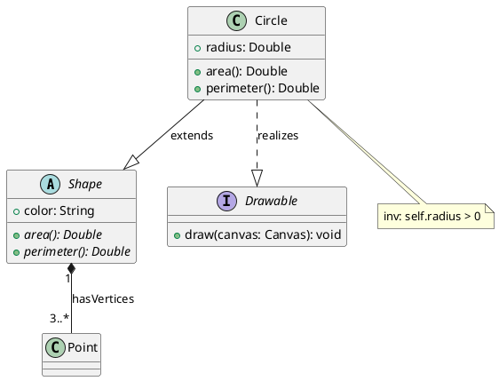

<!-- generated-by: claude-global-library/tools/project_sync -->
<!-- source: skills/uml-class-diagram-core/SKILL.md -- edit the library, then re-run sync_project.py -->

# UML Class Diagram Core

## Description

Provides authoritative UML 2.5.1 class diagram knowledge covering all metaclasses (Classifier, Property, Association, Operation, Interface, Component), relationship types (generalization, association, aggregation, composition, dependency, realization), OCL constraint syntax, visibility rules, and notational conventions. Generates correct PlantUML and draw.io representations with complete attribute compartments, multiplicity labels, and stereotype annotations.

## 1. UML 2.5.1 Metaclass Foundation

### 1.1 Core Metaclasses (Chapters 9-11)

The UML 2.5.1 specification (OMG formal/2017-12-05, ISO/IEC 19505-2:2012) defines the following primary metaclasses for class diagrams:

**Classifier** (abstract, Chapter 9) -- superclass of Class, Interface, DataType, Signal, Component, Artifact, Node.
- Key properties: `isAbstract: Boolean`, `isFinalSpecialization: Boolean`
- Notation: rectangle with three-compartment layout (name | attributes | operations)

**Property** (Chapter 9.5) -- represents attributes and association ends.
- Key properties: `name`, `visibility`, `type: Type[0..1]`, `lower/upper` (multiplicity), `isReadOnly`, `isDerived`, `aggregation: AggregationKind {none, shared, composite}`
- Derived attribute prefix: `/`; read-only suffix: `{readOnly}`

**Association** (Chapter 11.5) -- `memberEnd -> Property[2..*]`
- Binary: 2 ends; N-ary: N ends (shown as diamond node in diagram)
- AssociationClass: combines Association and Class (connected by dashed line to the relationship line)

**Operation** (Chapter 9.6) -- `BehavioralFeature`; `isQuery: Boolean`; `concurrency: CallConcurrencyKind {sequential, guarded, concurrent}`

**Interface** (Chapter 10.4) -- pure Classifier; realized via `InterfaceRealization` linking BehavioredClassifier to Interface.

**Component** (Chapter 11.3) -- StructuredClassifier with provided interfaces (lollipops), required interfaces (sockets), Ports, and Connectors.

### 1.2 Relationship Types and Notation

| Relationship | UML Notation | PlantUML Syntax |
|---|---|---|
| Generalization (inheritance) | Solid line, open triangle arrowhead | `Child --|> Parent` |
| Realization (interface impl) | Dashed line, open triangle arrowhead | `Class ..|> Interface` |
| Composition (whole-part, strong) | Solid line, filled diamond at whole | `Whole *-- Part` |
| Aggregation (whole-part, weak) | Solid line, open diamond at whole | `Whole o-- Part` |
| Association (plain) | Solid line, optional open arrowhead | `A -- B` or `A --> B` |
| Dependency | Dashed line, open arrowhead | `A ..> B` |
| Usage | Dashed line, open arrowhead, stereotype | `A ..> B : <<use>>` |

### 1.3 Visibility Prefix Notation

| Symbol | Visibility | Access |
|---|---|---|
| `+` | public | All elements |
| `-` | private | Owning class only |
| `#` | protected | Owning class plus subclasses |
| `~` | package | Elements in the same package |

### 1.4 Multiplicity Notation

| Notation | Formal Meaning |
|---|---|
| `1` | Exactly one |
| `0..1` | Zero or one (optional) |
| `*` or `0..*` | Zero or more |
| `1..*` | One or more |
| `m..n` | Between m and n inclusive |

## 2. Class Compartment Layout

Standard three-compartment structure:

```
+---------------------------+
| <<stereotype>>            |
| ClassName                 |  <- Name (bold; italic if abstract)
+---------------------------+
| + attribute: Type = val   |  <- Attributes
| - count: Integer          |
| / derivedAttr: String     |
+---------------------------+
| + operation(p: T): R      |  <- Operations
| # helper(): void          |
+---------------------------+
```

Abstract class: class name in italics or `{abstract}` keyword. Template class: dashed rectangle in upper-right listing type parameters.

## 3. OCL Constraint Syntax

### 3.1 Invariant Form

```
context ClassName inv ConstraintName:
    <boolean-expression>
```

### 3.2 Pre/Post Condition Form

```
context ClassName::operationName(param: Type): ReturnType
pre PreConditionName:  <boolean-expression>
post PostConditionName: <boolean-expression>
```

### 3.3 OCL Collection Operators

| Operator | Meaning |
|---|---|
| `->collect(expr)` | Map: apply expr to each element |
| `->select(cond)` | Filter: keep elements satisfying cond |
| `->forAll(v \| expr)` | Universal quantifier |
| `->exists(v \| expr)` | Existential quantifier |
| `->size()` | Cardinality |
| `->isUnique(expr)` | All results of expr are distinct |
| `->allInstances()` | All runtime instances of the type |

### 3.4 Worked OCL Invariants for BankAccount

```
-- Invariant 1: Balance must be non-negative for standard accounts
context BankAccount inv NonNegativeBalance:
    self.balance >= 0

-- Invariant 2: Overdraft limit bounded by credit rating
context BankAccount inv OverdraftWithinCreditLimit:
    self.overdraftLimit <= self.owner.creditRating * 1000

-- Invariant 3: Account numbers are globally unique
context BankAccount inv UniqueAccountNumbers:
    BankAccount.allInstances()->isUnique(acct | acct.accountNumber)
```

Let expression:
```
context BankAccount inv EligibleForBonus:
    let totalDeposits: Real =
        self.transactions->select(t | t.type = TransactionType::DEPOSIT)
                         ->collect(t | t.amount)->sum()
    in
    totalDeposits >= 10000 implies self.bonusEligible = true
```

## 4. PlantUML Complete Example



## 5. Code Example: Python Dataclass to PlantUML Converter

```python
import dataclasses
from typing import List, Optional


@dataclasses.dataclass
class UmlAttribute:
    """Represents a single attribute slot in a UML class compartment."""

    name: str
    type_name: str
    visibility: str = "public"
    is_derived: bool = False
    default_value: Optional[str] = None

    def to_plantuml_line(self) -> str:
        """Render this attribute as a PlantUML attribute declaration line."""
        prefix_map = {"public": "+", "private": "-", "protected": "#", "package": "~"}
        prefix = prefix_map.get(self.visibility, "+")
        derived_slash = "/" if self.is_derived else ""
        default_part = f" = {self.default_value}" if self.default_value is not None else ""
        return f"    {prefix} {derived_slash}{self.name}: {self.type_name}{default_part}"


@dataclasses.dataclass
class UmlOperation:
    """Represents a single operation declaration in a UML class compartment."""

    name: str
    params: List[str]
    return_type: str
    visibility: str = "public"
    is_abstract: bool = False
    is_query: bool = False

    def to_plantuml_line(self) -> str:
        """Render this operation as a PlantUML operation declaration line."""
        prefix_map = {"public": "+", "private": "-", "protected": "#", "package": "~"}
        prefix = prefix_map.get(self.visibility, "+")
        abstract_marker = "{abstract} " if self.is_abstract else ""
        query_marker = " {query}" if self.is_query else ""
        params_str = ", ".join(self.params)
        return f"    {prefix} {abstract_marker}{self.name}({params_str}): {self.return_type}{query_marker}"


@dataclasses.dataclass
class UmlClassifier:
    """Represents a UML classifier (class or abstract class) ready for PlantUML rendering."""

    name: str
    attributes: List[UmlAttribute]
    operations: List[UmlOperation]
    is_abstract: bool = False
    stereotypes: Optional[List[str]] = None

    def to_plantuml(self) -> str:
        """Render this classifier as a complete PlantUML class declaration block."""
        lines: List[str] = []
        keyword = "abstract class" if self.is_abstract else "class"
        lines.append(f"{keyword} {self.name} {{")
        for attr in self.attributes:
            lines.append(attr.to_plantuml_line())
        if self.attributes and self.operations:
            lines.append("    --")
        for op in self.operations:
            lines.append(op.to_plantuml_line())
        lines.append("}")
        return "\n".join(lines)
```

## 6. India-Specific Regulatory Context

**BIS Standard Adoption:**
Bureau of Indian Standards adopted IS/ISO 19505-1:2012 (UML Infrastructure) and IS/ISO 19505-2:2012 (UML Superstructure) via fast-track process in 2012. These are the Indian national standard equivalents of ISO/IEC 19505. Mandatory reference for NASSCOM-certified software projects seeking BIS compliance.

**MeitY SDLC Guidelines:**
MeitY e-Governance standards (STQC/TEC division) recommend IS/ISO 19505 for software specification documents submitted to government departments. Class diagrams are advised for systems above 5 KLOC; mandatory for government projects above 20 KLOC as part of the Software Architecture Document (SAD).

**STQC and CMMI Requirements:**
STQC Software Product Certification requires SAD with UML class diagrams at CMMI-DEV Level 3 appraisal (Requirements Development plus Technical Solution process areas). STQC DO (Defence Offset): DRDO/defence software procurement mandates UML class diagrams in architecture specifications. CMMI-DEV L4/L5: UML model artifacts serve as traceable deliverables under Quantitative Project Management.

**IT Act 2000 Section 43A Compliance:**
Section 43A (IT Act 2000) with SPDI Rules 2011 requires "reasonable security practices" (maps to ISO 27001). ISO 27001 ISMS documentation requires documented architecture including asset management and network topology. UML class diagrams serve as primary architecture evidence for Section 43A compliance audits when handling sensitive personal data (Aadhaar, PAN, financial records).

**NASSCOM Skill Standards:**
NASSCOM SSC/Q0502 (National Occupational Standards for Software Developer, NSQF Level 6/7) lists UML 2.x class diagram proficiency as a mandatory competency. NSQF Level 7 (Software Architect) requires UML mastery including OCL constraint authoring.

**Education:**
AICTE B.Tech (CSE/IT) model curriculum mandates UML 2.x in the Software Engineering course. UGC NET/JRF Computer Science syllabus includes UML in the Software Engineering unit. GATE CS Software Engineering section covers UML class diagrams.

## Deep Mathematical Foundations

### M1: Directed Attributed Multigraph Model

**Formal definition:** A class diagram is a directed attributed multigraph G = (V, E, Sigma, lambda_V, lambda_E) where:
- V = set of classifier nodes (classes, interfaces, enumerations, data types)
- E = multiset of directed relationship edges (same pair may have multiple edges of different types)
- Sigma = relationship type labels: {generalization, association, dependency, realization, usage, abstraction}
- lambda_V: V -> Attributes maps each classifier to its set of (name, type, visibility) triples
- lambda_E: E -> Sigma maps each edge to its relationship type

**Adjacency matrix for multigraphs:** For classifiers C_1, ..., C_n, the adjacency entry A_ij in {0, 1, *} where:
- A_ij = 0: no relationship from C_i to C_j
- A_ij = 1: exactly one typed relationship edge
- A_ij = *: multiple relationships of different types exist

**Worked example -- 3-class hierarchy:**

Classifiers: Shape (abstract), Circle, Color

Edges:
- (Circle, Shape, generalization): Circle extends Shape
- (Shape, Color, association): Shape references Color with multiplicity 1
- (Circle, Shape, dependency): Circle also has a usage dependency (e.g., calls a Shape factory method)

Adjacency (Sigma-typed):
```
          Shape       Circle      Color
Shape       0           0           1  (association)
Circle      2*          0           0  (generalization + dependency)
Color       0           0           0
```

The multigraph formalism is essential because UML permits a class to simultaneously extend another class AND have an association with it, which naive simple graphs cannot represent.

### M2: Inheritance DAG as Partial Order

**Formal partial order:** Define the subclassification relation <=_C on Classifier set C:

    A <=_C B  iff  A is B or A is a direct or transitive subclass of B

This relation satisfies all partial order axioms:
1. **Reflexivity:** A <=_C A (every class is a subtype of itself by identity substitution)
2. **Transitivity:** (A <=_C B) AND (B <=_C C) => (A <=_C C)
3. **Antisymmetry:** (A <=_C B) AND (B <=_C A) => A = B

UML 2.5.1 well-formedness (Chapter 9 OCL): no circular inheritance allowed, enforced by:
```
context Generalization inv NoCircularInheritance:
    not self.specific.allParents()->includes(self.specific)
```

**Hasse diagram construction -- remove transitive redundancy:**
Given the transitive closure of <=_C, retain edge (A, B) only if no intermediate C exists with A <_C C <_C B.

Algorithm: for each direct edge (A, B) in the raw generalization set, check whether (A, B) appears in the transitive closure of the remaining edges. If yes, the edge is redundant; remove it.

**Worked example -- 4-class hierarchy:**

Classes: Vehicle, Car, ElectricCar, HybridCar

Direct generalizations: Car <_C Vehicle; ElectricCar <_C Car; HybridCar <_C Car

Transitive closure adds: ElectricCar <_C Vehicle (via Car); HybridCar <_C Vehicle (via Car)

Hasse diagram retains ONLY the direct (non-transitive) edges:
```
        Vehicle
           |
          Car
         /   \
ElectricCar  HybridCar
```

Edges (ElectricCar, Vehicle) and (HybridCar, Vehicle) are removed from the Hasse diagram because they are derivable by transitivity through Car.

**Multiple inheritance:** UML 2.5.1 permits multiple generalization edges from one Specific to multiple General classifiers, making the inheritance structure a DAG (directed acyclic graph) rather than a tree. The partial order still holds across the DAG.

### M3: OCL Invariant Calculus

**OCL type hierarchy:** OCL 2.4 is a typed, side-effect-free language. Base types: Boolean, Integer, Real, String, UnlimitedNatural. Parametric collection types: Set(T), OrderedSet(T), Bag(T), Sequence(T).

**Navigation semantics:**
- Single-valued attribute `a: T` on self: `self.a` has type T
- Multi-valued end `roles: Set(Role)`: `self.roles` has type Set(Role); use `->` operators for collection operations

**OCL invariant semantics:** An invariant `context C inv I: expr` holds for a model if for every instance o of C in the model, `expr` evaluates to `true` when `self = o`. Formally:

    model |= inv I  iff  for all o: C, eval(expr, {self := o}) = true

**Worked invariants for BankAccount class:**

Invariant 1 -- balance constraint:
```
context BankAccount inv NonNegativeBalance:
    self.balance >= 0
```
Semantics: for every BankAccount instance b, b.balance >= 0 must hold.

Invariant 2 -- overdraft bounded by credit:
```
context BankAccount inv OverdraftWithinCreditLimit:
    self.overdraftLimit <= self.owner.creditRating * 1000
```
Navigation: `self.owner` traverses the owner association end (single-valued), then `.creditRating` accesses the attribute.

Invariant 3 -- global uniqueness with allInstances:
```
context BankAccount inv UniqueAccountNumbers:
    BankAccount.allInstances()->isUnique(acct | acct.accountNumber)
```
`allInstances()` returns the set of all runtime instances of BankAccount. `->isUnique(expr)` holds iff no two elements produce the same expr value.

**Let expression for complex invariants:**
```
context BankAccount inv BonusEligibility:
    let depositTotal: Real =
        self.transactions
            ->select(t | t.transactionType = TransactionKind::Deposit)
            ->collect(t | t.amount)
            ->sum()
    in
    depositTotal >= 10000.00 implies self.bonusEligible = true
```

Note: Full OCL denotational semantics (type system soundness, model-theoretic completeness proofs) are delegated to uml-diagram-mathematics-expert.

### M4: Visibility Lattice

**Lattice definition:** The four UML visibility levels form a totally ordered set L = {public, protected, package, private} with the order representing "at least as permissive":

    private <_v package <_v protected <_v public

This gives a complete lattice with:
- Least element (bottom): private (most restrictive)
- Greatest element (top): public (most permissive)
- Meet (greatest lower bound): more restrictive of any two
- Join (least upper bound): more permissive of any two

**Lattice structure:**
```
    public(+)        -- most permissive (top)
        |
  protected(#)
        |
   package(~)
        |
    private(-)       -- least permissive (bottom)
```

**Visibility monotonicity rule (inheritance widening):** If superclass A defines feature `f` with visibility `v`, then any subclass B overriding `f` must use visibility `v' >=_v v`. Widening is permitted; narrowing is forbidden.

Formal rule:
    override_permitted(B, f, v') iff v' >=_v visibility(A.f)

Worked example:
- Class A declares `# calculate(): Double` (protected)
- Class B extends A, overrides with `+ calculate(): Double` (public) -- PERMITTED (public >=_v protected)
- Class C extends A, overrides with `- calculate(): Double` (private) -- FORBIDDEN (private <_v protected, violates monotonicity)

OCL encoding in UML 2.5.1 (Chapter 9):
```
context Property inv RedefinitionVisibilityWidening:
    self.redefinedProperty->forAll(rp |
        self.visibility.ordinal() >= rp.visibility.ordinal())
```

### M5: Association Cardinality as Multiplicity Sets

**Formal multiplicity:** A multiplicity M is a non-empty subset of N_0 = {0, 1, 2, ...}. In UML practice, multiplicities are expressed as intervals:

| Notation | Formal Set M | Runtime constraint: size n must satisfy |
|---|---|---|
| `1` | {1} | n = 1 |
| `0..1` | {0, 1} | n in {0, 1} |
| `0..*` (or `*`) | {0, 1, 2, ...} = N_0 | n >= 0 (unconstrained) |
| `1..*` | {1, 2, 3, ...} = N+ | n >= 1 |
| `m..n` | {m, m+1, ..., n} | m <= n_actual <= n |

**Multiplicity constraint enforcement:** For an association end e with multiplicity M(e):

    runtime_constraint: |{objects referenced at end e}| is an element of M(e)

**OCL encoding of multiplicity constraint (1..3):**
```
context Parent inv ChildrenCardinality:
    self.children->size() >= 1 and self.children->size() <= 3
```

**Collection modifiers on association ends:**
- `{ordered}`: Sequence(T) -- preserves insertion order
- `{unique}`: Set(T) -- no duplicate objects
- `{ordered, unique}`: OrderedSet(T)
- Default (no modifier): Set(T) (unordered, unique by object identity in standard UML)

**OCL spec constraint on composition (Part 11.5.4):**
```
context Property inv:
    self.aggregation = AggregationKind::composite implies
    (self.opposite->notEmpty() implies
     self.opposite.aggregation = AggregationKind::none)
```
This ensures only one end of a binary association can be composite.

### M6: Template Binding Substitution

**Template classifier definition:** A template T has a TemplateSignature with parameter list P = (p_1, p_2, ..., p_n). Each parameter p_i carries:
- `name: String`
- `constrainingClassifier: Classifier[0..*]` (type bound, analogous to Java `<T extends C>`)
- `default: ParameterableElement[0..1]` (optional default argument)

**Binding:** A TemplateBinding connects a bound element B to template T with a substitution set S:

    TemplateBinding(B, T, S)  where  S = {(p_i, a_i) | i = 1..n}

Each (p_i, a_i) is a TemplateParameterSubstitution: p_i is the formal parameter, a_i is the actual argument.

**Binding completeness rule (well-formedness):**
    forall p_i in P, exists a_i such that (p_i, a_i) in S

**Type conformance constraint:** If p_i has constrainingClassifier C_i, then:
    type(a_i) <=_C C_i   (the actual argument must be a subtype of the constraint)

**Worked example -- List<T> bound to List<String>:**

Template definition: `List<T>` with unconstrained parameter T
- Attribute: `elements: T[0..*]`
- Operations: `add(e: T): void`, `get(index: Integer): T`, `size(): Integer`

Binding: `List<String>` = TemplateBinding(List_String, List_T, {(T, String)})

Substitution sigma: T |-> String

After applying sigma to all occurrences of T:
- `elements: String[0..*]`
- `add(e: String): void`
- `get(index: Integer): String`
- `size(): Integer` (no T, unchanged)

**OCL constraint on binding completeness:**
```
context TemplateBinding inv BindingCompleteness:
    self.signature.parameter->forAll(p |
        self.parameterSubstitution->exists(s | s.formal = p))
```

**PlantUML template notation:**
```plantuml
class "List<T>" {
    + elements: T[*]
    + add(e: T): void
    + get(index: Integer): T
}
note top of "List<T>" : T (unconstrained)

class "List<String>" <<bind T->String>> {
}
```

## Anti-Patterns to Avoid

1. **Collapsing a class pair's multiple relationship types into a single edge**: M1's multigraph formalism exists specifically because UML permits A_ij = * (e.g., Circle both generalizes AND has a dependency on Shape). Rendering only one edge between two classifiers when both a generalization and a usage/dependency relationship exist loses real model information — always check for the `*` (multi-edge) case, not just presence/absence.

2. **Drawing every transitive inheritance edge instead of the Hasse-diagram-reduced set**: M2's Hasse diagram construction explicitly removes an edge (A, B) whenever an intermediate C exists with A <_C C <_C B. Drawing (ElectricCar, Vehicle) directly alongside (ElectricCar, Car) and (Car, Vehicle) is not merely redundant clutter — it makes the diagram misrepresent which generalizations are direct versus derivable by transitivity.

3. **Allowing a subclass override to narrow visibility**: M4's visibility lattice monotonicity rule requires v' >=_v v — widening permitted, narrowing forbidden. Overriding a protected superclass method with a private one in the diagram (or generated code) violates the OCL RedefinitionVisibilityWidening invariant and breaks Liskov substitutability, even though many mainstream OOP languages won't flag it at compile time.

4. **Treating OCL invariants as documentation comments rather than model-theoretic constraints**: M3's semantics are precise — `model |= inv I` iff the expression evaluates true for every instance. Writing an OCL invariant that references an association end with the wrong navigability (e.g., navigating a role that isn't actually navigable per the association's owned/navigable-end configuration) produces an invariant that silently never validates against real instances.

5. **Using `Set(T)` semantics on an association end that needs insertion order preserved**: M5's collection-modifier table is explicit — default (unmodified) association ends are `Set(T)`, unordered. Diagramming a `{ordered}`-dependent relationship (e.g., an ordered list of steps) without the `{ordered}` modifier silently downgrades it to unordered-Set semantics in any OCL/code-generation pipeline that reads the diagram literally.

6. **Marking both ends of a binary association as composite**: M5's OCL constraint on Property (Part 11.5.4) requires that if one end is `AggregationKind::composite`, its opposite end's aggregation must be `none`. A diagram showing composite aggregation at both ends describes an impossible ownership structure — each part can have at most one composite owner.

7. **Leaving a TemplateBinding's parameter substitution incomplete**: M6's BindingCompleteness rule requires `forall p_i in P, exists a_i` — every formal template parameter must have a bound actual argument. Diagramming `List<T>` bound to a bind element without specifying the substitution for every declared parameter (e.g., a multi-parameter template like `Map<K,V>` bound with only K supplied) produces an ill-formed binding that downstream codegen cannot resolve.

8. **Binding a template argument that violates its constrainingClassifier**: M6's type conformance constraint requires type(a_i) <=_C C_i for any bounded parameter. Binding `T extends Comparable` to a type argument that doesn't implement Comparable (invisible in a diagram that omits the constraint annotation) produces a binding that looks valid on the diagram but fails codegen or runtime type-checking.

9. **Declaring circular inheritance across a multi-hop chain**: M2's UML 2.5.1 well-formedness rule (`NoCircularInheritance`) forbids `self.specific.allParents()->includes(self.specific)` — this is not just a direct-cycle check (A extends A) but a transitive one (A→B→C→A). A diagram that avoids obvious direct cycles can still violate this rule through a longer chain that's easy to miss without explicitly computing the transitive closure.

10. **Assuming OCL `allInstances()`-based invariants (e.g., global uniqueness) are cheap or always computable**: M3's UniqueAccountNumbers invariant relies on `BankAccount.allInstances()`, which requires enumerating every runtime instance of the class — appropriate for a design-time model constraint, but diagramming this as if it were a per-instance-local check (like the NonNegativeBalance invariant) misrepresents its actual evaluation cost and scope.

---

## Response Rules

1. Always cite UML version (2.5.1) and OMG spec chapter when referencing metamodel rules.
2. Provide PlantUML syntax for every relationship type shown.
3. When generating OCL constraints, use exact `context ClassName inv Name:` prefix.
4. Distinguish association (structural) from dependency (usage) -- never conflate.
5. Show multiplicity at both ends of every association, including the `1` default.
6. Place filled diamond (composition) at the whole/owner end; open diamond (aggregation) at the whole end.
7. Mark derived attributes with `/` prefix in the attribute compartment.
8. Mark abstract classes explicitly (italic or `{abstract}`).
9. For India context, cite IS/ISO 19505-1 (Infrastructure) or IS/ISO 19505-2 (Superstructure) as appropriate.
10. Delegate OCL formal soundness proofs (denotational semantics, type-system completeness) to uml-diagram-mathematics-expert.

## What Not to Do

- Do not use UML 1.x notation (e.g., interface ball-and-socket directly on class boxes without component context).
- Do not omit visibility prefixes -- unlabeled members are not implicitly public.
- Do not confuse open diamond (aggregation) with filled diamond (composition).
- Do not draw circular inheritance -- violates UML 2.5.1 well-formedness constraint.
- Do not use `.` for collection operations -- use `->select(...)`, `->collect(...)` etc.
- Do not place multiplicity at only one association end without explanation.
- Do not confuse `<<interface>>` stereotype (on a class box) with InterfaceRealization relationship.
- Do not generate `[TODO]` or placeholder OCL invariants -- write actual boolean expressions.
- Do not model N-ary associations as multiple binary ones without noting the semantic difference.

## Output Expectations

For class diagram requests, produce:
1. PlantUML code block with `@startuml`/`@enduml` delimiters, all classifiers, all relationships with multiplicity, OCL notes where relevant.
2. Relationship table listing each edge, its type (from Sigma), and navigability direction.
3. At least one OCL invariant per domain entity specified in requirements.
4. India compliance note citing IS/ISO 19505 and applicable MeitY/STQC requirement when context is Indian government or NASSCOM-certified software.
5. Design rationale explaining key structural decisions (composition vs aggregation, interface vs abstract class).

## Skill Scope

**In scope:**
- UML 2.5.1 class diagram metaclasses and notation (Chapters 9-11)
- OCL 2.4 constraint syntax for invariants and pre/post conditions
- PlantUML syntax for all relationship types
- Template classifier binding and substitution
- India regulatory context (BIS IS/ISO 19505, MeitY, STQC, NASSCOM SSC/Q0502)

**Out of scope:**
- Behavioral modeling (activity, state machine, sequence) -- see respective behavioral skills
- Draw.io XML generation -- see drawio-xml-generation-core skill
- Full OCL denotational semantics proofs -- delegate to uml-diagram-mathematics-expert
- Code-to-diagram reverse engineering -- see uml-from-code-generation-core skill

## Version

1.1.0 -- Added Anti-Patterns to Avoid section (10 bullets grounded in M1-M6)
1.0.0 -- Initial release, Domain 46 UML and Diagram Engineering