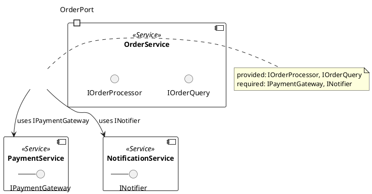
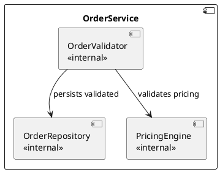

<!-- generated-by: claude-global-library/tools/project_sync -->
<!-- source: skills/uml-component-diagram-core/SKILL.md -- edit the library, then re-run sync_project.py -->

# UML Component Diagram Core

## Description

Provides authoritative UML 2.5.1 component diagram knowledge covering Component metaclasses (Component, Port, Connector, ComponentRealization, InterfaceRealization), provided and required interfaces, port typing and compatibility, connector semantics (assembly and delegation), internal component structure views, and mapping to microservices and layered architecture patterns. Generates correct PlantUML component diagrams with lollipop/socket notation, port labels, and architecture layer annotations.

## 1. UML 2.5.1 Component Metaclasses (Chapter 11.3)

**Component** -- encapsulating StructuredClassifier
- `provided: Interface[*]` -- interfaces the component realizes (provides to others)
- `required: Interface[*]` -- interfaces the component uses (requires from others)
- `packagedElement: PackageableElement[*]` -- owned classifiers encapsulated within the component
- `realization: ComponentRealization[*]` -- links to realizing classifiers

**ComponentRealization** -- links Component to the classifiers that implement it
- `realizingClassifier: Classifier[*]` -- classes that implement the component's behavior
- `abstraction: Component` -- the component being realized

**InterfaceRealization** -- BehavioredClassifier realizes Interface
- `contract: Interface` -- the interface being realized
- `implementingClassifier: BehavioredClassifier` -- the implementing class

**Port** (Chapter 11.3.4) -- typed interaction point on a Component boundary
- `type: Interface or Block` -- defines the interaction protocol
- `isService: Boolean` -- true if the port is part of the public service interface
- `isBehavior: Boolean` -- true if messages go directly to the component's behavior

**Connector** -- connects two Ports or ConnectableElements
- `end: ConnectorEnd[2..*]` -- the two (or more) connected endpoints
- ConnectorEnd: `role: ConnectableElement` + `partWithPort: Property[0..1]`
- Types: assembly connector (between parts) and delegation connector (external port to internal port)

### 1.1 Key OCL Well-formedness Constraints

```
-- All provided interfaces must be Interface metaclass instances
context Component inv:
    self.provided->forAll(i | i.oclIsKindOf(Interface))

-- All required interfaces must be Interface metaclass instances
context Component inv:
    self.required->forAll(i | i.oclIsKindOf(Interface))

-- ConnectorEnd with partWithPort must have Port as role
context ConnectorEnd inv:
    self.partWithPort->notEmpty() implies self.role.oclIsKindOf(Port)
```

## 2. Component Diagram Notation

### 2.1 Notation Elements

| Element | Notation |
|---|---|
| Component | Rectangle with component icon (two small protruding rectangles) in top-right |
| Provided interface (lollipop) | Solid circle on a short line extending from component boundary |
| Required interface (socket) | Open semicircle (socket) on a short line extending from component boundary |
| Assembly connector | Ball-and-socket junction: provided lollipop fitting into required socket |
| Port | Small square on the component boundary, labeled with port name |
| Delegation connector | Dashed arrow from external port to internal part/port |

### 2.2 PlantUML Component Diagram Example



### 2.3 Architectural Layer Stereotypes

Common stereotypes for layering (applied to Component):

| Stereotype | Layer | Typical usage |
|---|---|---|
| `<<Presentation>>` | UI tier | Web controllers, mobile screens |
| `<<Service>>` | Business logic tier | Domain services, use-case handlers |
| `<<Repository>>` | Data access tier | DAO classes, JPA repositories |
| `<<Gateway>>` | External integration tier | API clients, message producers |
| `<<Facade>>` | Simplification tier | Simplified interface to subsystem |

## 3. Microservices Mapping to UML Components

| Microservices Concept | UML Component Equivalent |
|---|---|
| Microservice | Component with `<<Service>>` stereotype |
| REST API endpoint | Provided interface (lollipop) on Port |
| External service call | Required interface (socket) on Port |
| API Gateway | Component with `<<Gateway>>` stereotype |
| Message topic (Kafka) | Interface typed as Signal or <<Signal>> component |
| Service mesh sidecar | Component nested inside service Component |
| gRPC proto contract | Interface with operation signatures |

## 4. Internal Component Structure View

The internal view (white-box) of a Component shows its contained Parts and their connections:



Internal assembly connectors show how internal parts collaborate. Delegation connectors (dashed) show which internal part handles messages arriving at an external port.

## 5. Hexagonal Architecture Mapping

The Hexagonal (Ports and Adapters) architecture maps directly to UML component notation:

- **Core domain component**: central Component with domain logic; no outgoing required interfaces to infrastructure
- **Primary ports** (driving adapters): provided interfaces on left side; e.g., `<<REST>>`, `<<CLI>>`
- **Secondary ports** (driven adapters): required interfaces on right side; e.g., `<<Database>>`, `<<MessageQueue>>`
- **Adapter components**: Components implementing primary ports or required interfaces

This separation ensures the domain component is testable in isolation by substituting secondary-port adapter components.

## India-Specific Regulatory Context

**MeitY SOA and API Guidelines:**
MeitY Service-Oriented Architecture (SOA) guidelines for e-governance applications reference UML component diagrams as the primary architecture view for API boundary documentation. The GeM (Government e-Marketplace) technical architecture documentation mandates component view diagrams for vendor integrations.

**SEBI Technology Framework:**
SEBI Circular on Technology Governance for Market Infrastructure Institutions (MIIs) requires architecture documentation for trading platforms. Component diagrams are used in SEBI audit submissions to demonstrate separation of order management, risk management, and settlement components. BSE and NSE system integration documents require component diagrams for exchange connectivity modules.

**STQC CMMI Requirements:**
STQC certification (CMMI-DEV L3 Technical Solution process area) requires that the software architecture document includes a component view showing provided and required interfaces. STQC Defence Offset assessments mandate component diagrams for security-critical subsystems.

**IT Act Section 43A Compliance:**
Component diagrams showing isolation between data-handling components and external interfaces serve as architecture evidence for IT Act Section 43A (SPDI Rules 2011) compliance audits. Demonstrates that sensitive personal data is processed only within controlled components with documented interfaces.

**BIS IS/ISO 19505-2:2012:**
Component metaclass specification (Chapter 11.3) is normatively covered by IS/ISO 19505-2 adopted by BIS. NASSCOM SSC/Q0502 NSQF Level 7 competency includes component diagram authoring for system architects.

## Deep Mathematical Foundations

### M1: Interface Signature Algebra

**Formal interface definition:** Interface I = (name, ops) where:
    ops = {op_1, op_2, ..., op_n}
    op_i = (op_name_i, in_params_i: List[Type], out_params_i: List[Type], exceptions_i: List[Type])

**Provided and required sets for a Component C:**
    provided(C) = {I_1, ..., I_k}  (interfaces C realizes and offers to others)
    required(C) = {J_1, ..., J_m}  (interfaces C uses and expects from others)

**Interface conformance:** Component C conforms to Interface I iff:
    I in provided(C) and for all op in I.ops, C contains an operation matching op's signature

**Worked example -- 2-interface component:**

Interface IOrderProcessor: ops = {placeOrder(cart: Cart, user: User): OrderId, cancelOrder(id: OrderId): void}
Interface IOrderQuery: ops = {findOrder(id: OrderId): Order, listOrders(user: User): List[Order]}

Component OrderService:
    provided(OrderService) = {IOrderProcessor, IOrderQuery}
    required(OrderService) = {IPaymentGateway, INotificationService}

OrderService must implement all operations of IOrderProcessor AND IOrderQuery. It must be wired to components providing IPaymentGateway and INotificationService.

### M2: Port-Connector Typed Graph

**Formal definition:** A component architecture is a typed graph CG = (C, P, K) where:
- C = set of component nodes
- P = set of port nodes with type function tau: P -> Interface and direction function dir: P -> {provided, required}
- K = set of connector edges, each connecting two compatible ports

**Port ownership:** Each port p in P is owned by exactly one component: owner: P -> C

**Compatibility predicate:** Two ports p_1 and p_2 are compatible for an assembly connector iff:
    dir(p_1) = provided AND dir(p_2) = required AND tau(p_1) conforms_to tau(p_2)

Or symmetrically:
    dir(p_1) = required AND dir(p_2) = provided AND tau(p_2) conforms_to tau(p_1)

**Conformance relation on interfaces:** Interface I_1 conforms_to Interface I_2 iff:
    for all op in I_2.ops, there exists op' in I_1.ops with matching signature (structural subtyping)

**Worked example -- 3-component typed graph:**

Components: OrderService (O), PaymentService (P), NotificationService (N)
Ports:
- O.paymentPort: type=IPaymentGateway, dir=required
- P.gatewayPort: type=IPaymentGateway, dir=provided
- O.notifyPort: type=INotifier, dir=required
- N.notifyPort: type=INotifier, dir=provided

Connectors: K = {(O.paymentPort, P.gatewayPort), (O.notifyPort, N.notifyPort)}
Both connectors are compatible: IPaymentGateway conforms_to IPaymentGateway (identity); INotifier conforms_to INotifier.

### M3: Component Substitutability (Liskov at Component Level)

**Component-level LSP:** Component C_2 substitutes C_1 in an architecture iff:
    provided(C_2) SUPERSET_OF provided(C_1)  AND  required(C_2) SUBSET_OF required(C_1)

Intuition:
- C_2 provides at least everything C_1 provided (clients lose no functionality)
- C_2 requires at most what C_1 required (environment needs to supply no more)

**Worked example -- substitutability check for 2 service versions:**

Component OrderServiceV1:
    provided = {IOrderProcessor}
    required = {IPaymentGateway, INotificationService}

Component OrderServiceV2:
    provided = {IOrderProcessor, IOrderQuery}
    required = {IPaymentGateway}

Substitutability check:
    provided(V2) = {IOrderProcessor, IOrderQuery} SUPERSET_OF {IOrderProcessor} = provided(V1) -- PASS
    required(V2) = {IPaymentGateway} SUBSET_OF {IPaymentGateway, INotificationService} = required(V1) -- PASS

Result: OrderServiceV2 substitutes OrderServiceV1. V2 offers more functionality and requires less from the environment. No wiring changes needed for existing clients.

### M4: Internal Structure as Composite Graph

**Two-level graph for internal component structure:**

Outer level: Component C with external ports E = {e_1, ..., e_j}

Inner level: Parts {p_1, ..., p_n} each of type T_i with multiplicity m_i, having internal ports {i_{k,l}}

**Delegation connectors (outer -> inner):** For each external port e_k:
    delegation(e_k) = i_{part, port}  where i is an internal port of some part

**Assembly connectors (inner <-> inner):** For parts p_a, p_b:
    assembly(i_{a, port_x}) connects to i_{b, port_y}  where compatible(type(port_x), type(port_y))

**Worked example -- 3-tier web app component internal structure:**

Component WebApplication:
    External ports: [UserPort: IUserInterface (provided), DatabasePort: IDatabase (required)]

    Internal parts:
    - presentationLayer: PresentationComponent (handles UserPort)
    - serviceLayer: ServiceComponent (business logic)
    - dataAccessLayer: DataAccessComponent (handles DatabasePort)

    Delegation connectors:
    - UserPort (external provided) -> PresentationPort (internal provided on presentationLayer)
    - DatabasePort (external required) -> DataPort (internal required on dataAccessLayer)

    Assembly connectors:
    - PresentationLayer.servicePort (required IService) <-> ServiceLayer.servicePort (provided IService)
    - ServiceLayer.dataPort (required IDataAccess) <-> DataAccessLayer.dataPort (provided IDataAccess)

### M5: Delegation Connector Semantics

**Formal delegation routing:** A delegation connector D consists of:
    D = (external_port e, internal_port i, direction dir)

For provided delegation (dir = provided):
    Messages arriving at external port e are forwarded to internal port i of a part:
    route_provided(msg, e) = i_{part, port}

For required delegation (dir = required):
    Messages sent from internal port i are forwarded to external port e:
    route_required(msg, i) = e

**Message routing trace for a 3-hop request:**

1. Client sends `placeOrder(cart, user)` to OrderService.OrderPort (external provided port)
2. Delegation connector forwards to OrderValidator.inPort (internal provided port of OrderValidator part)
3. OrderValidator sends `validatePricing(cart)` to PricingEngine.pricingPort (assembly connector, required -> provided)
4. PricingEngine returns `PricedCart` to OrderValidator via assembly connector
5. OrderValidator sends `persistOrder(pricedCart)` to OrderRepository.repoPort (assembly connector)
6. OrderRepository forwards `save(order)` to external DatabasePort (required delegation connector)
7. DatabasePort sends to external database component

Formal trace: external_in(e_order) -> delegate -> internal(validator) -> assemble -> internal(pricing) -> assemble -> internal(repo) -> delegate -> external_out(e_db)

### M6: Design Structure Matrix for Component Coupling

**DSM definition:** For n components C_1, ..., C_n, the Design Structure Matrix M is an n x n binary matrix where:
    M[i][j] = 1  iff  component C_j depends on component C_i  (C_j requires an interface provided by C_i)
    M[i][i] = 0  (no self-dependency)

**Reachability matrix:** R = (I + M)^n computed using boolean matrix arithmetic (OR for addition, AND for multiplication), where I is the identity matrix. R[i][j] = 1 iff C_j transitively depends on C_i.

**SCC detection from DSM:** A set of components S forms a circular dependency iff:
    for all C_i, C_j in S: R[i][j] = 1 AND R[j][i] = 1

**Worked example -- 4-component system with cycle:**

Components: Presentation(P), Service(S), Repository(R), Domain(D)

Dependencies: P depends on S; S depends on R and D; R depends on D (and improperly depends on S to create cycle)

M matrix (M[i][j] = 1: column j depends on row i):
```
       P   S   R   D
P  [   0   1   0   0  ]
S  [   0   0   1   0  ]  (R depends on S -- creates cycle S->R->S)
R  [   0   0   0   1  ]
D  [   0   0   0   0  ]
```

Wait: for cycle S <-> R: S depends on R (M[R][S] = 1) AND R depends on S (M[S][R] = 1).

Reachability R^4 reveals: R[S][R] = 1 AND R[R][S] = 1 => S and R form an SCC. Cycle detected.

Resolution: introduce interface IRepository in Domain layer; both S and R depend on it.

## Anti-Patterns to Avoid

1. **Declaring interface conformance without checking every operation's full signature**: M1's conformance rule requires that for every op in I.ops, C contains an operation matching op's signature — name, parameter types, return type, and exceptions all included. Verifying only the operation name (e.g. both declare `placeOrder`) while ignoring a mismatched parameter or return type produces a component that appears to conform on the diagram but fails at wiring/compile time.

2. **Wiring an assembly connector between two ports with the same direction**: M2's compatibility predicate requires one port to be `provided` and the other `required` (with conforming types) — two required ports or two provided ports cannot form a valid assembly connector regardless of type match. This is easy to miss when a diagram's port direction arrows are small or omitted.

3. **Treating interface conformance as symmetric (name equality) instead of the directional subtyping in M2**: `conforms_to` requires that for all op in I_2.ops, there exists op' in I_1.ops with a matching signature — this is a one-directional structural-subtyping check, not mutual equivalence. A required port typed by a superset interface can conform to a provided port typed by a subset interface, but not necessarily the reverse; diagramming the connector as if conformance were symmetric can hide real incompatibilities.

4. **Approving a component substitution using only the "provides more" half of the M3 LSP check**: substitutability requires BOTH provided(C_2) ⊇ provided(C_1) AND required(C_2) ⊆ required(C_1). A new component version that provides a superset of interfaces but ALSO requires a new dependency the environment doesn't supply fails substitutability even though the "provides more" half looks like an improvement.

5. **Omitting delegation connectors between an external port and its actually-handling internal part**: M4's two-level composite graph requires every external port e_k to have an explicit `delegation(e_k) = i_{part,port}` mapping to a real internal port. Drawing an external port on the outer component boundary without a delegation connector to any internal part leaves the port's implementation undefined in the diagram.

6. **Assuming a delegation connector and an assembly connector are interchangeable**: M5 distinguishes them by direction and endpoint kind — delegation always connects an external port to an internal port of the SAME component (routing inward/outward across the boundary), while assembly always connects two internal ports of DIFFERENT parts within the same component. Using an assembly-style bidirectional connector where a directional delegation is required loses the message-routing semantics M5's trace depends on.

7. **Computing the DSM reachability matrix with ordinary (not boolean) matrix arithmetic**: M6's R = (I+M)^n uses OR-for-addition, AND-for-multiplication boolean semantics specifically because dependency reachability is a yes/no relation, not a count. Using standard integer matrix multiplication produces path-count values that must still be thresholded to a boolean, and can overflow or be misread as a "strength of dependency" that the formalism doesn't actually define.

8. **Detecting circular component dependencies by inspection on large systems instead of computing R[i][j] AND R[j][i]**: M6's worked example shows a cycle (S↔R) that only becomes visible once the FULL reachability matrix is computed to power n, not just direct M-matrix entries — a component's cyclical dependency can be several hops removed and invisible from the direct dependency list alone.

9. **Introducing a shared "fix" interface for a detected cycle without verifying it actually breaks the cycle**: M6's resolution (introducing IRepository so both S and R depend on it instead of each other) only works because the new dependency direction is one-way from both former cycle members to the new interface. Adding a shared interface that either former member still depends on the OTHER member through does not eliminate the SCC — recompute R after any proposed fix rather than assuming introducing an interface is sufficient by itself.

10. **Mapping a microservice to a UML Component without distinguishing provided vs. required interfaces at the port level**: per §3's microservices mapping, a component-diagram representation of a microservice needs its ports typed and directioned (M2) to be useful for wiring/substitutability analysis (M3) — a component box with unlabeled or undirected ports discards exactly the information the rest of this skill's math depends on.

---

## Response Rules

1. Cite Chapter 11.3 of UML 2.5.1 spec when referencing Component metaclass rules.
2. Distinguish provided interface (lollipop) from required interface (socket) -- never swap them.
3. Show port type (interface name) when drawing ports; port labels clarify contracts.
4. Apply Liskov Substitutability check when a component is being replaced or versioned.
5. Run DSM cycle detection mentally for any component dependency graph -- flag cycles.
6. Map microservice concepts to UML metaclasses explicitly (service -> Component, REST API -> provided Interface).
7. For internal structure views, show both delegation and assembly connectors.
8. For India context, cite MeitY SOA guidelines and SEBI technology framework when relevant.
9. Annotate components with architecture-layer stereotypes (`<<Service>>`, `<<Repository>>`, etc.).
10. Delegate formal type-theoretic substitutability proofs to uml-diagram-mathematics-expert.

## What Not to Do

- Do not confuse Component (UML metaclass, Chapter 11.3) with the informal word "component" meaning any module.
- Do not show component internals in external/black-box views -- choose one perspective per diagram.
- Do not model microservice REST endpoints as operations on a class -- model them as provided interfaces on a component with Port.
- Do not allow circular component dependencies without flagging them via DSM cycle detection.
- Do not omit required interfaces -- incomplete interface contracts mislead architects about runtime coupling.
- Do not draw assembly connectors between ports of incompatible types without noting the type mismatch.
- Do not use component diagrams for database schema structure -- use class diagrams or ER diagrams instead.
- Do not generate placeholder interface names like `IServiceX` -- use meaningful domain-specific names.

## Output Expectations

For component diagram requests, produce:
1. PlantUML code block showing all components with provided (lollipop) and required (socket) interfaces, labeled ports, and connectors.
2. Substitutability analysis if a component replacement is being considered (provided superset, required subset check).
3. DSM or dependency table listing pairwise coupling relationships.
4. Cycle detection result for the component dependency graph.
5. India compliance note citing STQC SAD component view requirements, MeitY SOA guidelines, or SEBI technology framework when context is applicable.
6. Architecture layer annotation using standard stereotypes.

## Skill Scope

**In scope:**
- UML 2.5.1 component diagram metaclasses (Chapter 11.3)
- Port typing, assembly and delegation connectors
- Component substitutability (component-level LSP)
- Internal component structure view (composite graph)
- Microservices and hexagonal architecture mapping to UML components
- India regulatory context (MeitY SOA, SEBI, STQC, BIS IS/ISO 19505-2)

**Out of scope:**
- Package namespace organization -- see uml-package-diagram-core skill
- Deployment node mapping -- see uml-deployment-diagram-core skill
- Draw.io XML generation -- see drawio-xml-generation-core skill
- Formal type-theoretic substitutability proofs -- delegate to uml-diagram-mathematics-expert

## Version

1.1.0 -- Added Anti-Patterns to Avoid section (10 bullets grounded in M1-M6)
1.0.0 -- Initial release, Domain 46 UML and Diagram Engineering