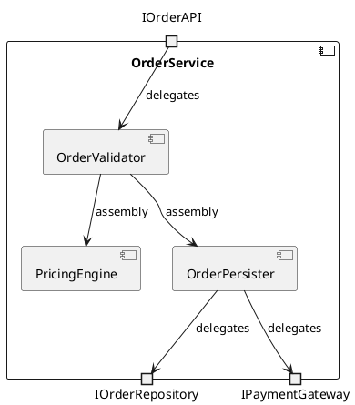

<!-- generated-by: claude-global-library/tools/project_sync -->
<!-- source: skills/uml-composite-structure-core/SKILL.md -- edit the library, then re-run sync_project.py -->

# UML Composite Structure Diagram Core

## Description

Provides authoritative UML 2.5.1 composite structure diagram knowledge covering StructuredClassifier metaclasses (StructuredClassifier, Part, Port, Connector, ConnectorEnd, Collaboration, CollaborationUse), part multiplicity, connector type system (assembly vs delegation), collaboration role binding and substitution, and design pattern application models. Generates correct PlantUML composite structure diagrams with port squares, connector lines, part notation, and collaboration use annotations.

## 1. UML 2.5.1 Composite Structure Metaclasses (Chapters 11.2-11.4)

**StructuredClassifier** (Chapter 11.2) -- abstract Classifier owning internal structure
- `ownedAttribute: Property[*]` -- includes both regular attributes and parts
- `ownedConnector: Connector[*]` -- connectors linking ports and parts within this classifier

**Part** -- a Property with `isComposite = true` owned by a StructuredClassifier
- `type: Classifier` -- the type of the part (determines its interface and behavior)
- `multiplicity: (lower, upper)` -- how many instances of this part exist at runtime

**Collaboration** (Chapter 11.4) -- StructuredClassifier describing a cooperation pattern
- `collaborationRole: ConnectableElement[*]` -- the roles in the collaboration
- Notation: dashed oval or dashed rectangle with the collaboration name

**CollaborationUse** -- applies a Collaboration to a Classifier via role bindings
- `type: Collaboration` -- the collaboration being applied
- `roleBinding: Dependency[*]` -- maps Collaboration roles to Classifier features

**ConnectorEnd** -- one endpoint of a Connector
- `role: ConnectableElement` -- the Part or Port connected at this end
- `partWithPort: Property[0..1]` -- if the role is a Port, this identifies which Part's port

**Port** (same metaclass as in component diagram -- Chapter 11.3)
- `type: Interface or Block` -- defines interaction protocol
- Notation: small square on the boundary of the containing classifier

### 1.1 Key OCL Well-formedness Constraints

```
-- All connectors must have exactly 2 ends in standard binary connectors
context StructuredClassifier inv:
    self.ownedConnector->forAll(c | c.end->size() = 2)

-- ConnectorEnd: if partWithPort is set, role must be a Port
context ConnectorEnd inv:
    self.partWithPort->notEmpty() implies self.role.oclIsKindOf(Port)

-- Collaboration must have at least one role
context Collaboration inv:
    self.collaborationRole->size() >= 1
```

## 2. Composite Structure Notation Rules

### 2.1 Part Notation

A Part is shown as a rectangle inside the containing Classifier boundary:

```
+-------------------------------------------+
| OrderService                              |
|                                           |
|  +-----------------------+                |
|  | validator : OrderValidator  |          |
|  |  [1]                  |               |
|  +-----------------------+                |
|                                           |
|  +-----------------------+                |
|  | pricer : PricingEngine  |              |
|  |  [1]                  |               |
|  +-----------------------+                |
|                                           |
|  +-----------------------+                |
|  | repo : IOrderRepository  |             |
|  |  [1]                  |               |
|  +-----------------------+                |
+-------------------------------------------+
```

Part label format: `partName : TypeName [multiplicity]`

### 2.2 Port Notation

Ports appear as small squares on the boundary of a Part or Classifier:

- Provided port (offers service): square on boundary, labeled with interface name or port name
- Required port (needs service): square on boundary, often with socket notation

### 2.3 Connector Notation

Assembly connector: solid line between two ports/parts of different parts within the same StructuredClassifier. Shows internal wiring.

Delegation connector: dashed line from an external Port of the containing Classifier to an internal Port of a Part. Shows which part handles external communications.

## 3. PlantUML Composite Structure Example

PlantUML does not have native composite structure syntax; use component diagram syntax to approximate:



For draw.io, use StructuredClassifier shapes with nested rectangles for parts and small squares for ports, connected by lines.

## 4. Collaboration and Design Pattern Application

### 4.1 Collaboration Definition (Observer Pattern)

```
Collaboration: Observer
  Roles:
    - subject: Subject  (the observable entity)
    - observer: Observer  (the observing entity)
  Connectors:
    - subject notifies observer when state changes
```

### 4.2 CollaborationUse in StockTracker

A CollaborationUse maps Collaboration roles to concrete features:

```
Classifier: StockTracker
  CollaborationUse: ObserverPattern (type = Observer collaboration)
    RoleBindings:
      - subject -> StockTracker.priceEngine  (part priceEngine plays subject role)
      - observer -> StockTracker.alertService  (part alertService plays observer role)
```

### 4.3 GoF Pattern Mapping

| Design Pattern | Collaboration Roles | Composite Structure Application |
|---|---|---|
| Observer | Subject, Observer | Subject part notifies Observer parts via connectors |
| Strategy | Context, Strategy | Context part has required port typed by Strategy interface |
| Template Method | AbstractClass, ConcreteClass | AbstractClass has internal ConcreteClass part |
| Composite | Component, Leaf, Composite | Composite has parts of type Component[0..*] (recursive) |
| Decorator | Component, ConcreteComponent, Decorator | Decorator wraps Component part via delegation |
| Command | Invoker, Command, Receiver | Invoker has required port typed by Command; Command has Receiver part |

## 5. Structured Classifier White-Box View

The composite structure diagram is the primary white-box (internal) view of a complex class or component. It shows:

1. Which concrete classes (Parts) implement the classifier's behavior
2. How these parts are wired together (assembly connectors)
3. How external ports delegate to internal parts (delegation connectors)
4. Multiplicity of each part (how many instances are created at runtime)

This contrasts with the class diagram (what features the classifier has) and the component diagram (what interfaces it provides/requires at the black-box level).

## India-Specific Regulatory Context

**Enterprise Architecture in Indian IT Industry:**
Enterprise architecture frameworks used by Indian IT majors (TCS, Infosys, Wipro, HCL) use composite structure diagrams for framework internal documentation. TCS BaNCS, Infosys Finacle, and Wipro HOLMES framework documentation includes composite structure views for their core processing engines.

**NASSCOM EA Working Group:**
NASSCOM Enterprise Architecture Working Group reference architecture for Indian banking and financial services uses composite structure diagrams to document service mesh patterns and internal microservice collaborations. These are cited in NASSCOM BFSI digital transformation playbooks.

**STQC CMMI L4/L5 Requirements:**
STQC certification at CMMI-DEV Level 4 (Quantitative Project Management) and Level 5 (Organizational Performance Management) requires that framework and platform components have detailed internal structure documentation. Composite structure diagrams satisfy this requirement.

**NASSCOM SSC/Q0502 Advanced Design:**
NASSCOM NSQF Level 7 (Software Architect) competency explicitly includes composite structure diagram authoring as part of advanced UML modeling skills. This is the highest NSQF level in the SSC/Q0502 qualification framework for software design.

**BIS IS/ISO 19505-2:2012:**
Composite structure diagram metaclasses (StructuredClassifier, Part, Connector, Collaboration) are normatively specified in Chapters 11.2-11.4 of IS/ISO 19505-2 adopted by BIS. Applicable to all BIS-compliant software architecture documentation in India.

**IT Act Section 43A:**
Composite structure diagrams documenting the internal structure of security modules (authentication engines, encryption components) serve as architecture evidence for ISO 27001 compliance under IT Act Section 43A, demonstrating defense-in-depth design.

## Deep Mathematical Foundations

### M1: Structured Classifier as a Port-Hypergraph

**Formal definition:** A StructuredClassifier SC is represented as a port-hypergraph H = (V, P, E_h) where:
- V = set of part nodes: V = {p_1, ..., p_n} (each p_i: (name, type: Classifier, multiplicity))
- P = set of port nodes with ownership: P subset V x Interface (each port has an owning part and a type)
- E_h = set of connectors (hyperedges): each c in E_h connects a subset of P (typically |c.endpoints| = 2)

**Port ownership function:** own: P -> V maps each port to its owning part.

**Hyperedge property:** A connector c = (p_a, p_b) connects ports p_a on part V_a and p_b on part V_b.

**Bipartite interpretation:** The port-hypergraph is bipartite between parts (V) and ports (P), with incidence relation: part V_i is incident to port p_j iff own(p_j) = V_i.

**Worked example -- 3-part web tier:**

SC: WebApplication
Parts: V = {presentation: PresentationLayer [1], service: ServiceLayer [1], persistence: PersistenceLayer [1]}
Ports:
  P = {presentation.httpIn: IHttpRequest (provided),
       presentation.servicePort: IService (required),
       service.serviceIn: IService (provided),
       service.persistPort: IDataAccess (required),
       persistence.dataIn: IDataAccess (provided)}
Connectors (E_h):
  c_1 = {presentation.servicePort, service.serviceIn}  (assembly: presentation -> service)
  c_2 = {service.persistPort, persistence.dataIn}       (assembly: service -> persistence)

Hypergraph degree: |E_h| = 2 connectors; each connector has degree 2 (binary connectors in this example).

### M2: Part Multiplicity Bounds

**Formal multiplicity constraint:** For each Part p_i in StructuredClassifier SC with multiplicity (lower_i, upper_i):

    runtime_constraint: |{instances of p_i at runtime}| in [lower_i, upper_i]

where upper_i may be * (unbounded = UnlimitedNatural::infinite).

**Multiplicity violation:** A violation occurs when at runtime:
    count < lower_i  (too few parts -- composition invariant violated)
    count > upper_i  (too many parts -- where upper_i is not *)

**OCL constraint encoding for a part with multiplicity 1..3:**
```
context StructuredClassifier inv:
    self.worker->size() >= 1 and self.worker->size() <= 3
```

**Worked example -- multiplicity constraint verification:**

Part: handlers: RequestHandler [2..4]
At runtime: 3 handler instances exist.
Verification: 2 <= 3 <= 4 -- VALID.

If only 1 handler exists: 1 < 2 -- VIOLATION (minimum cardinality not met).
If 5 handlers exist: 5 > 4 -- VIOLATION (maximum cardinality exceeded).

**Common multiplicity patterns:**
| Multiplicity | Meaning for a Part |
|---|---|
| `1` | Singleton part (exactly one instance always) |
| `0..1` | Optional part (may or may not be instantiated) |
| `0..*` | Dynamic collection (any number, including zero) |
| `1..*` | Non-empty collection (at least one required) |
| `n` | Fixed-size pool of n instances |

### M3: Connector Type System

**Assembly connector formal definition:** An assembly connector kappa_a = (end_1, end_2) where:
    end_1 is a required port p_r of part P_1 with type tau(p_r) = I_required
    end_2 is a provided port p_p of part P_2 with type tau(p_p) = I_provided

**Type compatibility rule for assembly:**
    compatible_assembly(kappa_a) iff I_provided conforms_to I_required
    where I_1 conforms_to I_2 iff I_1.ops SUPERSET_OF I_2.ops (I_1 provides all ops I_2 requires)

**Delegation connector formal definition:** A delegation connector kappa_d = (e_ext, i_int, dir) where:
    e_ext is an external port of the StructuredClassifier SC
    i_int is an internal port of a Part p_i of SC
    dir in {provided, required}

For provided delegation (dir = provided):
    Messages arriving at e_ext are forwarded to i_int
    Required: tau(i_int) conforms_to tau(e_ext)  (internal port can handle what external port receives)

For required delegation (dir = required):
    Messages sent from i_int are forwarded to e_ext
    Required: tau(e_ext) conforms_to tau(i_int)  (external port can route what internal port sends)

**Worked example -- assembly vs delegation distinction:**

StructuredClassifier: OrderService
External provided port e_api: type = IOrderProcessor
External required port e_repo: type = IRepository

Internal parts:
  validator: OrderValidator with ports {validIn: IOrderProcessor (provided), validOut: IValidatedOrder (provided)}
  persister: OrderPersister with ports {persIn: IValidatedOrder (required), dbOut: IRepository (required)}

Delegation connectors:
  kappa_d1 = (e_api, validator.validIn, provided): messages from clients -> validator
  kappa_d2 = (persister.dbOut, e_repo, required): persister's DB calls go out through e_repo

Assembly connector:
  kappa_a = (validator.validOut, persister.persIn): IValidatedOrder (provided) wires to IValidatedOrder (required)

Type checks:
  kappa_d1: tau(validator.validIn) = IOrderProcessor conforms_to tau(e_api) = IOrderProcessor -- PASS
  kappa_a: tau(validator.validOut) = IValidatedOrder conforms_to tau(persister.persIn) = IValidatedOrder -- PASS

### M4: Collaboration Formal Definition

**Formal definition:** A Collaboration C = (Roles, Connectors) where:
- Roles = {r_1, ..., r_n} (typed role occurrences; each r_i has type: Classifier and name: String)
- Connectors = {kappa_1, ..., kappa_m} (role-level connectors between roles)

**CollaborationUse:** A CollaborationUse CU = (context_classifier, collaboration, bindings) where:
- context_classifier: Classifier -- the classifier to which the collaboration is applied
- collaboration: Collaboration -- the collaboration being applied
- bindings: {(r_i, f_j)} -- mapping from Collaboration roles to Classifier features (parts or ports)

**Binding well-formedness:**
    for all r_i in Roles: exists f_j in context_classifier.features such that (r_i, f_j) in bindings

**Observer Pattern as Collaboration:**

Collaboration ObserverPattern:
    Roles = {subject: Subject, observer: Observer}
    Connectors = {kappa: (subject.notify_out, observer.update_in)}
        where subject.notify_out: required {void update()} and observer.update_in: provided {void update()}

CollaborationUse in StockMarketApp:
    context_classifier = StockMarketApp
    collaboration = ObserverPattern
    bindings = {(subject, priceEngine: PriceEngine part), (observer, alertService: AlertService part)}

The binding maps the abstract 'subject' role to the concrete priceEngine part, and 'observer' to alertService.

### M5: Role Binding Substitution

**Substitution function:** beta: CollaborationRoles -> ClassifierFeatures (total function)

**Substitution correctness:**

(1) Completeness: dom(beta) = Roles (all roles are bound):
    for all r_i in Roles, beta(r_i) is defined

(2) Type compatibility: for all r_i in Roles:
    type(beta(r_i)) <=_C type(r_i)
    (the bound classifier feature's type conforms to the role's type)

(3) Connector preservation: for each connector kappa = (r_i.p_a, r_j.p_b) in Collaboration:
    there exists a connector or communication path between beta(r_i).p_a' and beta(r_j).p_b'
    in the context_classifier's internal structure

**Worked example -- Strategy Pattern role binding:**

Collaboration Strategy:
    Roles = {context: Context, strategy: IStrategy}
    Connectors = {kappa: (context.strategyPort, strategy.executePort)}

Context role type: Context (has strategyPort: IStrategy required)
Strategy role type: IStrategy (has executePort: IStrategy provided)

CollaborationUse in DataProcessor:
    context_classifier = DataProcessor
    bindings:
      beta(context) = DataProcessor.processorCore  (part processorCore: ProcessorCore [1])
      beta(strategy) = DataProcessor.algorithmSlot  (part algorithmSlot: IAlgorithm [1])

Type compatibility checks:
  type(processorCore) = ProcessorCore; type(context) = Context; ProcessorCore <=_C Context -- PASS (ProcessorCore implements Context interface)
  type(algorithmSlot) = IAlgorithm; type(strategy) = IStrategy; IAlgorithm <=_C IStrategy -- PASS (IAlgorithm is a refinement of IStrategy)

### M6: Design Pattern Application Model

**Pattern application definition:** A PatternApplication PA = (pattern, context, beta) where:
- pattern: Collaboration -- the GoF or custom pattern
- context: Classifier -- the classifier in which the pattern is instantiated
- beta: complete role binding substitution (as defined in M5)

**GoF Composite Pattern application model:**

Pattern Composite:
    Roles = {component: IComponent, leaf: Leaf, composite: Composite}
    Connectors:
      kappa_1 = (composite.children_port, component.component_port): Composite[*] contains Component[*]

PatternApplication in FileSystem:
    context = FileSystem
    pattern = Composite
    bindings:
      beta(component) = FileSystem.fsNode: FileSystemNode [1..*]  (abstract base)
      beta(leaf) = FileSystem.file: File [0..*]                   (File implements FileSystemNode)
      beta(composite) = FileSystem.directory: Directory [0..*]    (Directory contains FileSystemNode[*])

Recursive structure: Directory.children: FileSystemNode [0..*]
The composite pattern's self-referential structure (composite contains components which may be composites) maps to the recursive Part multiplicity.

**Observer Pattern application model:**

PatternApplication in EventSystem:
    context = EventSystem
    pattern = ObserverPattern
    bindings:
      beta(subject) = EventSystem.eventBus: EventBus [1]
      beta(observer) = EventSystem.subscribers: ISubscriber [0..*]

Multiplicity of observer role: 0..* (zero or more subscribers at runtime).

**Strategy Pattern application model:**

PatternApplication in SortEngine:
    context = SortEngine
    pattern = Strategy
    bindings:
      beta(context) = SortEngine.sorter: Sorter [1]     (context part)
      beta(strategy) = SortEngine.algorithm: ISortAlgorithm [1]  (pluggable strategy)

The algorithm slot can be replaced at runtime (Setter Injection) -- the multiplicity 1 means exactly one strategy is active at any time.

## Anti-Patterns to Avoid

1. **Drawing a connector directly between two parts instead of between their ports**: M1's port-hypergraph formalism defines connectors as edges between PORTS (P), not parts (V) — `own: P -> V` is the incidence relation, and a connector's endpoints must be port nodes. A diagram wiring `part_a` straight to `part_b` without going through declared ports loses the interface-typed contract the connector is supposed to enforce.

2. **Checking only the lower bound of a part's multiplicity**: M2's runtime constraint requires count ∈ [lower_i, upper_i] — both bounds matter. The worked example shows a violation can occur either by having too few instances (count < lower_i) OR too many (count > upper_i, when upper_i isn't `*`); verifying only that "at least one instance exists" misses over-cardinality violations.

3. **Wiring an assembly connector where the required interface's operations exceed the provided interface's operations**: M3's compatible_assembly rule requires `I_provided conforms_to I_required`, meaning I_provided.ops must be a SUPERSET of I_required.ops (the provider offers everything the requirer needs, and may offer more). A provided interface offering fewer operations than what's required produces an assembly connector that looks wired but can't actually satisfy every call the requiring port might make.

4. **Confusing assembly and delegation connector direction requirements**: M3 gives delegation two DIFFERENT conformance directions depending on dir — provided delegation requires `tau(i_int) conforms_to tau(e_ext)`, required delegation requires the OPPOSITE (`tau(e_ext) conforms_to tau(i_int)`). Applying the provided-delegation conformance check to a required-delegation connector (or vice versa) validates the wrong direction and can pass a genuinely broken wiring.

5. **Leaving a Collaboration role unbound in a CollaborationUse**: M4's binding well-formedness requires `for all r_i in Roles: exists f_j ... such that (r_i, f_j) in bindings` — every declared role must map to a concrete classifier feature. A CollaborationUse that binds only some of the pattern's roles (e.g. binding `subject` but leaving `observer` unbound) is an ill-formed pattern application, not a partially-applied one.

6. **Treating role-binding type compatibility as name-matching instead of the M5 conformance check**: `type(beta(r_i)) <=_C type(r_i)` is a structural subtyping check, not string equality on type names. Binding a role to a part whose type merely has a similar name (but doesn't actually conform, e.g. missing required operations) passes a superficial review but fails M5's actual well-formedness rule.

7. **Omitting connector preservation when binding a Collaboration's roles**: M5's condition (3) requires that for every connector between two roles in the abstract Collaboration, a CORRESPONDING connector or communication path must exist between the bound parts in the concrete context classifier's internal structure. Binding all roles individually without verifying the abstract pattern's own wiring is reproduced concretely produces a "pattern application" that doesn't actually implement the pattern's interaction.

8. **Modeling the GoF Composite pattern's recursive structure with a fixed, non-recursive multiplicity**: M6's Composite application shows `Directory.children: FileSystemNode [0..*]` — the self-referential structure (a composite containing components which may themselves be composites) requires the recursive typing to be preserved. Flattening the model to a fixed two-level Directory→File structure loses the pattern's defining recursive-containment property.

9. **Assuming a Strategy-pattern role binding with multiplicity 1 permits multiple simultaneously-active strategies**: M6's Strategy application states the algorithm slot's multiplicity of 1 means exactly one strategy is active at any time (even though it can be swapped via setter injection at runtime). Diagramming or implementing a "strategy pool" with multiplicity 0..* where the pattern's semantics call for exactly one active strategy misrepresents the pattern.

10. **Applying the M6 PatternApplication model without a complete M5 role-binding substitution**: M6 defines PatternApplication as `(pattern, context, beta)` where beta is explicitly "a complete role binding substitution" — an incomplete or type-incompatible beta (violating either M5 condition (1) completeness or (2) type compatibility) means the pattern application itself is ill-formed, not merely under-documented.

---

## Response Rules

1. Cite Chapters 11.2-11.4 of UML 2.5.1 when referencing StructuredClassifier, Part, and Collaboration metaclasses.
2. Show parts as named rectangles with `partName : TypeName [multiplicity]` inside the containing classifier.
3. Show ports as small squares on part boundaries; label with interface type.
4. Distinguish assembly connectors (solid line, between internal parts) from delegation connectors (dashed line, external port to internal part).
5. For collaboration application, always show the full role binding substitution (which concrete feature maps to which role).
6. Verify type compatibility at all connector ends (provided type conforms to required type).
7. Check part multiplicity constraints (lower and upper bounds are satisfied in examples).
8. For design pattern documentation, use the PatternApplication model (pattern, context, beta).
9. For India context, cite STQC CMMI L4/L5 requirements and NASSCOM NSQF Level 7 architect competency.
10. Delegate formal substitution correctness proofs and port-graph hyperedge matching algorithms to uml-diagram-mathematics-expert.

## What Not to Do

- Do not confuse composite structure diagram (internal white-box view) with component diagram (black-box interface view) -- they serve different purposes.
- Do not show class attributes and operations in part boxes -- parts show structural containment, not feature lists.
- Do not omit port type labels -- unlabeled ports make connector compatibility unverifiable.
- Do not draw connectors between incompatible port types without flagging the type mismatch.
- Do not omit part multiplicity -- `[1]` is not the same as `[0..*]` and must be specified.
- Do not model database schema or deployment topology in composite structure -- use class or deployment diagrams.
- Do not create CollaborationUse without showing the role binding substitution -- incomplete bindings are ill-formed.
- Do not use composite structure to show temporal behavior -- use sequence or activity diagrams for that.

## Output Expectations

For composite structure diagram requests, produce:
1. Textual description of the internal structure (parts with types and multiplicities, ports with types, connectors with types).
2. PlantUML approximation using component diagram syntax, annotated with part/port labels.
3. Connector type compatibility verification (assembly and delegation connectors checked against port types).
4. Collaboration definition and CollaborationUse role binding table if a design pattern is applied.
5. Part multiplicity compliance check: all examples satisfy (lower <= count <= upper).
6. India compliance note citing STQC CMMI L4/L5 requirements and NASSCOM NSQF Level 7 when context is applicable.

## Skill Scope

**In scope:**
- UML 2.5.1 composite structure diagram metaclasses (Chapters 11.2-11.4)
- Part, Port, Connector (assembly and delegation) semantics and notation
- Collaboration, CollaborationUse, and role binding substitution
- Design pattern application modeling (GoF patterns in composite structure)
- India regulatory context (STQC CMMI L4/L5, NASSCOM NSQF Level 7, BIS IS/ISO 19505-2)

**Out of scope:**
- Component diagram black-box views -- see uml-component-diagram-core skill
- Class diagram feature specification -- see uml-class-diagram-core skill
- Draw.io XML generation -- see drawio-xml-generation-core skill
- Formal port-graph hyperedge matching proofs -- delegate to uml-diagram-mathematics-expert

## Version

1.1.0 -- Added Anti-Patterns to Avoid section (10 bullets grounded in M1-M6)
1.0.0 -- Initial release, Domain 46 UML and Diagram Engineering