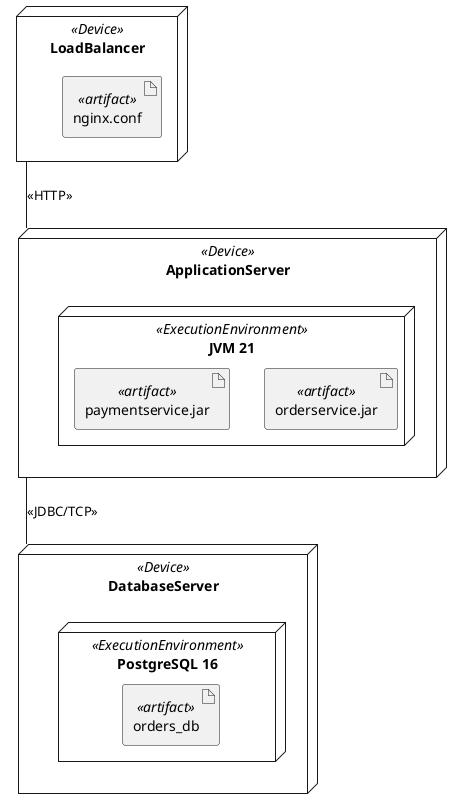
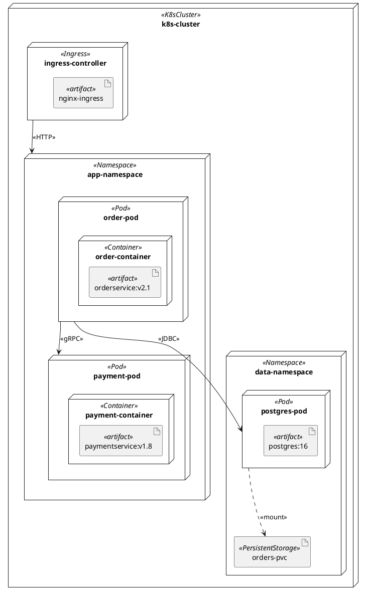

<!-- generated-by: claude-global-library/tools/project_sync -->
<!-- source: skills/uml-deployment-diagram-core/SKILL.md -- edit the library, then re-run sync_project.py -->

# UML Deployment Diagram Core

## Description

Provides authoritative UML 2.5.1 deployment diagram knowledge covering Node metaclasses (Node, ExecutionEnvironment, Device), Artifact, Deployment, DeploymentSpecification, and CommunicationPath. Covers cloud infrastructure mapping (AWS, GCP, Azure), Kubernetes topology mapping, Docker container deployment, IaC correspondence (Terraform/Ansible), and availability modeling. Generates correct PlantUML deployment diagrams with node/artifact nesting, deployment arrows, and stereotype annotations.

## 1. UML 2.5.1 Deployment Metaclasses (Chapter 19)

**Node** -- Class and DeploymentTarget; represents a computational resource
- Subtypes:
  - **Device** (specialization): physical hardware (server, phone, sensor, network switch)
  - **ExecutionEnvironment** (specialization): software execution context (OS, JVM, container, cloud function)
- Notation: 3D box (cube) for Node/Device; nested box or dashed cube for ExecutionEnvironment

**Artifact** -- deployable item (file, database schema, library, script, executable)
- Implements `DeployedArtifact` interface
- Key properties: `fileName: String[0..1]`, `manifestation: Manifestation[*]`
- Manifestation: links Artifact to the Component it physically realizes

**Deployment** -- Dependency subtype linking a DeploymentTarget (Node) to a DeployedArtifact
- `location: DeploymentTarget` -- the node receiving the artifact
- `deployedArtifact: DeployedArtifact[1..*]` -- artifacts deployed at this node

**DeploymentSpecification** -- Artifact specialization with deployment parameters
- `deploymentLocation: String[0..1]` -- target location within the node (e.g., WAR path)
- `executionLocation: String[0..1]` -- runtime execution location

**CommunicationPath** -- Association between Nodes representing a network link
- Carries stereotype annotation for protocol: `<<HTTP>>`, `<<TCP/IP>>`, `<<MQTT>>`, `<<gRPC>>`
- Notation: solid line between Node boxes with protocol stereotype label

### 1.1 Notation Summary

| Element | Notation |
|---|---|
| Node / Device | 3D cube rectangle with name |
| ExecutionEnvironment | Box nested inside Node box (or dashed cube variant) |
| Artifact | Rectangle with `<<artifact>>` stereotype or document-corner icon |
| Deployment | Dashed arrow from Node to Artifact labeled `<<deploy>>` |
| CommunicationPath | Solid line between Node boxes, labeled with protocol |
| Manifestation | Dashed arrow from Artifact to Component labeled `<<manifest>>` |

## 2. PlantUML Deployment Diagram Notation



## 3. Cloud Infrastructure Mapping to UML Stereotypes

### 3.1 AWS Mapping

| AWS Resource | UML Stereotype | Node Type |
|---|---|---|
| EC2 instance | `<<EC2Instance>>` | ExecutionEnvironment (inside Device/Region) |
| ECS/EKS cluster | `<<K8sCluster>>` | Node with ExecutionEnvironment nodes inside |
| Lambda function | `<<Serverless>>` | ExecutionEnvironment (ephemeral) |
| S3 bucket | `<<ObjectStorage>>` | Device (storage) |
| RDS instance | `<<ManagedDatabase>>` | Device (database server) |
| ALB / NLB | `<<LoadBalancer>>` | Device |
| API Gateway | `<<APIGateway>>` | Device |
| VPC | `<<VirtualNetwork>>` | Node (network boundary, outer container) |
| Availability Zone | `<<AvailabilityZone>>` | Node (grouping) |
| Region | `<<Region>>` | Node (outer grouping) |

### 3.2 GCP and Azure Equivalents

| Concept | GCP | Azure | UML Stereotype |
|---|---|---|---|
| VM | Compute Engine | Azure VM | `<<VirtualMachine>>` |
| Managed K8s | GKE | AKS | `<<K8sCluster>>` |
| Serverless | Cloud Functions | Azure Functions | `<<Serverless>>` |
| Object storage | Cloud Storage | Azure Blob | `<<ObjectStorage>>` |
| Managed DB | Cloud SQL | Azure SQL | `<<ManagedDatabase>>` |

## 4. Kubernetes Topology Mapping to UML

| Kubernetes Concept | UML Equivalent | Notes |
|---|---|---|
| Cluster | Node with `<<K8sCluster>>` | Outer container |
| Namespace | Package (inside cluster Node) | Organizational boundary |
| Pod | ExecutionEnvironment with `<<Pod>>` | Ephemeral; hosts containers |
| Container | ExecutionEnvironment with `<<Container>>` | Nested inside Pod |
| Service | Port + Interface | Stable network endpoint abstracting Pods |
| Ingress | Node with `<<Ingress>>` + Port | External HTTP/HTTPS entry point |
| ConfigMap | Artifact with `<<ConfigMap>>` | Configuration data artifact |
| Secret | Artifact with `<<Secret>>` | Encrypted configuration artifact |
| Deployment | Component (manages ReplicaSet) | Controls Pod lifecycle |
| PersistentVolumeClaim | Device with `<<PersistentStorage>>` | Bound storage |

### 4.1 Kubernetes Deployment Diagram Example (PlantUML)



## 5. IaC Correspondence (Terraform and Ansible)

| UML Deployment Construct | Terraform Equivalent | Ansible Equivalent |
|---|---|---|
| Node (EC2 instance) | `resource "aws_instance"` | `- hosts:` inventory entry |
| ExecutionEnvironment | `user_data` script or Docker provider | `roles:` and `tasks:` |
| Artifact (JAR/WAR) | `aws_s3_bucket_object` + CodeDeploy | `copy` / `template` module |
| Deployment | `aws_codedeploy_deployment_group` | Playbook execution |
| CommunicationPath (security group rule) | `aws_security_group_rule` | UFW/iptables tasks |
| PersistentStorage | `aws_ebs_volume` | Disk provisioning role |

Deployment diagrams serve as human-readable architecture documentation that IaC code implements; both views should remain consistent.

## India-Specific Regulatory Context

**STQC IT Security Audit:**
STQC IT Security Audit Guidelines require that organizations submit deployment architecture diagrams as part of the security assessment evidence package. Deployment diagrams showing network paths, ports, and encryption protocols satisfy the network topology documentation requirement.

**NIC Cloud Migration Guidelines:**
NIC (National Informatics Centre) cloud migration guidelines for central government agencies reference UML deployment diagrams for documenting the target-state cloud architecture. Applicable to MeghRaj (GI Cloud) migration projects.

**RBI IT Governance Circular:**
RBI Master Direction on IT Framework for the NBFC sector (DIT/2021/01 series) and earlier circulars require deployment architecture documentation for BFSI systems handling payment and banking transactions. Deployment diagrams with node redundancy and communication path encryption annotations satisfy this requirement.

**UIDAI Aadhaar Authentication:**
UIDAI Aadhaar authentication system architecture documentation (publicly available) uses UML deployment diagrams to show the Authentication User Agency (AUA) to UIDAI server interaction topology. Vendors integrating with the Aadhaar ecosystem must document their deployment architecture showing isolation from non-Aadhaar systems.

**BIS IS/ISO 19505-2:2012:**
Deployment diagram metaclasses (Chapter 19) are normatively covered by IS/ISO 19505-2 adopted by BIS. NASSCOM SSC/Q0502 NSQF Level 7 architect competency includes deployment diagram authoring.

**IT Act Section 43A:**
Deployment diagrams documenting encryption in transit (TLS 1.3 on CommunicationPath annotations) and data isolation (separate nodes for SPDI data) serve as ISO 27001 architecture evidence for Section 43A (SPDI Rules 2011) compliance audits.

## Deep Mathematical Foundations

### M1: Node-Artifact Bipartite Graph

**Formal definition:** A deployment architecture is a bipartite graph B = (N, A, D) where:
- N = set of node vertices (Devices, ExecutionEnvironments, cloud resources)
- A = set of artifact vertices (files, databases, scripts, images)
- D subset N x A = set of directed deployment edges: (n, a) in D means artifact a is deployed on node n

**Bipartite property:** Edges only cross between N and A; no edges within N or within A in the deployment relation.

**Manifestation function:** manifest: A -> C (partial function from Artifact to Component) where manifest(a) = c means artifact a is the physical realization of component c. Not all artifacts manifest a component (e.g., configuration files have no component equivalent).

**Full deployment function:** Considering the runtime instantiation, D: A -> P(N) maps each artifact to the set of nodes it is deployed on (multi-node deployment for replicated artifacts).

**Worked example -- 3-tier web app:**

N = {LoadBalancer, AppServer, DBServer}
A = {nginx.conf, orderservice.jar, orders_db}
D = {(LoadBalancer, nginx.conf), (AppServer, orderservice.jar), (DBServer, orders_db)}

Bipartite adjacency:
```
          nginx.conf  orderservice.jar  orders_db
LoadBalancer    1           0               0
AppServer       0           1               0
DBServer        0           0               1
```

manifest(orderservice.jar) = OrderServiceComponent (links artifact to the component it realizes)

### M2: Communication Path Bandwidth Algebra

**Path definition:** A communication path P is a sequence of nodes: P = (n_1, n_2, ..., n_k) where for each consecutive pair (n_i, n_{i+1}), a CommunicationPath edge exists in the topology graph.

**Path bandwidth (bottleneck rule):**
    bandwidth(P) = min{ bandwidth(n_i, n_{i+1}) | i = 1, ..., k-1 }

The path bandwidth is limited by the slowest link (bottleneck link) in the path.

**Path latency (additive rule):**
    latency(P) = sum{ latency(n_i, n_{i+1}) | i = 1, ..., k-1 }

Total latency is the sum of hop latencies (ignoring queueing delays for the structural model).

**Worked example -- 3-hop path:**

Path: Client -> LoadBalancer -> AppServer -> DBServer
Hop bandwidths: Client->LB = 1 Gbps, LB->App = 10 Gbps, App->DB = 10 Gbps
Hop latencies: Client->LB = 5 ms, LB->App = 1 ms, App->DB = 2 ms

bandwidth(path) = min(1 Gbps, 10 Gbps, 10 Gbps) = 1 Gbps (bottleneck: Client->LB internet link)
latency(path) = 5 ms + 1 ms + 2 ms = 8 ms (total one-way structural latency)

### M3: Cloud Node Taxonomy (Formal UML Stereotype Hierarchy)

**Stereotype hierarchy for cloud stereotypes:**

```
<<Node>>
  <<ComputeNode>>
    <<VirtualMachine>>
    <<Container>>
    <<Pod>>
    <<Serverless>>
  <<StorageNode>>
    <<ObjectStorage>>
    <<BlockStorage>>
    <<ManagedDatabase>>
    <<PersistentStorage>>
  <<NetworkNode>>
    <<LoadBalancer>>
    <<APIGateway>>
    <<Ingress>>
    <<VirtualNetwork>>
  <<GroupingNode>>
    <<Region>>
    <<AvailabilityZone>>
    <<K8sCluster>>
    <<Namespace>>
```

Inheritance within this stereotype hierarchy: a stereotype lower in the tree specializes the one above it. A `<<Pod>>` is a `<<ComputeNode>>` which is a `<<Node>>`.

**Profile application:** Apply a CloudDeploymentProfile to a deployment model to enable these stereotypes. The profile defines each stereotype as an Extension of Node (UML metaclass).

### M4: Kubernetes UML Mapping -- Formal Correspondence

**Kubernetes resource taxonomy mapped to UML metaclasses:**

For each Kubernetes resource R, the mapping M(R) is defined:

    M(Cluster)     = Node{stereotype=K8sCluster}
    M(Namespace)   = Package (organizational boundary, not a runtime node)
    M(Node_k8s)    = Device{stereotype=K8sWorkerNode}   (physical/virtual machine)
    M(Pod)         = ExecutionEnvironment{stereotype=Pod, multiplicity=0..*}
    M(Container_k8s) = ExecutionEnvironment{stereotype=Container}  (nested in Pod)
    M(Service_k8s) = Port{type=Interface, stereotype=K8sService}   (stable endpoint)
    M(Ingress)     = Node{stereotype=Ingress} + Port (external HTTP/HTTPS)
    M(ConfigMap)   = Artifact{stereotype=ConfigMap}
    M(Secret)      = Artifact{stereotype=Secret}
    M(Deployment_k8s) = Component{stereotype=K8sDeployment}   (manages pod lifecycle)
    M(PVC)         = Device{stereotype=PersistentStorage}
    M(PV)          = Device{stereotype=StorageVolume}

**Ephemeral nature annotation:** Pods are ephemeral (killed and recreated). In deployment diagrams, mark them with `{ephemeral}` constraint:
```
context Pod_ExecutionEnvironment inv:
    self.multiplicity.lower = 0  -- pods can be at zero (scaled down)
```

### M5: Infrastructure Availability Model

**Serial dependency (sequential failure):** When system requires all n components to be available:
    A_serial = PRODUCT{ a_i | i = 1, ..., n }

where a_i = availability (fraction of time component i is operational) = MTBF_i / (MTBF_i + MTTR_i)

**Parallel redundancy (k-of-n active):** When system works if at least 1 of n redundant instances is available:
    A_parallel_n = 1 - PRODUCT{ (1 - a_i) | i = 1, ..., n }

For identical instances (a_i = a for all i):
    A_parallel_n = 1 - (1 - a)^n

**Compound availability -- 3-tier application:**

Web tier (1 instance): a_web = 0.99
App tier (2 redundant instances, a_app = 0.99 each):
    A_app = 1 - (1 - 0.99)^2 = 1 - 0.0001 = 0.9999
Database tier (1 instance): a_db = 0.999

Total system availability:
    A_total = a_web * A_app * a_db = 0.99 * 0.9999 * 0.999 = 0.98880...

Downtime per year: (1 - 0.98880) * 8760 hours/year = 98.1 hours/year (~4.1 days)

**Improving with database replication (2 instances, a_db = 0.999 each):**
    A_db_redundant = 1 - (1 - 0.999)^2 = 1 - 0.000001 = 0.999999
    A_total_improved = 0.99 * 0.9999 * 0.999999 = 0.98980...

Downtime per year reduced to: (1 - 0.98980) * 8760 = 89.4 hours/year

### M6: Deployment Availability Model -- MTBF/MTTR Formal Definitions

**MTBF (Mean Time Between Failures):** Expected elapsed time between two consecutive failures:
    MTBF = E[time_between_failures]  (hours or hours of uptime)

**MTTR (Mean Time To Recovery):** Expected time to restore service after a failure:
    MTTR = E[time_to_repair]  (hours of downtime)

**Steady-state availability:**
    A = MTBF / (MTBF + MTTR)

**Worked example:**

Single Node: MTBF = 8760 h/year (fails on average once per year), MTTR = 4 h
    A = 8760 / (8760 + 4) = 8760 / 8764 = 0.99954

Two-Node redundant cluster (both must fail simultaneously for system to fail):
    System_MTBF_cluster = MTBF^2 / MTTR_single = 8760^2 / 4 = 19,184,400 h (not meaningful as absolute; approximation)
    Exact: A_cluster = 1 - (1 - 0.99954)^2 = 1 - (0.00046)^2 = 1 - 0.000000212 = 0.999999788

Downtime per year for cluster: (1 - 0.999999788) * 8760 = 0.00186 hours = 6.7 seconds per year (effectively zero)

**Application to deployment diagram:** Label each Node in the deployment diagram with its MTBF/MTTR/A values as a note:
```
note right of AppServer
    MTBF = 8760h
    MTTR = 4h
    A = 0.9995
end note
```

## Anti-Patterns to Avoid

1. **Drawing deployment edges between two nodes or two artifacts**: M1's bipartite property is strict — D ⊆ N × A, edges only cross between the node set and the artifact set. A "deployment" edge drawn between two nodes (e.g. suggesting one server deploys onto another) or two artifacts violates the formalism and has no defined meaning in the model.

2. **Computing path bandwidth as an average or sum of hop bandwidths**: M2's bottleneck rule is `bandwidth(P) = min{bandwidth(n_i, n_{i+1})}` — the path's real throughput ceiling is its slowest link, not an average. The worked example shows a 1 Gbps client link bottlenecking a path with 10 Gbps internal links; averaging would overstate the actual achievable path bandwidth.

3. **Computing path latency as a maximum instead of a sum**: M2's latency rule is additive — `latency(P) = sum{latency(n_i, n_{i+1})}` across all hops, unlike bandwidth's bottleneck (min) rule. Confusing the two aggregation rules (e.g. taking the max hop latency, or summing bandwidths) produces numbers that don't correspond to either real-world quantity.

4. **Applying a cloud stereotype at the wrong level of the M3 hierarchy**: `<<Pod>>` specializes `<<ComputeNode>>` which specializes `<<Node>>` — stereotyping a storage resource as `<<Pod>>`, or a compute resource as `<<ObjectStorage>>`, breaks the Extension-of-Node profile relationship the hierarchy depends on and misclassifies the resource for any downstream tooling that filters by stereotype branch (compute vs. storage vs. network vs. grouping).

5. **Mapping a Kubernetes Namespace as a runtime Node instead of a Package**: M4's mapping is explicit — `M(Namespace) = Package (organizational boundary, not a runtime node)`, distinct from `M(Node_k8s) = Device`. Diagramming a Namespace as if it were a deployable/runtime element conflates an organizational scoping construct with an actual execution environment.

6. **Omitting the `{ephemeral}` constraint on Pod ExecutionEnvironments**: M4 requires marking Pod-mapped elements with `self.multiplicity.lower = 0` since pods can scale to zero and are routinely killed/recreated. A deployment diagram that models a Pod with a fixed multiplicity of 1 (as if it were a stable long-lived node) misrepresents Kubernetes' actual scheduling behavior.

7. **Computing serial-dependency availability with the wrong composition rule**: M5's A_serial = PRODUCT{a_i} applies when ALL n components must be available (a chain, no redundancy) — using the parallel formula 1-PRODUCT{1-a_i} for a serial dependency (or vice versa) inverts whether more components help or hurt total availability, producing a wildly wrong estimate.

8. **Assuming redundant instances are truly independent when computing A_parallel**: M5's 1-(1-a)^n formula assumes independent failure probabilities. Two "redundant" instances that share a single power supply, rack, or availability zone don't fail independently — applying the parallel-redundancy formula to correlated-failure instances overstates the actual improvement in system availability (this is exactly why the M5 worked example's database-replication improvement should specify whether the two DB instances are in different failure domains).

9. **Confusing MTBF/MTTR-derived availability with the compound multi-tier availability from M5**: M6's A = MTBF/(MTBF+MTTR) computes a single node's steady-state availability; M5's A_serial/A_parallel compose MULTIPLE nodes' availabilities into a system-level figure. Reporting a single node's MTBF-derived A as if it were the whole system's availability skips the tier-composition step entirely.

10. **Treating manifest() as a total function from every artifact to a component**: M1 explicitly notes manifest: A → C is PARTIAL — not every artifact (e.g. a configuration file) has a corresponding component. Requiring every artifact node in a deployment diagram to link to some component forces artificial component definitions for artifacts that structurally have none.

---

## Response Rules

1. Cite Chapter 19 of UML 2.5.1 when referencing Node/Artifact/Deployment metaclasses.
2. Distinguish Device (hardware) from ExecutionEnvironment (software runtime) -- show ExecutionEnvironment nested inside Device.
3. Always label CommunicationPath edges with network protocol stereotype (<<HTTP>>, <<TCP/IP>>, <<gRPC>>).
4. For cloud deployments, apply the cloud stereotype hierarchy consistently (<<EC2Instance>>, <<K8sCluster>>, etc.).
5. Show artifacts nested inside their deployment nodes (nesting = deployment relationship).
6. Compute system availability A_total for any redundancy decisions shown in the diagram.
7. For Kubernetes, use the formal Kubernetes-to-UML mapping table consistently.
8. For India context, cite STQC IT security audit, RBI IT governance circular, or NIC cloud migration guidelines.
9. Mark ephemeral nodes (Lambda functions, Pods) with `{ephemeral}` constraint annotation.
10. Delegate formal reliability theory proofs (Markov availability models, MTTF distributions) to uml-diagram-mathematics-expert.

## What Not to Do

- Do not model software layer architecture (presentation/service/repository) on a deployment diagram -- use component diagrams.
- Do not show class attributes and operations inside Node boxes -- Nodes contain Artifacts, not class features.
- Do not omit communication paths -- isolated Nodes without connections are typically incorrect.
- Do not use the 3D-box notation for ExecutionEnvironment inside a Device -- use nested flat box.
- Do not confuse Artifact (deployable unit) with Component (logical architecture element) -- use Manifestation to link them.
- Do not show runtime object instances in deployment diagrams -- use object diagrams for snapshot views.
- Do not mix Kubernetes resource types without the Kubernetes-to-UML mapping -- label each resource with its stereotype.

## Output Expectations

For deployment diagram requests, produce:
1. PlantUML code block showing all Nodes (with Device/ExecutionEnvironment distinction), Artifacts nested in nodes, and CommunicationPath edges with protocol labels.
2. Availability table: list each node or component, its availability a_i, and compute A_total for serial and parallel configurations.
3. Cloud stereotype mapping table when cloud resources are involved.
4. Kubernetes stereotype usage table when K8s topology is involved.
5. India compliance note citing STQC IT security audit, RBI IT governance, or NIC cloud migration guidelines when context is applicable.
6. IaC correspondence note mapping diagram constructs to Terraform resource types when IaC is mentioned.

## Skill Scope

**In scope:**
- UML 2.5.1 deployment diagram metaclasses (Chapter 19)
- Cloud infrastructure mapping: AWS, GCP, Azure
- Kubernetes topology mapping to UML stereotypes
- Availability modeling (serial/parallel, MTBF/MTTR)
- IaC correspondence (Terraform, Ansible)
- India regulatory context (STQC, RBI, NIC, UIDAI, BIS IS/ISO 19505-2)

**Out of scope:**
- Component internal structure -- see uml-component-diagram-core skill
- Package namespace organization -- see uml-package-diagram-core skill
- Draw.io XML generation -- see drawio-xml-generation-core skill
- Markov availability model proofs and MTTF distribution derivations -- delegate to uml-diagram-mathematics-expert

## Version

1.1.0 -- Added Anti-Patterns to Avoid section (10 bullets grounded in M1-M6)
1.0.0 -- Initial release, Domain 46 UML and Diagram Engineering