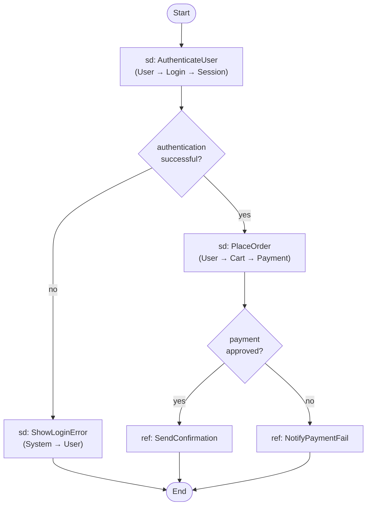

<!-- generated-by: claude-global-library/tools/project_sync -->
<!-- source: skills/uml-interaction-overview-core/SKILL.md -- edit the library, then re-run sync_project.py -->

# UML Interaction Overview Core

## Description

Produces UML 2.5.1 interaction overview diagrams (IOD, Chapter 17.6 of the OMG specification)
combining activity-diagram control flow structure with interaction fragment nodes. Covers the
InteractionOverview metaclass, InteractionUse (ref frame) semantics, Gate parameterization, inline
interaction frames, trace composition algebra using CCS process algebra operators, control flow
graph construction, isomorphism with activity diagrams, and an interaction complexity metric.
Addresses NASSCOM process documentation, STQC test planning, and NIC-SSDLC multi-system
interaction requirements applicable to Indian enterprise and government IT projects.

## 1. UML 2.5.1 Interaction Overview Metamodel (Chapter 17.6)

### Core metaclasses

**InteractionOverview:** Subtype of `Interaction` (which is itself a subtype of `Behavior` and
`Namespace`). Uses the Activity notation for its layout, but the nodes in the activity graph are
interaction fragments (inline frames or ref frames) instead of conventional actions.

**InteractionUse:** Also called a `ref` frame. References another named `Interaction` defined
elsewhere. Properties:
- `refersTo: Interaction` — the referenced Interaction definition
- `actualGate: Gate[*]` — actual Gate instances that map to the formal Gates of the referenced Interaction

**Gate:** A `MessageEnd` on the boundary of an Interaction or InteractionUse. Formal gates are
defined on the referenced `Interaction`; actual gates are provided at the `InteractionUse` call
site. The Gate-to-Gate mapping resolves the message passing between the outer context and the
referenced sub-interaction.

**Inline Interaction:** An `Interaction` or `CombinedFragment` drawn inline within an activity
node position in the InteractionOverview (using an `sd` frame). The interaction is defined locally
rather than by reference.

**Activity control nodes (from Chapter 15, reused in IOD):**
- `InitialNode` — single entry point of the IOD
- `ActivityFinalNode` — end point; all flows terminate here
- `DecisionNode` — OR-split: exactly one outgoing edge fires based on guard
- `MergeNode` — OR-join: accepts token from whichever incoming edge fires
- `ForkNode` — AND-split: all outgoing edges fire simultaneously (parallel paths)
- `JoinNode` — AND-join: waits for all incoming edges to be taken

### Notation rules

| Element | Notation |
|---------|----------|
| Inline interaction | Rectangular frame with pentagon label `sd interactionName` |
| InteractionUse (ref) | Rectangular frame with pentagon label `ref interactionName` |
| DecisionNode | Diamond (same as activity diagram) |
| MergeNode | Diamond (same as activity diagram, no guard) |
| ForkNode / JoinNode | Thick bar (same as activity diagram) |
| InitialNode | Filled black circle |
| ActivityFinalNode | Bullseye |
| Control flow edge | Solid arrow (may have guard `[condition]`) |

### Relationship to other diagrams

An Interaction Overview Diagram uses:
- **Activity diagram structure:** for control flow (decisions, forks, merges, loops)
- **Sequence diagram content:** for the interaction fragments inside each node

When all interaction content is removed from an IOD, the resulting structure is isomorphic to an
Activity Diagram (see M5). This isomorphism enables round-trip analysis between the two diagram
types.

## 2. When to Use Interaction Overview vs Sequence Diagram

| Criterion | Sequence Diagram | Interaction Overview |
|-----------|-----------------|---------------------|
| Number of scenarios | 1–2 alternate paths | 3+ alternate scenarios |
| Control flow complexity | Linear or simple alt | Multiple branches, loops, parallel paths |
| Granularity | Detailed message-level | High-level orchestration of sub-scenarios |
| Reuse | Each sd is self-contained | ref frames reuse defined interactions |
| Reader | Developer (implementation detail) | Architect/analyst (scenario navigation map) |

## 3. Inline vs Ref (InteractionUse) Frames

**Inline `sd` frame:** The interaction content is defined locally within the IOD node. Use when
the interaction is specific to this IOD and not reused elsewhere.

**`ref` frame (InteractionUse):** References an Interaction defined in a separate sequence diagram
or in a named `sd` block elsewhere. Use when:
1. The referenced interaction is reused across multiple IODs.
2. The IOD is a navigation map; detailed interaction content lives in dedicated sequence diagrams.
3. The referenced interaction accepts parameters (Gate-parameterized).

**Gate parameterization example:**
```
ref AuthenticateUser(userId: "U123", sessionToken: out)
```
`userId` is an input gate (message flowing into the referenced interaction); `sessionToken` is an
output gate (message flowing out). The formal gates on the `AuthenticateUser` Interaction match to
these actual gates at the call site.

## 4. Combined Fragment Operators in IOD Context

Within inline `sd` frames in an IOD, the same 12 `InteractionOperatorKind` literals available in
sequence diagrams apply: `alt`, `opt`, `break`, `par`, `seq`, `strict`, `neg`, `critical`,
`ignore`, `consider`, `assert`, `loop`.

The IOD's outer activity control flow handles macro-level branching (via DecisionNode/MergeNode).
Inner `alt`, `opt`, and `loop` fragments handle micro-level variations within a single interaction
node. Avoid duplicating the same branching logic at both levels — use outer DecisionNode for
scenario selection, inner `alt` for message-level alternatives within a selected scenario.

## 5. Generating IOD — Output Format

PlantUML does not natively support full IOD notation. Use annotated activity diagram style with
comments marking interaction content. For tooling, draw.io with UML stencils or Rational Rose /
Enterprise Architect provides native IOD support.

Mermaid approximation (using flowchart with labeled nodes):



PlantUML annotated approximation:

```
@startuml
start
:sd AuthenticateUser\n(User → Login → Session);
if (authentication successful?) then (yes)
  :sd PlaceOrder\n(User → Cart → Payment);
  if (payment approved?) then (yes)
    :ref SendConfirmation;
  else (no)
    :ref NotifyPaymentFail;
  endif
else (no)
  :sd ShowLoginError;
endif
stop
@enduml
```

## 6. Deep Mathematical Foundations

### M1: Interaction Frame as CCS Process Algebra

**Communicating Sequential Processes / CCS operators** model the interaction composition semantics
of an InteractionOverview. Each interaction fragment `I` has a trace set `traces(I)`.

**Operator definitions:**

```
alt(I_1, I_2):   traces = traces(I_1) ∪ traces(I_2)
                 (non-deterministic choice: either I_1 or I_2 executes)

seq(I_1, I_2):   traces = { t_1 · t_2 | t_1 ∈ traces(I_1), t_2 ∈ traces(I_2) }
                 (sequential: I_1 completes, then I_2 starts)

par(I_1, I_2):   traces = { w ∈ (Sigma_1 ∪ Sigma_2)* | w|_Sigma_1 ∈ traces(I_1)
                             AND w|_Sigma_2 ∈ traces(I_2) }
                 (parallel: all interleavings of I_1 and I_2 that preserve per-Lifeline order)

loop(I, n, m):   traces = ∪_{k=n}^{m} traces(I)^k
                 (I executes k times, n ≤ k ≤ m)

opt(I):          traces = traces(I) ∪ {ε}    (I or skip)

ref(sd_name):    traces = traces(sd_name)    (substitution of named interaction)
```

**CCS Expression for a 3-fragment IOD:**

Consider an IOD with:
1. Fragment A: `AuthenticateUser` (always executes first)
2. Branch on auth success: either `PlaceOrder` OR `ShowError`
3. Final fragment: `LogAudit` (always executes last)

CCS expression:
```
IOD = seq(A, seq(alt(PlaceOrder, ShowError), LogAudit))
```

Trace set:
```
traces(IOD) = { a · p · l | a ∈ traces(A), p ∈ traces(PlaceOrder), l ∈ traces(LogAudit) }
            ∪ { a · e · l | a ∈ traces(A), e ∈ traces(ShowError), l ∈ traces(LogAudit) }
```

The CCS expression makes the compositional semantics explicit and enables trace-based testing:
each element of `traces(IOD)` is a distinct test scenario.

### M2: Combined Fragment Algebra

**Fragment operators compose hierarchically.** The full algebra of InteractionOperatorKind
operators (12 literals from UML 2.5.1) satisfies the following composition rules:

**Sequential composition (seq and strict):**
```
traces(seq(f_1, f_2)) = { t_1 · t_2 | t_1 ∈ traces(f_1), t_2 ∈ traces(f_2) }
```
`seq`: messages from f_1 come before messages from f_2 on each Lifeline individually,
but messages on different Lifelines may interleave (weaker than strict).

`strict`: total ordering — ALL messages of f_1 precede ALL messages of f_2 across ALL Lifelines.

**Parallel composition (par):**
```
traces(par(f_1, f_2)) = { w : w|_{Li} ∈ traces_{Li}(f_1) AND w|_{Lj} ∈ traces_{Lj}(f_2)
                           for all Lifelines Li, Lj }
```
All interleavings that respect the per-Lifeline ordering of both f_1 and f_2.

**Alternative composition (alt):**
```
traces(alt(f_1, f_2)) = traces(f_1) ∪ traces(f_2)
```
Non-deterministic: the system chooses one branch.

**Operator precedence (highest to lowest binding):**
```
critical > strict > seq > par > alt
```

**Worked Example — 2-level nested fragment composition:**

Fragment F_outer = `alt(F_inner_1, F_inner_2)` where:
- `F_inner_1 = seq(sd_Login, sd_Payment)` (login then payment)
- `F_inner_2 = sd_GuestCheckout` (guest path)

```
traces(F_outer) = traces(seq(sd_Login, sd_Payment)) ∪ traces(sd_GuestCheckout)
               = { l · p | l ∈ traces(sd_Login), p ∈ traces(sd_Payment) }
               ∪ traces(sd_GuestCheckout)
```

Total test cases: product of traces within each `seq` branch plus traces of the alternative.

### M3: Interaction Occurrence (ref) Substitution Semantics

**Substitution rule.** When an `InteractionUse` references `sd_name`, the analysis replaces
the `ref` node with the complete trace set of `sd_name`:

```
traces(ref sd_name) = traces(sd_name)
```

**Parameterized substitution.** For a ref with Gate parameters:

```
ref sd_name(a_1 → f_1, a_2 → f_2, ..., a_n → f_n)
```

where `a_i` = actual gate (message at call site), `f_i` = formal gate (message in sd_name):

The substitution maps message identities: everywhere `f_i` appears in `traces(sd_name)`,
replace with `a_i`. The resulting trace set is the substituted interaction.

**Worked Example — Gate substitution:**

```
Interaction: sd AuthenticateUser
  formal gates: in: loginRequest(userId), out: authResponse(token)

InteractionUse call:
  ref AuthenticateUser(loginRequest("U123") → loginRequest(userId),
                       authResponse(token) → sessionToken)
```

After substitution: every occurrence of `loginRequest(userId)` in traces(AuthenticateUser)
becomes `loginRequest("U123")`, and `authResponse(token)` becomes `sessionToken`.

This resolves actual message values at the IOD level while keeping the referenced interaction
abstract and reusable.

### M4: Control Flow Graph for IOD

**IOD Control Flow Graph (CFG) construction:**

Nodes in the IOD CFG:
```
V_CFG = (inline interaction nodes) ∪ (InteractionUse/ref nodes)
       ∪ {DecisionNode, MergeNode, ForkNode, JoinNode, InitialNode, ActivityFinalNode}
```

Edges in the IOD CFG:
```
E_CFG = { (u, v, guard) | control flow edge from node u to node v, with optional guard [guard] }
```

**Loop detection.** A loop fragment in the outer control flow creates a back edge `(v, u)` where
`u` is an ancestor of `v` in the DFS tree. Back edges indicate cycles in the CFG.

**Path enumeration.** Each path from InitialNode to ActivityFinalNode in the CFG that exercises
no loop iteration corresponds to a distinct test scenario. Loops add additional paths per
iteration count.

**Worked Example — CFG for a 4-fragment IOD:**

```
Nodes: Initial, sdAuth, Decision_D1, sdPlaceOrder, sdShowError, MergeNode_M1,
       ref_SendConfirm, ActivityFinal

Edges:
  Initial     → sdAuth            [always]
  sdAuth      → Decision_D1       [always]
  Decision_D1 → sdPlaceOrder      [guard: auth_success = true]
  Decision_D1 → sdShowError       [guard: auth_success = false]
  sdPlaceOrder → ref_SendConfirm  [always]
  sdShowError  → MergeNode_M1     [always]
  ref_SendConfirm → MergeNode_M1  [always]
  MergeNode_M1 → ActivityFinal   [always]
```

CFG has 8 nodes and 8 edges. Two paths (no loops):
- Path 1: Initial → sdAuth → D1 → sdPlaceOrder → ref_SendConfirm → M1 → Final
- Path 2: Initial → sdAuth → D1 → sdShowError → M1 → Final

Two distinct test scenarios.

### M5: Decision/Merge Correspondence with Activity Diagrams

**Isomorphism theorem.** If all interaction content is removed from an InteractionOverview
(replacing each interaction node with a single opaque action node), the resulting structure is
graph-isomorphic to an Activity Diagram with the same control flow structure.

**Formal mapping:**

| IOD element | Activity Diagram element |
|-------------|--------------------------|
| Inline `sd` frame | Action (OpaqueAction) |
| `ref` frame (InteractionUse) | CallBehaviorAction |
| DecisionNode | DecisionNode |
| MergeNode | MergeNode |
| ForkNode | ForkNode |
| JoinNode | JoinNode |
| InitialNode | InitialNode |
| ActivityFinalNode | ActivityFinalNode |
| Control flow edge with guard | ControlFlow edge with guard |
| `par` fragment inside sd | ForkNode + JoinNode wrapping sub-actions |

This isomorphism means:
1. Any Activity Diagram can be "lifted" to an IOD by replacing each action with a sequence diagram.
2. Any IOD can be "projected" to an Activity Diagram by removing interaction content.
3. Cyclomatic Complexity calculated on the IOD CFG equals CC of the isomorphic Activity Diagram.

**Worked Example — Isomorphism mapping:**

IOD:
```
Initial → sd_Login → [auth?] → sd_PlaceOrder or sd_Error → Merge → Final
```

Isomorphic Activity Diagram:
```
Initial → LoginAction → [auth?] → PlaceOrderAction or ShowErrorAction → Merge → Final
```

The control structure is identical. The only difference is the content of each node (interaction
traces vs action behaviors).

### M6: Interaction Complexity Metric (IC)

**Definition.** The Interaction Complexity of an IOD is a weighted sum of its fragment types,
with a nesting depth multiplier:

```
IC(IOD) = Σ_{f_i ∈ fragments(IOD)} weight(f_i) × 1.5^(depth(f_i) - 1)
```

**Base weights per fragment type:**
```
alt      → weight = 2   (branching: adds 1 path per extra operand)
loop     → weight = 3   (repetition: adds multiple paths)
par      → weight = 2   (concurrent paths)
critical → weight = 1   (atomic region: no structural branching)
opt      → weight = 1   (single optional path)
ref      → weight = 1   (external reference: complexity hidden inside referenced sd)
inline sd → weight = 1  (leaf interaction node)
break    → weight = 2   (exceptional exit path)
```

**Depth multiplier:** A fragment at nesting depth `d` (root = depth 1) contributes its weight
multiplied by `1.5^(d-1)`.
- Depth 1: multiplier = 1.0 (top-level fragment)
- Depth 2: multiplier = 1.5 (fragment nested inside another fragment)
- Depth 3: multiplier = 2.25

**Threshold:** `IC(IOD) > 15` → split the IOD into two or more IODs linked by `ref` frames.

**Worked Example — IC Calculation for a Complex IOD:**

IOD structure:
```
- seq (depth 1, weight 1)
  - ref AuthenticateUser (depth 2, weight 1)
  - alt (depth 2, weight 2)
    - sd PlaceOrder (depth 3, weight 1)
      - loop(1,3) retry attempts (depth 4, weight 3)
    - sd GuestCheckout (depth 3, weight 1)
  - ref AuditLog (depth 2, weight 1)
```

IC calculation:
```
seq at depth 1:            1 × 1.5^0 = 1.0
ref AuthenticateUser at depth 2:   1 × 1.5^1 = 1.5
alt at depth 2:            2 × 1.5^1 = 3.0
sd PlaceOrder at depth 3:  1 × 1.5^2 = 2.25
loop(1,3) at depth 4:      3 × 1.5^3 = 10.125
sd GuestCheckout at depth 3: 1 × 1.5^2 = 2.25
ref AuditLog at depth 2:   1 × 1.5^1 = 1.5

IC = 1.0 + 1.5 + 3.0 + 2.25 + 10.125 + 2.25 + 1.5 = 21.625
```

`IC = 21.625 > 15` — threshold exceeded. Recommendation: extract `PlaceOrder + loop` into a
separate named interaction `sd PlaceOrderWithRetry` and replace the inline sd with a `ref` frame.
This reduces the IOD's IC while preserving the complete semantics in the referenced interaction.

## 7. Anti-Patterns to Avoid

1. **Using `seq` composition when `strict` total ordering was actually intended**: M2 distinguishes `seq` (messages from f_1 precede f_2 per-Lifeline, but cross-Lifeline interleaving is allowed) from `strict` (ALL messages of f_1 precede ALL messages of f_2 across every Lifeline). Modeling a fragment as `seq` when the real requirement is a hard global barrier between two phases understates the actual ordering constraint and permits interleavings the system doesn't actually allow.

2. **Treating `par` composition as if it interleaves in every possible order equally likely**: M1/M2's par(I_1, I_2) trace set is the set of ALL interleavings that respect each fragment's own per-Lifeline ordering — it does not imply any particular scheduling probability or fairness. Assuming `par` behaves like a race with equal-likelihood outcomes conflates the formal (structural) trace-set semantics with a runtime scheduling assumption the model doesn't make.

3. **Substituting a `ref` frame's gate parameters incorrectly (formal/actual mismatch)**: M3's substitution rule requires every occurrence of the formal gate f_i in traces(sd_name) to be replaced with the actual gate a_i from the call site. Omitting a gate mapping, or swapping the direction (substituting a formal gate's name into the actual value instead of the reverse), produces a trace set that references undefined messages.

4. **Assuming operator precedence when nesting fragments without explicit grouping**: M2's stated precedence is `critical > strict > seq > par > alt` (highest to lowest binding). Relying on this implicit precedence for deeply nested combined fragments rather than making the grouping explicit (as the worked example does with `alt(seq(...), ...)`) risks a diagram whose visual nesting doesn't match its actual compositional semantics.

5. **Computing loop trace sets without respecting the (n, m) iteration bounds**: M1's loop(I, n, m) trace set is the union over k=n to m of traces(I)^k — only iteration counts within the declared bounds are valid. Treating a bounded loop as if it always executes exactly once, or unboundedly, misrepresents both the minimum-execution guarantee and the maximum-iteration ceiling the loop actually declares.

6. **Building the IOD control flow graph without correctly identifying back edges for loops**: M4's loop detection is precise — a back edge (v, u) exists where u is an ancestor of v in the DFS tree. Missing a back edge (treating a loop fragment as forward-only control flow) undercounts the CFG's actual cycle structure and produces an incomplete path enumeration for test-scenario generation.

7. **Assuming the IOD-to-Activity-Diagram isomorphism preserves interaction CONTENT, not just control structure**: M5's isomorphism theorem is explicit that it holds for control flow structure only, after replacing each interaction node with an opaque action — Cyclomatic Complexity computed on the IOD CFG equals the isomorphic Activity Diagram's CC, but the actual message-level behavior inside each `sd`/`ref` node is NOT part of what the isomorphism claims to preserve.

8. **Computing Interaction Complexity (IC) using flat weights, ignoring nesting depth**: M6's IC formula multiplies each fragment's base weight by 1.5^(depth-1) — the worked example shows a depth-4 `loop` fragment contributing 10.125 (weight 3 × 1.5³) rather than its base weight of 3. Summing raw weights without the depth multiplier substantially undercounts the true complexity of deeply nested fragments.

9. **Leaving an IC(IOD) > 15 unrefactored because "it's just one diagram"**: M6's threshold explicitly recommends splitting the IOD into multiple IODs linked by `ref` frames once IC exceeds 15 — the worked example (IC = 21.625) shows extracting the highest-contributing nested fragment (PlaceOrder + loop) into a named `ref`-referenced interaction reduces the top-level IC while preserving full semantics in the referenced interaction, not discarding any behavior.

10. **Confusing `ref` (InteractionUse, complexity-hiding) with `inline sd` (leaf interaction node) when estimating diagram complexity**: M6 assigns `ref` and `inline sd` the same base weight (1) at the IOD level specifically because ref's actual complexity is hidden inside the referenced interaction, not eliminated. Treating a heavily-`ref`-based IOD as "simple" because its top-level IC is low ignores that the referenced interactions may themselves carry substantial complexity that should be assessed separately.

---

## 8. India-Specific Layer

**NASSCOM Process Documentation — Large IT Programs:**
India's large IT services firms (TCS, Infosys, Wipro, HCL) manage multi-phase programs with
dozens of interconnected subsystems. NASSCOM best practices for program documentation recommend
Interaction Overview Diagrams as the top-level navigation artifact for complex business scenarios
that span multiple sequence diagrams. An IOD serves as the "scenario map" that an architect or
program manager can read without descending into sequence-level message detail. NASSCOM's
NASSCOM-NIIT curriculum for Advanced Java includes IOD as an advanced design artifact.

**STQC Test Planning — Scenario Coverage:**
STQC (Standardisation Testing and Quality Certification) uses IODs during test planning for
government system certification. The IOD's path enumeration (each path from InitialNode to
ActivityFinalNode is a distinct test scenario) directly generates the test case inventory. STQC
auditors verify that the test case count matches the number of executable paths in the IOD for
process-area coverage under CMMI Level 3 and Level 4. This approach aligns with BIS IS/ISO 9126
functional suitability testing.

**BIS IS/ISO 14764 — Software Maintenance:**
BIS IS/ISO 14764 (Software Engineering — Software Life Cycle Processes — Maintenance) references
interaction diagrams for change impact analysis. When a software change request arrives, the IOD
shows which scenarios (paths through the system) are affected by a change in a referenced `sd`
interaction. Impact analysis proceeds by: identifying which `ref sd_name` frames in IODs reference
the modified interaction, then tracing all IOD paths that include those frames. This is formally
equivalent to backward reachability on the IOD CFG.

**NIC-SSDLC — Complex System Interaction Documentation:**
For central government IT projects that involve multiple integrated systems (e.g., AADHAAR + UAN +
e-KYC integration for Pradhan Mantri schemes), NIC-SSDLC Phase 3 (Design) recommends Interaction
Overview Diagrams to document cross-system orchestration. The IOD maps the macro-level flow while
individual sequence diagrams document each system-to-system interaction. This two-level approach
keeps the architecture documentation readable at both the overview and detail levels.

## 9. Response Rules

1. Use IOD when there are 3 or more distinct interaction scenarios that share the same
   high-level control flow — use a plain sequence diagram with `alt` if there are only 2 paths.
2. Separate macro-level branching (DecisionNode in the IOD) from micro-level branching
   (`alt` fragments inside individual interaction nodes).
3. Use `ref` frames for any interaction that is reused across multiple IODs or that has its
   own dedicated sequence diagram — do not inline large interactions.
4. Compute the IC metric and flag IODs with IC > 15 as candidates for decomposition.
5. For each IOD, enumerate all executable paths (from InitialNode to ActivityFinalNode)
   and confirm that each path is a meaningful, testable test scenario.
6. Verify gate parameter mapping for all `ref` frames — every formal gate in a referenced
   Interaction must have a matching actual gate at the InteractionUse call site.
7. For India government projects referencing NIC-SSDLC, include the IOD in Phase 3 design
   documentation and cross-reference it to use cases from Phase 2.
8. Produce both Mermaid flowchart (approximation) and PlantUML activity syntax output.
   Note where native IOD notation is not supported by the target tool.

## 10. What Not to Do

- Do not use an IOD when a single sequence diagram with `alt` or `opt` fragments is
  sufficient — IOD adds overhead; use it only when the scenario space is genuinely complex.
- Do not nest `alt` fragments at the outer IOD level AND in the inner `sd` frame for the
  same branching condition — pick one level to express the branching.
- Do not omit gate parameter declarations on `ref` frames when the referenced interaction
  has formal gates — unresolved gates produce ambiguous interaction semantics.
- Do not create IOD paths with no final node — every path in the CFG must reach
  ActivityFinalNode or a clearly labelled exception exit.
- Do not use ForkNode in an IOD without a corresponding JoinNode on every parallel path —
  orphaned parallel paths violate the AND-split semantics.
- Do not embed very long interaction sequences inline in an IOD — use `ref` frames to keep
  individual nodes compact.
- Do not compute IC by counting only top-level fragments — apply the depth multiplier to
  correctly weight deeply nested complexity.

## 11. Output Expectations

For each interaction overview diagram request, deliver:

1. **Fragment inventory:** All inline `sd` frames and `ref` frames with their names, interaction
   references, and Gate parameter mappings.
2. **Control flow summary:** List of all DecisionNodes with guards, ForkNodes, JoinNodes,
   MergeNodes, and their connectivity.
3. **CCS expression:** The algebraic composition expression for the IOD (seq, alt, par, loop,
   ref operators).
4. **Executable path list:** All distinct paths from InitialNode to ActivityFinalNode with
   guard conditions for each Decision.
5. **Mermaid flowchart approximation:** `flowchart TD` block with labeled nodes for each
   interaction fragment.
6. **PlantUML activity approximation:** `@startuml` / `@enduml` block.
7. **IC metric:** Calculated IC value with fragment-by-fragment breakdown and threshold
   assessment.
8. **India compliance note** (if applicable): NIC-SSDLC Phase 3, STQC test planning, BIS
   IS/ISO 14764 change impact analysis.

## 12. Skill Scope

**In scope:**
- UML 2.5.1 Chapter 17.6 Interaction Overview notation and semantics
- InteractionOverview, InteractionUse (ref frame), and inline sd frame metaclasses
- Gate formal/actual mapping and parameterized ref substitution
- Combined Fragment operator algebra (CCS-based trace composition)
- Control flow graph construction and path enumeration
- Isomorphism with Activity Diagrams
- Interaction Complexity (IC) metric
- India regulatory context: NASSCOM program documentation, STQC test planning,
  BIS IS/ISO 14764, NIC-SSDLC Phase 3

**Out of scope:**
- Full formal trace algebra soundness proofs — delegate to uml-diagram-mathematics-expert
- Detailed sequence diagram content within each node (use uml-sequence-diagram-core)
- Activity diagram generation (use uml-activity-diagram-core)
- Draw.io XML generation (see drawio-xml-generation-core)

## 13. Version

v1.1.0 — Added Section 7 Anti-Patterns to Avoid (10 bullets grounded in M1-M6); India-Specific Layer through Version renumbered §8-13.
v1.0.0 — Initial release. Domain 46: UML & Diagram Engineering. Covers UML 2.5.1 Chapter 17.6.
India layer: NASSCOM program documentation, STQC test planning, BIS IS/ISO 14764, NIC-SSDLC.
