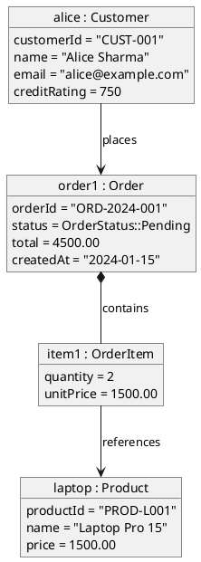
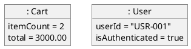
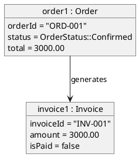
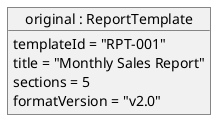
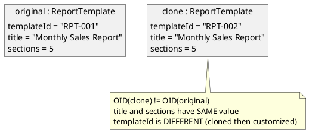

<!-- generated-by: claude-global-library/tools/project_sync -->
<!-- source: skills/uml-object-diagram-core/SKILL.md -- edit the library, then re-run sync_project.py -->

# UML Object Diagram Core

## Description

Provides authoritative UML 2.5.1 object diagram knowledge covering InstanceSpecification metaclasses (InstanceSpecification, Slot, Link, ValueSpecification), model-theoretic interpretation semantics, object identity versus value equality, snapshot consistency with class diagrams, OCL invariant validation on object states, prototype pattern modeling, and test fixture specification. Generates correct PlantUML object diagrams with instance:ClassName notation, slot values, and link labels.

## 1. UML 2.5.1 Object Diagram Metaclasses (Chapters 9, 11)

Object diagrams are a presentation-level diagram type built on the InstanceSpecification metaclass from the core metamodel. There is no dedicated "ObjectDiagram" metaclass; the diagram reuses Classification and StructuredClassifiers metamodel elements.

**InstanceSpecification** -- represents an instance of a classifier at a point in time
- `classifier: Classifier[*]` -- the class(es) this instance is an instance of (multiple for multiple classification)
- `slot: Slot[*]` -- the attribute values (feature-value pairs) for this instance
- `specification: ValueSpecification[0..1]` -- an expression evaluating to the instance value (for primitives)

**Slot** -- owned by InstanceSpecification; represents a single attribute value
- `definingFeature: StructuralFeature` -- the attribute or association end this slot defines
- `value: ValueSpecification[*]` -- the values (supports multi-valued features)

**Link** -- an instance of an Association; not a separate metaclass but represented as an InstanceSpecification with `classifier = Association`
- `end: InstanceSpecification[2..*]` -- the instances at each end of the link

**ValueSpecification** (abstract) subtypes:
- `LiteralBoolean`: Boolean value
- `LiteralInteger`: Integer value
- `LiteralString`: String value
- `LiteralReal`: Real/floating-point value
- `LiteralUnlimitedNatural`: UnlimitedNatural (for multiplicity values)
- `LiteralNull`: null/undefined
- `InstanceValue`: reference to another InstanceSpecification (object reference)
- `OpaqueExpression`: string expression (language-specific, e.g., OCL or Java)

### 1.1 Notation Rules

**Instance name format:** `objectName : ClassName`
- Named instance: `myAccount : BankAccount`
- Anonymous instance: `: BankAccount` (colon prefix, no name before it)
- Underlined in UML 2.4 and earlier; UML 2.5 makes underlining optional if context is clear

**Attribute slot format:** `attributeName = value`
- String values: `name = "Alice"`
- Integer values: `balance = 5000`
- Boolean values: `isActive = true`
- Null values: `address = null`

**Link notation:** A solid line between two instance boxes, optionally labeled with the association name and role names at ends.

## 2. PlantUML Object Diagram Notation

PlantUML uses the `object` keyword for InstanceSpecification:



## 3. Object Diagram Consistency with Class Diagram

An object diagram is a valid **snapshot** of a running system iff:

1. **Type conformance:** For each instance i with `i.classifier = {C_1, ..., C_n}`, i must satisfy all attributes defined in C_1, ..., C_n (and their supertypes).
2. **Slot type validity:** For each slot (feature f, value v) in instance i, `type(v)` must conform to `type(f)` (value type matches attribute type).
3. **Multiplicity satisfaction:** For each association end e with multiplicity M(e), the count of links at that end for instance i must be in M(e).
4. **OCL invariant satisfaction:** For each OCL invariant `context C inv: expr`, all instances of C in the snapshot must satisfy expr.

**Formal consistency predicate:**
    consistent(snapshot, classModel) iff:
    (1) forall i in snapshot.instances, exists C in classModel.classes: i.classifier SUBSET_OF supertypes_closure(C)
    (2) forall (i, slot) in snapshot, type(slot.value) <=_C type(slot.definingFeature)
    (3) forall link in snapshot.links, |{links at end e for each instance}| in M(e)
    (4) forall invariant inv, forall i: eval(inv.expr, {self := i}) = true

## 4. Test Fixture Specification

Object diagrams serve as precise test fixture specifications:

**Before state (precondition):** Object diagram showing the state before an operation executes.
**After state (postcondition):** Object diagram showing the expected state after the operation.

Example -- `placeOrder` test:

Before:


After:


This before/after pair directly corresponds to an OCL pre/post condition pair.

## 5. Prototype Pattern Modeling

Object diagrams are ideal for illustrating the Prototype design pattern:

**Prototype (before clone):**


**After shallow clone:**


## India-Specific Regulatory Context

**CMMI L5 Process Documentation:**
CMMI-DEV Level 5 process documentation (Organizational Performance Management, Causal Analysis and Resolution) uses object diagrams to specify instance-level test data for defect traceability. Object diagrams as test fixtures provide formal, unambiguous test scenario specifications.

**STQC Certification for Safety-Critical Systems:**
STQC certification for safety-critical embedded and defence software (under BIS IS/IEC 61508 alignment) requires object diagrams as test case specifications for unit and integration testing. Object diagrams provide formally verifiable test inputs and expected outputs.

**NASSCOM NSQF Level 6 Competency:**
NASSCOM SSC/Q0502 (NSQF Level 6 -- Software Developer) includes "object modeling" as a core skill. Object diagrams are part of the UML 2.x proficiency assessment for this qualification level.

**AICTE and UGC Curriculum:**
AICTE B.Tech Software Engineering lab exercises standardly include UML object diagrams for illustrating design patterns (Singleton, Prototype, Observer states). UGC NET Computer Science syllabus includes object modeling under UML.

**BIS IS/ISO 19505-2:2012:**
Object diagram notation is specified in Chapter 9 (InstanceSpecification) and Chapter 11 of IS/ISO 19505-2 adopted by BIS. Applicable to all BIS-compliant software documentation in India.

**IT Act Section 43A:**
Object diagrams showing instances of classes that handle sensitive personal data (as specified under SPDI Rules 2011) can serve as test fixture evidence demonstrating that test environments use anonymized/pseudonymized data, supporting Section 43A compliance documentation.

## Deep Mathematical Foundations

### M1: InstanceSpecification as a Ground Term

**Typed logic interpretation:** An InstanceSpecification IS = (name, classifiers, slots) is a ground term in the typed predicate logic of the UML model:

Formally: IS is a ground term of type C (where C is its classifier) iff:
- `classifiers(IS)` is a non-empty set of Classifier references
- For each `slot = (feature_i, value_i)` in `slots(IS)`:
  - `feature_i` is a StructuralFeature of some C in `classifiers(IS)` (or inherited)
  - `value_i` has type conforming to `feature_i.type`

**Ground term property:** A term is *ground* when all type parameters are substituted with concrete types (no free type variables). InstanceSpecification is a fully instantiated object: all referenced classifiers are concrete (non-abstract or abstract with full concrete subtype binding).

**Typing rule:**
    well_typed(IS) iff:
    (1) classifiers(IS) is non-empty
    (2) for all slot(f, v) in slots(IS): type(v) <=_C type(f)

**Worked example -- BankAccount instance:**

Classifier: BankAccount (with attributes: accountNumber: String, balance: Real, owner: Customer)

InstanceSpecification:
- name: acct1
- classifiers: {BankAccount}
- slots:
  - (accountNumber, LiteralString("HDFC-001-2024"))
  - (balance, LiteralReal(15000.50))
  - (owner, InstanceValue(customer1_IS))  -- reference to another IS

Type check:
  type(LiteralString) = String <=_C String = type(accountNumber) -- PASS
  type(LiteralReal) = Real <=_C Real = type(balance) -- PASS
  type(InstanceValue(customer1_IS)) = Customer <=_C Customer = type(owner) -- PASS

Result: well_typed(acct1_IS) = true

### M2: Slot Value Assignment as a Partial Function

**Formal definition:** For an InstanceSpecification IS with classifier C, the slot assignment is a partial function:

    f_IS: StructuralFeature(C) --partial--> Value

Where the domain of f_IS is the set of features for which a Slot exists (features without a slot are undefined/unset).

**Partiality reason:** Optional features (multiplicity 0..1, 0..*) need not have a slot. Required features (multiplicity 1) MUST have a slot for the IS to be well-formed.

**Value domain per feature type:**
| Feature Type | Allowed ValueSpecification Subtypes |
|---|---|
| Boolean | LiteralBoolean |
| Integer | LiteralInteger |
| String | LiteralString |
| Real | LiteralReal |
| UnlimitedNatural | LiteralUnlimitedNatural |
| Any class type | InstanceValue (reference to another IS) |
| Null/absent | LiteralNull |
| Computed | OpaqueExpression |

**Worked example -- Person instance:**

Classifier Person: attributes {name: String, age: Integer, address: Address[0..1], tags: String[*]}

f_person1:
  name   |-> LiteralString("Ravi Kumar")      -- required, present
  age    |-> LiteralInteger(35)                -- required, present
  address|-> LiteralNull                        -- optional, explicitly null
  tags   |-> {LiteralString("vip"), LiteralString("premium")} -- multi-valued, present

Note: `tags` is multi-valued (String[*]); its slot `value: ValueSpecification[*]` holds multiple entries.

### M3: Link Object Relational Algebra

**Link definition:** A link L is an instance of an Association A:
    L = (classifier: A, ends: {e_1: IS_1, e_2: IS_2})

For a binary Association A with ends (role_1, role_2), a link L connects InstanceSpecification IS_1 at role_1 and IS_2 at role_2.

**Link set for Association A:** LS(A) = set of all links whose classifier is A in the current snapshot.

**Relational operations on link sets:**

Select: select_LS(pred) = {L in LS(A) | pred(L)}
    Example: select all Orders with status = Pending:
    select_links(L | L.classifier = placedBy AND L.ends.order.status = Pending)

Project: project_LS(end_name) = {L.ends[end_name] | L in LS(A)}
    Example: all Customers who have placed at least one Order:
    project_links(customer) for LS(placedBy) = {IS_1, IS_3, IS_7}

Join: join_LS1_LS2(shared_end) = {(L_1, L_2) | L_1.ends[e] = L_2.ends[e]}
    where e is the shared end

**Worked example -- Order-Product link algebra:**

Associations:
- placedBy: Customer [1] <-> Order [0..*]  (link set LS_placed)
- contains: Order [1] <-> OrderItem [1..*]  (link set LS_contains)
- references: OrderItem [*] <-> Product [1]  (link set LS_refs)

Query: "All Products ordered by Customer alice1":
1. select_LS_placed(L | L.customer = alice1) => {L_placed_1, L_placed_2} (orders by alice1)
2. project(order) = {order1, order2}
3. select_LS_contains(L | L.order in {order1, order2}) => {L_cont_1, ..., L_cont_n}
4. project(orderItem) = {item1, item2, item3}
5. select_LS_refs(L | L.orderItem in {item1, item2, item3}) => all ref links
6. project(product) = {laptopP, mouseP, keyboardP}

Result: Products {Laptop, Mouse, Keyboard} were ordered by alice1.

### M4: Snapshot Consistency -- Model-Theoretic Interpretation

**Snapshot semantics:** An object diagram D represents a system state S(t) at time t:

    S(t) = (Objects(t), Links(t), SlotValues(t))

where:
- Objects(t) = set of InstanceSpecifications in the snapshot
- Links(t) = set of link instances in the snapshot
- SlotValues(t) = slot assignment function for all objects

**Consistency with class diagram CD:**

Predicate consistent(D, CD):

(C1) Type conformance: for all IS in Objects(t), IS.classifier SUBSET_OF Classes(CD)

(C2) Feature completeness: for all required feature f of IS.classifier (multiplicity lower >= 1),
    IS has a slot for f: (f, value) in IS.slots for some value != null

(C3) Multiplicity satisfaction: for all Association A in CD, for all end e with multiplicity M(e),
    for all IS in Objects(t): count(links at e for IS) is in M(e)

(C4) OCL invariant satisfaction: for all invariant (context C inv I: expr) in CD,
    for all IS with IS.classifier = C: eval(expr, {self := IS, S(t) := S(t)}) = true

**Consistency check example:**

Class diagram: Order has items: OrderItem[1..*] (must have at least 1 item)

Object snapshot: order1 has zero links in LS(contains)

Check (C3): count(links at items for order1) = 0, M(items) = {1, 2, 3, ...} = 1..*
0 is NOT in {1, 2, 3, ...} => INCONSISTENCY DETECTED

Resolution: add at least one OrderItem linked to order1 in the snapshot.

### M5: Object Identity Semantics

**OID (Object Identifier):** Every InstanceSpecification has a unique identity OID(IS), comparable to the JVM object reference or a database primary key.

**Reference equality (identity):** IS_1 === IS_2 iff OID(IS_1) = OID(IS_2). Two names refer to the same object only if they share an OID.

**Value equality (structural):** IS_1 == IS_2 iff for all structural features f: f(IS_1) = f(IS_2). Two distinct objects can have identical attribute values without being the same object.

**Link semantics:** Link ends use OID (reference equality) to identify instances:
    link L = (A, {end_1: OID_1, end_2: OID_2})

Two links are the same link iff they share both the Association A and the pair (OID_1, OID_2).

**Aliasing:** If two names in a diagram refer to the same IS (same OID), they are aliases. In PlantUML, the `as aliasName` construct creates a name alias but does not copy the object.

**Worked example -- OID vs value equality distinction:**

IS_1: name=alice, OID=OID_A, slots={name="Alice Sharma", balance=5000}
IS_2: name=aliceClone, OID=OID_B, slots={name="Alice Sharma", balance=5000}

Reference equality: OID_A != OID_B => IS_1 !== IS_2 (different objects)
Value equality: all slots identical => IS_1 == IS_2 (structurally equal)

In a Set(Customer), IS_1 and IS_2 are DISTINCT elements (sets use OID identity).
A unique-name constraint (OCL allInstances()->isUnique(c | c.name)) would be VIOLATED by this snapshot.

### M6: Prototype Pattern Object Diagram Semantics

**Prototype pattern formal model:**

Define: clone operation as a function clone: IS -> IS such that:
- OID(clone(IS)) != OID(IS)  (new object identity)
- for all features f: f(clone(IS)) = f(IS)  (identical attribute values -- shallow copy)

**Shallow clone property:** Referenced objects (InstanceValue slots) are NOT cloned; both the original and clone hold references to the same child IS:
    InstanceValue(clone(IS).childRef) = InstanceValue(IS.childRef)
    (same OID at the child reference)

**Deep clone property:** Referenced objects ARE recursively cloned:
    OID(clone(IS).childRef) != OID(IS.childRef)
    AND clone(IS).childRef has same slot values as IS.childRef (recursively)

**Object diagram for shallow vs deep clone:**

Shallow clone scenario (original IS_orig and clone IS_clone share address reference IS_addr):

Before clone: IS_orig (name="Alice", address -> IS_addr{city="Mumbai"})
After shallow clone: IS_clone (name="Alice", address -> IS_addr{city="Mumbai"})
Note: IS_clone.address points to SAME IS_addr as IS_orig.address

After deep clone: IS_clone2 (name="Alice", address -> IS_addr2{city="Mumbai"})
IS_addr2 is a NEW InstanceSpecification with OID != OID(IS_addr)

**OCL postcondition for clone operation:**
```
context Prototype::clone(): Prototype
post:
    result.oclType() = self.oclType() and
    result <> self and
    result.name = self.name
```

## Anti-Patterns to Avoid

1. **Marking an InstanceSpecification well-typed based on name similarity instead of the M1 typing rule**: `well_typed(IS)` formally requires classifiers(IS) non-empty AND every slot value's type conforms to its feature's declared type (`type(v) <=_C type(f)`). A slot whose value merely "looks right" (e.g. a string that happens to parse as a number) without conforming to the feature's declared type fails the M1 typing rule even if it displays correctly in a diagram tool.

2. **Requiring a slot for every optional feature**: M2's slot-assignment is explicitly a PARTIAL function — only required features (multiplicity 1) must have a slot; optional features (0..1, 0..*) need not. Forcing every feature to have an explicit slot (even a `LiteralNull` placeholder for genuinely absent optional data) misrepresents which omissions are structurally required to be resolved versus which are legitimately unset.

3. **Omitting a required feature's slot and assuming it's implicitly null**: the inverse of #2 — M2 states required features (multiplicity 1) MUST have a slot for the IS to be well-formed. An object diagram missing a slot for a required feature isn't "implicitly null," it's ill-formed and fails M4's consistency check (C2, feature completeness).

4. **Confusing link-set Select/Project/Join semantics and applying the wrong operation**: M3's relational algebra distinguishes Select (filter by predicate, same arity) from Project (extract one end, changes what's returned) from Join (combine two link sets on a shared end). Using Project when a filtered link set (Select) was intended silently discards which links matched, not just narrowing what's displayed.

5. **Declaring an object snapshot consistent without checking all four C1-C4 predicates**: M4's `consistent(D, CD)` requires type conformance (C1), feature completeness (C2), multiplicity satisfaction (C3), AND OCL invariant satisfaction (C4) — all four, not any one. A snapshot that passes type-checking (C1) but violates a multiplicity constraint (C3, as in the worked example's zero-item Order) is still inconsistent.

6. **Treating value equality as sufficient for object identity in a Set**: M5 distinguishes reference equality (`===`, same OID) from value equality (`==`, identical slot values). Two InstanceSpecifications with identical attribute values but different OIDs are DISTINCT elements in a `Set(Customer)` — assuming they'd collapse to one element (because they "look the same") misreads how UML's identity-based collection semantics actually work.

7. **Assuming a shallow clone recursively copies referenced objects**: M6's shallow-clone property is explicit — referenced InstanceValue slots keep the SAME OID as the original; only the top-level object gets a new identity. Diagramming or implementing a "clone" operation that shares child references while believing it performed a full copy produces silent aliasing bugs when the shared child is later mutated through either the original or the clone.

8. **Using PlantUML's `as aliasName` construct expecting it to duplicate the object**: M5 states aliasing creates a name alias for the SAME OID, not a copy. Two differently-named boxes in a diagram that both use `as` on the same underlying instance still refer to one object — treating them as independent objects when reasoning about the diagram misreads the notation.

9. **Verifying a snapshot's OCL invariants by checking only the objects the invariant's context class names, ignoring cross-object navigation**: M4's C4 requires `eval(expr, {self := IS, S(t) := S(t)})` — the invariant is evaluated against the FULL snapshot state S(t), not just the single context instance in isolation, since most non-trivial invariants navigate to other objects via links. Checking an invariant against an instance without also having the linked instances present in the snapshot produces an unevaluable (or wrongly-passing) check.

10. **Assuming deep clone produces objects with identical OIDs at every level except the root**: M6's deep-clone property requires EVERY recursively-cloned referenced object to get a new OID (`OID(clone(IS).childRef) != OID(IS.childRef)`), not just the top-level clone. A "deep clone" implementation that gives the root a fresh OID but leaves grandchild references pointing at the original's OIDs is actually a partial/shallow clone at deeper levels, not a true deep clone.

---

## Response Rules

1. Cite Chapters 9 and 11 of UML 2.5.1 when referencing InstanceSpecification metaclasses.
2. Use `objectName : ClassName` notation (colon-separated, underlined or context-declared as instance).
3. Show all relevant slots with their values for the scenario -- do not omit important attributes.
4. Validate consistency with the class diagram: check type conformance, multiplicity, and OCL invariants.
5. Distinguish reference equality (same OID) from value equality (same slot values) explicitly.
6. For test fixture use cases, produce a before/after pair of object diagrams.
7. For prototype pattern, show OID distinctness with a note annotation.
8. For India context, cite STQC safety-critical system requirements and NASSCOM NSQF Level 6.
9. Mark multi-valued slots explicitly with set or sequence notation.
10. Delegate model-theoretic completeness proofs (Tarskian semantics for UML instances) to uml-diagram-mathematics-expert.

## What Not to Do

- Do not show method bodies or algorithms in object diagram slots -- slots hold attribute values only.
- Do not omit the classifier in instance notation -- `: ClassName` is always required.
- Do not use object diagrams to show architecture structure -- use class or component diagrams.
- Do not violate class diagram multiplicity constraints in object diagrams without flagging it as an inconsistency.
- Do not conflate link (association instance) with object (class instance) -- they are different InstanceSpecification roles.
- Do not show dynamic behavior (sequence of events) in object diagrams -- use sequence or activity diagrams.
- Do not omit OCL invariant checks when demonstrating that an object state is valid.
- Do not use object diagrams for class-level features (class-scoped attributes, operations) -- show only instance-level slots.

## Output Expectations

For object diagram requests, produce:
1. PlantUML code block showing all instances with `: ClassName` notation, slots with literal values, and links with association names.
2. Consistency analysis: verify all instances satisfy their classifier's multiplicity constraints and OCL invariants.
3. OID notation note when multiple instances of the same classifier exist (clarify which are distinct objects vs aliases).
4. For test fixture requests: before/after state pair with OCL pre/post condition correspondence.
5. India compliance note citing STQC safety-critical test specification or NASSCOM NSQF Level 6 object modeling when context is applicable.

## Skill Scope

**In scope:**
- UML 2.5.1 object diagram metaclasses (InstanceSpecification, Slot, Link, ValueSpecification)
- Snapshot consistency with class diagrams (type conformance, multiplicity, OCL invariants)
- Object identity (OID) vs value equality semantics
- Test fixture specification (before/after state pairs)
- Prototype pattern object diagram modeling
- India regulatory context (STQC, NASSCOM NSQF, BIS IS/ISO 19505-2)

**Out of scope:**
- Class diagram design -- see uml-class-diagram-core skill
- Behavioral state snapshots (mid-execution state) -- include both object and state machine diagrams
- Draw.io XML generation -- see drawio-xml-generation-core skill
- Model-theoretic completeness proofs (Tarskian semantics) -- delegate to uml-diagram-mathematics-expert

## Version

1.1.0 -- Added Anti-Patterns to Avoid section (10 bullets grounded in M1-M6)
1.0.0 -- Initial release, Domain 46 UML and Diagram Engineering