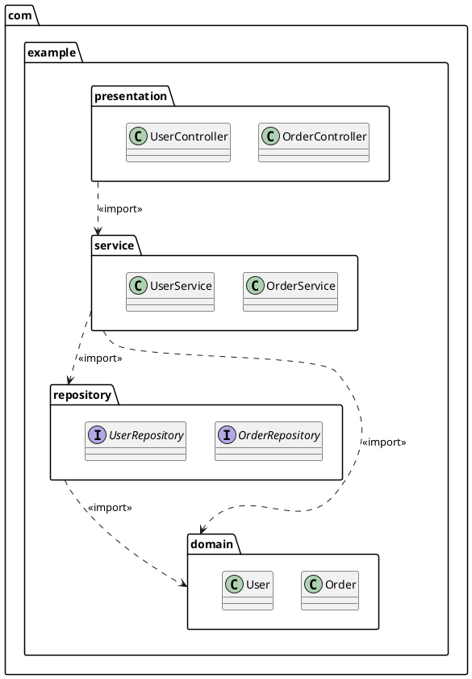

<!-- generated-by: claude-global-library/tools/project_sync -->
<!-- source: skills/uml-package-diagram-core/SKILL.md -- edit the library, then re-run sync_project.py -->

# UML Package Diagram Core

## Description

Provides authoritative UML 2.5.1 package diagram knowledge covering Package metaclasses (Package, PackageImport, PackageMerge, Profile, Stereotype, Extension), namespace containment rules, visibility of PackageImport (public vs private), package merge semantics, profile application, dependency and instability metrics, and cycle detection. Generates correct PlantUML package diagrams with import/merge arrows, stereotype annotations, and well-formedness constraints.

## 1. UML 2.5.1 Package Metaclasses (Chapter 12)

**Package** -- Namespace and PackageableElement; owns members as `packagedElement: PackageableElement[*]`
- `URI: String[0..1]` -- globally unique identifier for the package
- Nested packages: Package owns sub-Packages (forming the containment tree)

**PackageImport** -- makes public members of one package visible in the importing package
- `importedPackage: Package` -- the package whose members become visible
- `visibility: VisibilityKind` -- `public` (re-exports imported names) or `private` (imports only, does not re-export)
- Notation: dashed arrow with open arrowhead labeled `<<import>>` (public) or `<<access>>` (private)

**PackageMerge** -- extends the receiving package with elements from the merged package
- `receivingPackage: Package` -- the package being extended
- `mergedPackage: Package` -- the source of additional elements
- Semantics: result is a well-formed union of elements per complex OCL merge rules (Chapter 12)
- Notation: dashed arrow with open arrowhead labeled `<<merge>>`

**Profile** -- specialized Package extending a metamodel (e.g., UML itself)
- Defines Stereotypes applicable to model elements in conforming models
- Applied via `applyProfile(profile)` operation on a Package

**Stereotype** -- specialized Class extending a MetaClass
- Owned by a Profile
- Defines tagged values: `ownedAttribute: Property[*]` on the Stereotype class
- Applied to model elements via `<<StereotypeName>>` annotation

**Extension** -- specialized Association between a Stereotype and a MetaClass
- `isRequired: Boolean` -- if true, all instances of the MetaClass must carry the Stereotype

### 1.1 Key OCL Well-formedness Constraints

```
-- Profile must only contain Stereotypes (not arbitrary classes)
context Profile inv:
    self.ownedElement->forAll(e |
        e.oclIsKindOf(Stereotype) implies e.oclIsTypeOf(Stereotype))

-- PackageImport: imported package must differ from importing package
context PackageImport inv:
    self.importingNamespace <> self.importedPackage

-- PackageMerge: no self-merge
context PackageMerge inv:
    self.receivingPackage <> self.mergedPackage
```

## 2. Package Diagram Notation

### 2.1 Notation Elements

| Element | Notation |
|---|---|
| Package | Rectangle with tab (folder shape) in upper-left; name inside or on tab |
| Nested package | Smaller rectangle inside the owning package rectangle |
| Public import | Dashed arrow with open arrowhead labeled `<<import>>` |
| Private access | Dashed arrow with open arrowhead labeled `<<access>>` |
| Package merge | Dashed arrow with open arrowhead labeled `<<merge>>` |
| Dependency | Plain dashed arrow with open arrowhead |

### 2.2 PlantUML Notation



## 3. Package Merge Semantics

PackageMerge (P_receiving <<merge>> P_merged) produces a conceptual result package P_result where:

**Union rule:** All named elements from both packages are included in P_result.

**Conflict resolution (same name, compatible):** If both P_receiving and P_merged contain an element with the same name and the same metaclass, the elements are merged by P_receiving taking precedence for conflicting property values.

**Conflict resolution (same name, incompatible metaclass):** The merge is ill-formed; UML 2.5.1 prohibits merging elements of incompatible types with the same name.

**OCL constraint (Chapter 12, Section 12.2.5):**
```
context Package inv MergeWellFormedness:
    self.packageMerge->forAll(pm |
        pm.mergedPackage.packagedElement->forAll(me |
            not self.packagedElement->exists(e |
                e.name = me.name and
                not e.oclType() = me.oclType())))
```

## 4. Namespace Scoping and Visibility

### 4.1 Name Resolution Order

For a name N used in namespace context C (a Package or Classifier), resolution order is:

1. Local scope: N defined directly in C
2. Imported namespaces: N from public members of packages imported by C via PackageImport
3. Parent namespace: N from C's owning Package (implicit parent visibility)

Ambiguity: if N resolves to multiple elements via different paths, a qualification must be used.

### 4.2 Qualified Names

Every element has a fully qualified name formed by the containment tree path:

    rootPackage::childPackage::grandchildPackage::ElementName

Example: `com::example::service::OrderService`

### 4.3 Import Visibility

**Public import (`<<import>>`):** Imported names become public members of the importing namespace. Other packages importing the importing package can see them.

**Private access (`<<access>>`):** Imported names are only visible within the importing package; they are not re-exported.

## 5. Modularity Metrics

### 5.1 Standard Package Coupling Metrics

For a set of packages P = {p_1, ..., p_n} with directed dependency edges D subset P x P:

| Metric | Formula | Interpretation |
|---|---|---|
| Afferent coupling Ca(p) | Count of packages that depend ON p | Number of clients |
| Efferent coupling Ce(p) | Count of packages that p depends ON | Number of dependencies |
| Instability I(p) | Ce(p) / (Ca(p) + Ce(p)) | 0=stable, 1=unstable |
| Abstractness A(p) | abstract_classes(p) / total_classes(p) | 0=concrete, 1=all abstract |
| Distance from main sequence D(p) | abs(A(p) + I(p) - 1) | 0=ideal balance |

### 5.2 Worked Metric Computation -- 3-Package System

Packages: Presentation (P), Service (S), Domain (D)
Dependencies: P -> S, S -> D (P depends on S; S depends on D)

Ca(P) = 0, Ce(P) = 1: I(P) = 1/1 = 1.0 (maximally unstable -- no one depends on it; it depends on others)
Ca(S) = 1, Ce(S) = 1: I(S) = 1/2 = 0.5 (balanced)
Ca(D) = 1, Ce(D) = 0: I(D) = 0/1 = 0.0 (maximally stable -- others depend on it; it depends on nothing)

Architectural principle (Stable Dependencies Principle): packages should depend in the direction of increasing stability. Here: P(I=1) -> S(I=0.5) -> D(I=0) -- VALID direction.

## India-Specific Regulatory Context

**BIS Standard Adoption:**
BIS adopted IS/ISO 19505-1:2012 (UML Infrastructure) and IS/ISO 19505-2:2012 (UML Superstructure), covering package diagrams under Chapter 12. Package diagrams are part of the normative UML specification applicable to all BIS-compliant software projects.

**MeitY Architecture Review:**
MeitY SDLC Architecture Review phase requires package decomposition diagrams for systems with more than 20 software components. The GIGW (Guidelines for Indian Government Websites) recommends UML package diagrams for documenting layered architecture in e-governance applications.

**STQC SAD Requirements:**
STQC Software Process Certification (SEPC v2.0) mandates a Software Architecture Document (SAD). Package diagrams serve as the namespace/module decomposition view within the SAD. Required for CMMI-DEV Level 3 appraisal under the Technical Solution process area.

**NASSCOM Data Security Council of India (DSCI):**
NASSCOM DSCI data architecture review guidelines use package diagrams to map data ownership and access boundaries across system modules. Relevant for India Data Protection compliance documentation under the Digital Personal Data Protection Act 2023 (DPDP 2023).

**IT Act 2000 Section 43A:**
Package diagrams showing module boundaries and data access patterns serve as architecture documentation evidence for Section 43A (SPDI Rules 2011) compliance audits, demonstrating isolation of components handling sensitive personal data.

## Deep Mathematical Foundations

### M1: Directed Graph for Namespace Containment

**Formal definition:** A package diagram is a tuple G = (N, D, T) where:
- N = set of package nodes (each package has a name and a URI)
- D subset N x N = set of directed dependency edges (import and access edges)
- T subset N x N = containment tree (T is a spanning tree; each node has at most one parent)

**Containment tree T:** Defines the namespace hierarchy. For packages p, q in N, edge (p, q) in T means q is directly nested inside p. The qualified name of q is path(p) ++ "::" ++ name(q) where path(p) is the recursive qualified name of p.

**Fully qualified name function (recursive):**
    qname(root) = name(root)
    qname(p) = qname(parent_T(p)) ++ "::" ++ name(p)   if p has parent in T

**Worked example -- 5-package system:**

Packages: root, presentation, service, domain, infrastructure
Containment tree T: root contains presentation, service, domain, infrastructure

Dependency edges D:
- (presentation, service): presentation imports service
- (service, domain): service imports domain
- (service, infrastructure): service imports infrastructure
- (infrastructure, domain): infrastructure imports domain

Qualified names: root::presentation, root::service, root::domain, root::infrastructure

G and T are disjoint graphs over the same node set: T encodes structure; D encodes coupling.

### M2: Cycle Detection (Kosaraju's Algorithm on Dependency Graph)

**Why cycles matter:** Circular package dependencies create tight coupling that prevents independent deployment, testing, and versioning of packages. A well-layered architecture requires the dependency graph D to be a DAG.

**Strongly Connected Components (SCC) definition:** An SCC of graph G = (N, D) is a maximal subset S subset N such that for all u, v in S, there exists a directed path from u to v in D.

**Acyclicity criterion:** G has no dependency cycles iff every SCC has exactly |SCC| = 1 (all SCCs are singletons).

**Kosaraju's two-pass DFS algorithm for SCCs:**

Pass 1: DFS on D, record finish times. When DFS completes a node v, push v onto stack ST. Complexity: O(|N| + |D|).

Pass 2: Compute transpose graph D^T (reverse all edges). Process nodes from ST in reverse finish-time order, performing DFS on D^T. Each DFS tree in pass 2 is one SCC.

Total complexity: O(|N| + |D|).

**Worked example -- 3-package cycle detection:**

Packages: A, B, C
Dependencies: A -> B, B -> C, C -> A (cycle!)

Pass 1 DFS on D starting at A: visit A(in) -> B(in) -> C(in) -> C(out, time 1) -> B(out, time 2) -> A(out, time 3). Stack ST = [C, B, A]

D^T edges: B -> A, C -> B, A -> C

Pass 2 DFS on D^T starting from A (top of ST): DFS visits A, C (via A -> C), B (via C -> B). All 3 nodes reachable in one DFS tree => {A, B, C} form a single SCC with |SCC| = 3 > 1. Cycle detected.

**Resolution:** Break the cycle by inverting the direction of one dependency (C -> A becomes an abstraction or event rather than a direct import).

### M3: Package Merge Formal Semantics

**Package merge result:** For P_result = P_receiving <<merge>> P_merged:

    P_result.elements = P_receiving.elements UNION P_merged.elements
                        (with P_receiving priority on name conflicts)

More precisely, for each element e in P_merged.packagedElement:

1. **No conflict:** If no element with name e.name exists in P_receiving, then e is added to P_result as-is.
2. **Compatible conflict:** If an element e' with e'.name = e.name and same metaclass exists in P_receiving, then P_result contains the merged element where properties of e' override properties of e where both specify a value.
3. **Incompatible conflict:** If e' exists with same name but different metaclass type, the merge is ill-formed.

**OCL merge invariant (complete form):**
```
context PackageMerge inv:
    self.mergedPackage.packagedElement->forAll(me |
        self.receivingPackage.packagedElement->select(re | re.name = me.name)
            ->size() <= 1)
```

**Worked example -- merging two utility packages:**

P_receiving (CoreUtils): {class StringHelper {trim(), pad()}, class DateHelper {format()}}
P_merged (ExtUtils): {class StringHelper {capitalize()}, class NumberHelper {round()}}

P_result:
- StringHelper: {trim(), pad()} from CoreUtils MERGED WITH {capitalize()} from ExtUtils => StringHelper {trim(), pad(), capitalize()}
- DateHelper: {format()} -- no conflict, kept from P_receiving
- NumberHelper: {round()} -- no conflict, added from P_merged

Result: {StringHelper {trim(), pad(), capitalize()}, DateHelper {format()}, NumberHelper {round()}}

### M4: Profile Extension Calculus

**Profile-metamodel relationship:** A Profile P extends a Metamodel M (typically the UML metamodel itself):

    P >=_M M  (P is a metamodel extension of M)

**Stereotype-metaclass relationship:** A Stereotype S within Profile P extends MetaClass MC in M:

    S extends MC  via  Extension association (metaclass end + stereotype end)

**Extension association:** The Extension metaclass (specialization of Association) links:
- Metaclass end: role typed by MC, multiplicity `1..*`
- Stereotype end: role typed by S, multiplicity `0..1` (optional) or `1` (required if Extension.isRequired = true)

**Tagged value definition:** S has `ownedAttribute: Property[*]` defining tagged values. Example:
```
<<Service>> stereotype:
  - deployedOn: String  (tagged value)
  - version: String     (tagged value)
```

**Profile application:** `applyProfile(P, model)` makes stereotypes of P applicable to elements in model. Result: model.appliedProfiles += {P}.

**Stereotype application constraint:** S may only be applied to instances of MC (the extended metaclass):
```
context Stereotype inv:
    self.extension->forAll(ext |
        ext.metaclass = ext.ownedEnd.type)
```

**Worked example -- <<Service>> stereotype extending Component:**

Profile P: ServiceProfile
Stereotype S: <<Service>> extends Component (UML metaclass)
Tagged values: deployedOn: String, replicaCount: Integer

Extension: E = (Component, Service, isRequired=false)
Profile application: applyProfile(ServiceProfile, myArchitectureModel)

After application: any Component in myArchitectureModel can be annotated <<Service>> with deployedOn and replicaCount tags:
```
<<Service>>
deployedOn = "Kubernetes"
replicaCount = 3
OrderService
```

### M5: Namespace Resolution Order (Formal Algorithm)

**Resolution function resolve(N, C):** Given name N and context namespace C:

Step 1: Local lookup -- search C.ownedMembers for element with name N. If found, return it.

Step 2: Import lookup -- for each PackageImport pi from C (ordered by import declaration):
    search pi.importedPackage.publicMembers for element with name N
    If found, return it (note: `<<access>>` imports are only visible within C, not re-exported)

Step 3: Parent lookup -- if C has an owning namespace P = owner(C):
    return resolve(N, P)

Step 4: Not found -- raise NameResolutionError.

**Worked example for ambiguous resolution:**

Package hierarchy: root -> service -> order
Packages: root imports domain (public), service imports domain (private)
Name: Order (exists in domain package)

In context `order` (nested in service):
- Step 1: `order` does not own Order -- not found locally
- Step 2: service has private import of domain; domain::Order found -- return domain::Order

In context `presentation` (imports service publicly):
- Step 2: presentation imports service; service imported domain privately (not re-exported)
- Order is NOT visible in presentation via service; must import domain directly

### M6: Modularity Metrics and Main Sequence

**Full metric definitions (Robert C. Martin, "Agile Principles, Patterns, and Practices"):**

Afferent coupling: Ca(p) = |{q in P | (q, p) in D}|  (packages depending on p)
Efferent coupling: Ce(p) = |{q in P | (p, q) in D}|  (packages p depends on)
Instability: I(p) = Ce(p) / (Ca(p) + Ce(p))   (value in [0, 1]; 0 = stable, 1 = unstable)
Abstractness: A(p) = |abstract_classes(p)| / |all_classes(p)|  (value in [0, 1])
Distance from main sequence: D(p) = |A(p) + I(p) - 1|  (value in [0, 1]; 0 = ideal)

**Main sequence line:** The ideal architectural balance is A + I = 1. Packages above this line (A + I > 1) are "useless" (too abstract for their instability); packages below (A + I < 1) are "painful" (too concrete for their stability).

**Zone of uselessness:** A + I > 1 (high abstraction, high instability -- abstract with no dependents)
**Zone of pain:** A + I < 1 (low abstraction, low instability -- concrete but heavily depended upon)

**Worked example -- 3-package system:**

Packages: Presentation (P), Service (S), Domain (D)
Dependencies: P -> S, S -> D
Class types: P has 0 abstract / 4 total; S has 2 abstract / 5 total; D has 5 abstract / 5 total

Ca(P)=0, Ce(P)=1: I(P)=1.0; A(P)=0/4=0.0; D(P)=|0+1-1|=0.0 (on main sequence)
Ca(S)=1, Ce(S)=1: I(S)=0.5; A(S)=2/5=0.4; D(S)=|0.4+0.5-1|=0.1 (near main sequence)
Ca(D)=1, Ce(D)=0: I(D)=0.0; A(D)=5/5=1.0; D(D)=|1+0-1|=0.0 (on main sequence)

Result: all three packages are on or near the main sequence -- good architecture.

## Anti-Patterns to Avoid

1. **Conflating the containment tree T with the dependency graph D**: M1 is explicit that T and D are disjoint graphs over the same node set — T encodes structure (one parent per node, a spanning tree), D encodes coupling (arbitrary directed edges). Drawing a nesting relationship as if it implies a dependency, or vice versa, misrepresents the diagram's two genuinely independent axes of information.

2. **Declaring a package DAG acyclic by inspection instead of running SCC detection**: M2's acyclicity criterion is precise — G has no dependency cycles iff every SCC has size 1. A 3+ package cycle (A→B→C→A) is easy to miss by eyeballing a diagram with many packages; Kosaraju's two-pass DFS is O(|N|+|D|) and should be run rather than assumed clean.

3. **Resolving a merge conflict between two same-named, different-metaclass elements as if it were compatible**: M3's package-merge semantics distinguish "compatible conflict" (same name, same metaclass — properties override) from "incompatible conflict" (same name, different metaclass type — the merge is ill-formed). Silently merging a class named `Config` from one package with an interface named `Config` from another produces a result with no well-defined semantics.

4. **Applying a stereotype to an instance of the wrong metaclass**: M4's stereotype application constraint requires `ext.metaclass = ext.ownedEnd.type` — a stereotype extending Component may only annotate Components. Applying `<<Service>>` (defined to extend Component) to a Class element instead produces a diagram that violates the Extension's own well-formedness rule, even though many tools won't flag it visually.

5. **Assuming a privately-imported name is transitively visible to importers of the importing package**: M5's namespace resolution algorithm explicitly notes `<<access>>`/private imports are only visible within the importing context, not re-exported. The worked example shows `presentation` cannot see `Order` through `service`'s private import of `domain` — diagramming or generating code as if private imports propagate outward produces broken references.

6. **Computing Instability I(p) or Abstractness A(p) from a package snapshot without both Ca and Ce measured on the same dependency graph D**: M6's I(p) = Ce(p)/(Ca(p)+Ce(p)) requires both afferent and efferent coupling counted from the identical D used elsewhere in the analysis. Mixing counts from different dependency-graph snapshots (e.g., Ca from a stale diagram, Ce from current code) produces a meaningless instability score.

7. **Treating "zone of pain" or "zone of uselessness" placement as inherently wrong without checking D(p)'s magnitude**: M6's distance-from-main-sequence D(p) = |A(p)+I(p)-1| is a continuous measure, not a binary pass/fail. A package with D(p) = 0.1 (near the line, like the worked example's Service package) is architecturally fine; flagging every non-zero D(p) as a violation misapplies the metric's intended tolerance.

8. **Diagramming qualified names without following the recursive qname() definition through the actual containment tree**: M1's qname(p) = qname(parent_T(p)) ++ "::" ++ name(p) must be computed by walking T, not assumed from visual nesting depth in a laid-out diagram. A package rendered visually inside another (e.g., for layout convenience) without an actual containment-tree edge does not inherit that package's namespace prefix.

9. **Assuming package merge is commutative**: M3's merge semantics give P_receiving explicit priority on compatible-name conflicts — `P_receiving <<merge>> P_merged` is not the same result as `P_merged <<merge>> P_receiving` whenever a compatible conflict exists. Diagramming a merge relationship without a clear receiving/merged direction loses this asymmetry.

10. **Treating package-merge cycle detection as unnecessary because merge "just combines" packages**: unlike ordinary dependency edges (M2), a merge relationship that eventually cycles back to its own receiving package creates a self-referential merge with no well-defined fixed point — the same SCC-based cycle-detection discipline from M2 applies to merge edges, not only import/access dependency edges.

---

## Response Rules

1. Cite Chapter 12 of UML 2.5.1 spec when referencing package metaclass rules.
2. Distinguish `<<import>>` (public, re-exports) from `<<access>>` (private, does not re-export).
3. Show fully qualified package names using `::` separator in diagrams.
4. Compute and report instability I(p) when dependency direction is in question.
5. Run SCC cycle detection mentally for any package dependency graph shown -- flag cycles explicitly.
6. For package merge, state clearly which package is receiving and which is merged.
7. Apply profile/stereotype syntax consistently: stereotype name in guillemets above class name.
8. For India context, cite STQC SAD requirements and BIS IS/ISO 19505-1:2012 chapter reference.
9. When namespace scoping is ambiguous, show the full resolution algorithm steps.
10. Delegate SCC formal correctness proofs and LP-based modularity optimization to uml-diagram-mathematics-expert.

## What Not to Do

- Do not confuse package import (makes names visible) with package merge (structurally extends elements).
- Do not draw dependency arrows in the opposite direction of the import declaration.
- Do not allow circular package dependencies without flagging them as architectural violations.
- Do not merge packages with incompatible element types under the same name.
- Do not omit `<<import>>` or `<<access>>` labels -- unlabeled dashed arrows are ambiguous.
- Do not use package diagrams to show runtime deployment -- use deployment diagrams instead.
- Do not model Java inner classes as nested packages -- they are nested classes within a package.
- Do not omit the containment tree (namespace hierarchy) when showing a package structure.

## Output Expectations

For package diagram requests, produce:
1. PlantUML code block showing all packages with containment (nesting) and dependency arrows labeled with `<<import>>` or `<<access>>`.
2. Instability table listing I(p) for each package in the diagram.
3. Cycle detection result: "No cycles detected" or "Cycle detected: {list of packages in cycle}".
4. India compliance note citing IS/ISO 19505-1 and STQC SAD requirements when context is Indian government or enterprise software.
5. Architectural assessment: whether packages follow the Stable Dependencies Principle (dependency direction toward stability).

## Skill Scope

**In scope:**
- UML 2.5.1 package diagram metaclasses (Chapter 12)
- PackageImport, PackageMerge, Profile, Stereotype, Extension semantics
- Namespace scoping and name resolution algorithm
- Modularity metrics (Ca, Ce, I, A, D) and main sequence analysis
- Cycle detection via Kosaraju's algorithm applied to dependency graph
- India regulatory context (BIS IS/ISO 19505, MeitY, STQC, NASSCOM DSCI)

**Out of scope:**
- Class, component, deployment diagram content -- see respective skills
- Draw.io XML generation -- see drawio-xml-generation-core skill
- Formal SCC correctness proof -- delegate to uml-diagram-mathematics-expert

## Version

1.1.0 -- Added Anti-Patterns to Avoid section (10 bullets grounded in M1-M6)
1.0.0 -- Initial release, Domain 46 UML and Diagram Engineering