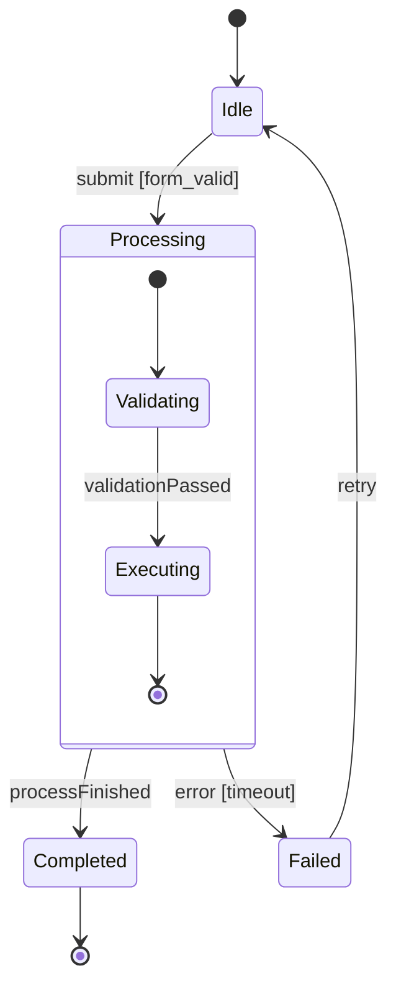

<!-- generated-by: claude-global-library/tools/project_sync -->
<!-- source: skills/uml-state-machine-core/SKILL.md -- edit the library, then re-run sync_project.py -->

# UML State Machine Core

## Description

Produces UML 2.5.1 behavioral and protocol state machines (Chapter 14 of the OMG specification)
covering simple, composite, and orthogonal states, all 10 PseudostateKind literals, transition
kinds, history pseudostates, protocol state machine pre/post constraints, formal FSM and EFSM
correspondence, NFA-to-DFA subset construction, Harel statechart hierarchy, and reachability
analysis. Addresses ISRO/HAL embedded system documentation, IRDAI claims lifecycle, and ISO 26262
automotive functional safety standards applicable to safety-critical Indian engineering domains.

## 1. UML 2.5.1 State Machine Metamodel (Chapter 14)

### Core metaclasses

**StateMachine:** Subclass of Behavior. Properties: `region: Region[1..*]`; `kind` is implied by
subtype: `BehaviorStateMachine` or `ProtocolStateMachine`.

**Region:** Namespace owning `State[*]` and `Transition[*]` elements. Every StateMachine has at
least one top-level Region.

**State:** Vertex in a Region. Three structural kinds:
- **Simple state:** No sub-regions. May have `entry`, `do`, and `exit` behaviors.
- **Composite state:** Exactly one sub-Region (sequential sub-states).
- **Orthogonal state:** Two or more sub-Regions (concurrent sub-state machines).
- **Submachine state:** References another StateMachine via `submachine` property.

State behaviors: `entry: Behavior[0..1]` (on entry), `do: Behavior[0..1]` (while active),
`exit: Behavior[0..1]` (on exit).

**Transition:** Connects two Vertices. Properties:
- `source/target: Vertex`
- `trigger: Trigger[*]` (events that fire the transition)
- `guard: Constraint[0..1]` (Boolean precondition)
- `effect: Behavior[0..1]` (action executed on transition)
- `kind: TransitionKind`: `internal` (no exit/entry of owning state), `local` (stays within
  composite state boundary), `external` (exits and re-enters state, triggering exit/entry actions)

**Completion transition:** Transition with no trigger — fires when the current state's do-behavior
completes or, for composite states, when all sub-states reach their final state.

**Pseudostate (10 PseudostateKind literals — UML 2.5.1 canonical):**
1. `initial` — single outgoing transition (no trigger); fires on region entry
2. `deepHistory` (H*) — restores deepest previously active configuration
3. `shallowHistory` (H) — restores last active direct sub-state only
4. `join` — AND-join: fires when ALL incoming transitions have been taken
5. `fork` — AND-split: activates ALL target Regions simultaneously
6. `junction` — static conditional routing (guard evaluated at model-check time)
7. `choice` — dynamic conditional routing (guard evaluated at runtime after transition)
8. `terminate` — exits the entire StateMachine (not just current composite)
9. `entryPoint` — named entry into a composite/submachine state
10. `exitPoint` — named exit from a composite/submachine state

### Notation rules

| Element | Notation |
|---------|----------|
| Simple state | Rounded rectangle with name |
| Composite state | Rounded rectangle containing sub-states |
| Orthogonal state | Rounded rectangle with horizontal dashed dividers (one per sub-Region) |
| Initial pseudostate | Solid filled circle |
| Final state (FinalState) | Solid circle inside ring (bullseye) |
| History (H) | Circle containing letter H |
| Deep History (H*) | Circle containing H* |
| Choice | Diamond |
| Junction | Solid circle (small, no fill) |
| Fork / Join | Thick horizontal or vertical bar |
| Transition | Arrow labeled `trigger [guard] / effect` |
| Internal transition | Listed inside state compartment: `trigger [guard] / effect` |

## 2. Transition Semantics and Priority

When multiple transitions are enabled simultaneously:

1. Transitions in the innermost (most deeply nested) state take priority over transitions in
   outer composite states (inner-first rule).
2. Among equally nested transitions, guards determine enablement.
3. Among enabled transitions at the same level, the first defined (model order) fires (UML
   specifies non-determinism; tools may apply ordering heuristics).

**Transition sequence (external kind):** exit source → execute effect → enter target. For
composite states: all exit actions from inner to outer, then effect, then all entry actions from
outer to inner.

## 3. History Pseudostate Usage

**Shallow history (H):** When the composite state is re-entered via its H pseudostate, the direct
sub-state that was active when the composite was last exited is restored. Sub-states of that
sub-state start fresh from their initial pseudostate.

**Deep history (H*):** When the composite state is re-entered via H*, the complete configuration
(all nested active states at every level) that was active on last exit is fully restored.

**Construction pattern:** Add a transition from H or H* to the default sub-state for the first
entry (before any history exists). This initial transition fires only when no history has been
recorded.

## 4. Protocol State Machine

A ProtocolStateMachine specifies the valid sequence of operations on a Classifier. Each
`ProtocolTransition` has:
- `pre: Constraint[0..1]` — precondition (OCL or natural language) that must hold BEFORE the
  operation is called
- Trigger: the operation (not a signal event)
- `post: Constraint[0..1]` — postcondition that must hold AFTER the operation completes

A calling client that invokes operations in an order that violates the protocol produces
undefined behavior. The ProtocolStateMachine serves as a contract specification — formal
interface invariant.

Example: `Stack` protocol state machine:
- State `Empty`: only `push()` is callable (pre: stack is empty)
- State `NonEmpty`: `push()` and `pop()` are callable; `pop()` post: one fewer element

## 5. Generating State Machine Diagrams — Output Format

PlantUML syntax:

```
@startuml
[*] --> Idle

Idle --> Processing : submit [form_valid] / validate()
Processing --> Completed : processFinished
Processing --> Failed : error [timeout] / logError()
Completed --> [*]
Failed --> Idle : retry

state Processing {
  [*] --> Validating
  Validating --> Executing : validationPassed
  Executing --> [*]
}
@enduml
```

Mermaid stateDiagram-v2 syntax:



## 6. Deep Mathematical Foundations

### M1: FSM Formal Definition (Moore and Mealy Machines)

**Finite State Machine formal definition:**

```
M = (Q, Sigma, delta, q_0, F)
```

where:
- `Q` = finite, non-empty set of states
- `Sigma` = finite set of input events (alphabet)
- `delta: Q × Sigma_epsilon → P(Q)` = extended transition function;
  `Sigma_epsilon = Sigma ∪ {epsilon}` (includes epsilon/completion transitions)
- `q_0 ∈ Q` = initial state (specified by initial pseudostate)
- `F ⊆ Q` = set of final/accepting states (FinalState nodes)

**Moore machine** (output on states):
```
lambda_M: Q → O    (output function; output depends on current state only)
```
UML correspondence: `entry: Behavior` and `do: Behavior` on states approximate Moore output.

**Mealy machine** (output on transitions):
```
lambda_Mealy: Q × Sigma → O    (output on transitions)
```
UML correspondence: `effect: Behavior` on transitions is Mealy output.

**UML Behavioral State Machine as EFSM** (Extended FSM with data variables):
```
M_EFSM = (Q, Sigma, Gamma, delta, lambda, q_0, F)
```
where `Gamma` = set of actions (effects), and `delta` is conditioned by guard predicates over
a data context (variables, parameters).

**Worked Example — Traffic Light Controller (Moore):**

```
Q = {Red, RedAmber, Green, Amber}
Sigma = {timerExpiry, emergencySignal}
delta:
  delta(Red, timerExpiry)       = RedAmber
  delta(RedAmber, timerExpiry)  = Green
  delta(Green, timerExpiry)     = Amber
  delta(Amber, timerExpiry)     = Red
  delta(*, emergencySignal)     = Red   (override to Red from any state)
q_0 = Red
F = {}  (no accepting state; machine runs continuously)
lambda_M:
  lambda_M(Red)      = displayRed()
  lambda_M(RedAmber) = displayRedAndAmber()
  lambda_M(Green)    = displayGreen()
  lambda_M(Amber)    = displayAmber()
```

Execution trace: `Red -[timerExpiry]→ RedAmber -[timerExpiry]→ Green -[timerExpiry]→ Amber -[timerExpiry]→ Red`

### M2: NFA to DFA Subset Construction

An NFA N = (Q_N, Sigma, delta_N, q_0, F_N) has non-deterministic transitions and epsilon moves.
The equivalent DFA D = (Q_D, Sigma, delta_D, q_D0, F_D) is constructed as follows:

**Epsilon-closure:**
```
epsilon_closure(S) = BFS/DFS from all states in S, following only epsilon transitions
```
That is, all states reachable from S without consuming input.

**DFA construction (subset construction):**
```
Q_D     = P(Q_N)  (power set of NFA states; each DFA state is a SET of NFA states)
q_D0    = epsilon_closure({q_0})
delta_D(S, a) = epsilon_closure( ⋃_{q ∈ S} delta_N(q, a) )  for a ∈ Sigma
F_D     = { S ∈ Q_D : S ∩ F_N ≠ ∅ }
```

**Complexity:** `|Q_D| ≤ 2^|Q_N|` in the worst case (exponential blowup). In practice, many DFA
states are unreachable and the reachable subset is much smaller.

**Worked Example — NFA to DFA for 3-state NFA:**

NFA:
```
Q_N = {q0, q1, q2};  Sigma = {a, b};  F_N = {q2}
delta_N:
  delta_N(q0, a) = {q0, q1}
  delta_N(q0, b) = {q0}
  delta_N(q1, b) = {q2}
  delta_N(q2, a) = {}
  delta_N(q2, b) = {}
  (no epsilon transitions)
```

DFA subset construction (start from {q0}):

| DFA state (set) | Input a | Input b | Final? |
|-----------------|---------|---------|--------|
| {q0} | {q0,q1} | {q0} | No |
| {q0,q1} | {q0,q1} | {q0,q2} | No |
| {q0,q2} | {q0,q1} | {q0} | Yes (q2 ∈ F_N) |

DFA has 3 reachable states (far fewer than 2^3 = 8 possible). This language accepts strings
ending in `ab` (the NFA's designed language).

**UML application:** Hierarchical state machines (composite states) can be compiled into flat
DFAs for formal verification. The NFA→DFA construction is the key step in this compilation.

### M3: Harel Statechart — Hierarchical State Machine (HSM)

**Definition.** A Hierarchical State Machine is a tuple HSM = (Q, Q_simple, children, parent,
Sigma, delta, q_0, F) where:

- `Q` = all states (simple and composite)
- `Q_simple = {q ∈ Q : children(q) = ∅}` = simple (leaf) states
- `children: Q → P(Q)` = sub-states of a composite state
- `parent: Q → Q ∪ {root}` = parent state (forms a tree `T_Q`)
- `Sigma, delta, q_0, F` = as in FSM

**Active configuration:** The set of currently active states forms a path from root to a simple
state in the tree. For orthogonal states, multiple paths may be simultaneously active (one per
sub-Region).

**Transition semantics in HSM:**

For a transition `t: s → t_state` where source `s` is in composite state `C`:
1. Determine the Least Common Ancestor (LCA) composite state of `s` and `t_state`.
2. Execute `exit` actions for `s` and all composite ancestors up to (but not including) LCA.
3. Execute `t.effect`.
4. Execute `entry` actions for all composites from LCA down to `t_state`.

**History pseudostate semantics:**
- `H` (shallow): `last_active_direct_substate[C]` → restored to that sub-state on re-entry
- `H*` (deep): `last_active_configuration[C]` (entire nested path) → fully restored

**Worked Example — 3-level nested state machine (Document Editor):**

```
Application (orthogonal: [Editing Region, MenuBar Region])

Editing Region (composite):
  initial → NotEditing
  NotEditing → Editing : documentOpened
  Editing (composite, with H*):
    initial → TextMode
    TextMode → DrawMode : switchToDrawing
    DrawMode → TextMode : switchToText

MenuBar Region (composite):
  initial → Enabled
  Enabled → Disabled : documentClosed
```

If user is in `Editing/DrawMode` and document is closed (→ `NotEditing`), then document is
re-opened and the `H*` pseudostate is followed → restored to `Editing/DrawMode` (deep history
restores both `Editing` and `DrawMode` levels).

### M4: Pseudostate Semantics — All 10 PseudostateKind Literals

UML 2.5.1 defines exactly **10** PseudostateKind literals. This section specifies the formal
semantics of each.

**1. `initial`**
Outgoing: exactly 1 transition with no trigger and no guard (or trivially true guard).
Fires immediately when the owning Region is entered (at Region initialization).
Cannot be the target of any transition.

**2. `deepHistory` (H*)**
Restores the last recorded active configuration (all nested active states) of the owning
composite state on re-entry. On first entry (no history recorded), follows an outgoing
transition to the default initial sub-state.

**3. `shallowHistory` (H)**
Restores only the last active direct sub-state of the owning composite on re-entry.
Nested sub-states within the restored sub-state start from their own initial pseudostate.

**4. `join`**
Multiple incoming transitions, one outgoing transition. AND-join semantics: fires only when
ALL incoming transitions have been taken (all contributing Regions have exited). Used to
synchronize concurrent orthogonal Regions before proceeding.

**5. `fork`**
One incoming transition, multiple outgoing transitions. AND-split semantics: takes ALL
outgoing transitions simultaneously, activating each target Region concurrently.

**6. `junction`**
Static conditional routing. Guards on outgoing transitions are evaluated at model-check time
(static analysis). The path is determined before the junction is entered. Equivalent to a
Mealy-machine conditional split determined at design time.

**7. `choice`**
Dynamic conditional routing. Guards on outgoing transitions are evaluated at runtime AFTER
the incoming transition has been taken. At least one guard must be true at runtime (else
undefined behavior — add an `[else]` guard as safety). Use when the condition depends on
runtime data not available until the transition fires.

**Key difference — junction vs choice:**
```
junction: guard evaluated BEFORE transition fires (static, design-time)
choice:   guard evaluated AFTER transition fires  (dynamic, runtime)
```
If the guard is `[order.total > 1000]`, use `choice` (runtime value). If the guard is a
structural condition on the model topology, use `junction`.

**8. `terminate`**
Causes the entire StateMachine (not just the current Region) to terminate. Exits all active
states and destroys the StateMachine instance. No further transitions are possible.

**9. `entryPoint`**
Named entry into a composite or submachine state. Allows transitions from outside the
composite to target a specific internal sub-state directly, without entering via the composite's
initial pseudostate. Appears on the boundary of the composite state.

**10. `exitPoint`**
Named exit from a composite or submachine state. Transitions from within the composite exit
the composite at a designated named point, allowing the outer state machine to distinguish
between multiple exit conditions (normal exit vs error exit, for example).

### M5: Protocol State Machine — Compliance Verification

**Definition.** A ProtocolStateMachine PSM = (Q, Ops, delta_P, q_0) where:
- `Q` = protocol states
- `Ops` = set of operations (triggers)
- `delta_P: Q × Ops → Q` = protocol transition function, with:
  - `pre(t): Constraint` — precondition on source state before `op` is called
  - `post(t): Constraint` — postcondition on target state after `op` returns

**Compliance check.** A call trace `sigma = (op_1, op_2, ..., op_n)` complies with PSM iff:
```
For all i in 1..n:
  1. pre(delta_P(q_{i-1}, op_i)) is satisfied in state q_{i-1}
  2. After executing op_i, the system transitions to q_i = delta_P(q_{i-1}, op_i)
  3. post(delta_P(q_{i-1}, op_i)) is satisfied in state q_i
```
A trace that violates pre or post at any step is a protocol violation.

**Worked Example — Stack Protocol State Machine:**

```
States: Q = {Empty, NonEmpty}
Operations: Ops = {push(x), pop(), peek(), isEmpty()}
q_0 = Empty

Transitions:
  t1: Empty   -[push(x)]→ NonEmpty
      pre:  stack.size() = 0         (unnecessary: state Empty implies this)
      post: stack.top() = x

  t2: NonEmpty -[push(x)]→ NonEmpty
      pre:  stack.size() > 0
      post: stack.size() = stack_before.size() + 1

  t3: NonEmpty -[pop()]→ Empty
      pre:  stack.size() = 1
      post: stack.size() = 0

  t4: NonEmpty -[pop()]→ NonEmpty
      pre:  stack.size() > 1
      post: stack.size() = stack_before.size() - 1

  t5: Empty / NonEmpty -[isEmpty()]→ same state  (query, no state change)
      post: result = (stack.size() = 0)
```

Invalid call traces:
- `pop()` on `Empty` state: no transition from Empty via pop() → protocol violation
- `peek()` on `Empty` state: no transition defined → protocol violation
- `push(1), push(2), pop(), pop(), pop()`: third pop() from Empty → violation

### M6: Reachability Analysis

**Forward reachability:** States reachable from the initial state.
```
R_forward(q_0) = BFS/DFS from q_0 following all transitions (regardless of guard/trigger)
```
Unreachable states: `U = Q \ R_forward(q_0)`
Action: unreachable states are dead model elements — remove or investigate.

**Backward reachability:** States from which a final state is reachable.
```
R_backward(F) = BFS/DFS from each f ∈ F on reversed transition graph
```
Dead states: `D = R_forward(q_0) \ R_backward(F)`
Dead states are reachable from q_0 but have no path to any final state — potential deadlock
or missing final state definition.

**Minimization — Hopcroft Partition Refinement:**

Goal: find the minimum DFA (smallest number of states) equivalent to a given DFA.

Algorithm:
1. Initial partition: `P = {F, Q \ F}` (final states vs non-final states)
2. Repeat until no change:
   For each partition group G and each input symbol a:
     Split G into subgroups such that states in the same subgroup transition on `a` to
     the SAME partition group.
   If a split occurred, refine P.
3. Each group in final P is a single state in the minimized DFA.

Two states `p, q ∈ Q` are equivalent (indistinguishable) iff for ALL input sequences `w ∈ Sigma*`:
```
delta*(p, w) ∈ F  ⟺  delta*(q, w) ∈ F
```
Equivalent states are merged in the minimized DFA.

**Worked Example — Reachability with Dead State Identification:**

```
States: Q = {A, B, C, D, E}
Initial: q_0 = A;  Final: F = {E}
Transitions:
  A -[e1]→ B,  A -[e2]→ C,  B -[e3]→ D,  C -[e4]→ D,  D -[e5]→ E
  (State C also has: C -[e6]→ C -- self-loop only)
```

Forward reachability (from A):
- BFS: A → {B, C} → {D} → {E}
- `R_forward(A) = {A, B, C, D, E}` — all states reachable. `U = ∅`.

Backward reachability (from E):
- BFS on reversed graph: E → {D} → {B, C} → {A}
- `R_backward({E}) = {A, B, C, D, E}`

Dead states: `D_dead = R_forward \ R_backward = ∅` — no dead states.

Now add state F (a trap): add transition `B -[e7]→ F` with no outgoing transitions from F.
- `R_forward(A)` now includes F.
- `R_backward({E})` does NOT include F (no path from F to E).
- `D_dead = {F}` — dead state identified. F is reachable but has no path to the final state.

Action: add a transition from F to some state on a path to E, or mark F as an intentional
error sink with its own terminal behavior.

## 7. Anti-Patterns to Avoid

1. **Confusing Moore-style (`entry`/`do`) and Mealy-style (`effect`) outputs when modeling behavior**: M1 distinguishes λ_M: Q → O (output depends only on current state, UML's entry/do) from λ_Mealy: Q × Σ → O (output depends on the transition taken, UML's effect). Putting transition-specific logic in a state's `entry` behavior loses the distinction between "always happens on entering this state" and "happens only via this specific transition."

2. **Assuming a hierarchical state machine's LCA-based transition exit/entry order is optional**: M3's transition semantics require a strict sequence — exit actions up to (not including) the LCA, then the transition's effect, then entry actions down from the LCA to the target. Executing entry actions before all relevant exit actions complete (or skipping the LCA computation entirely) can re-trigger entry behavior for a state that was never actually exited.

3. **Treating shallow history (H) as if it restores the full nested configuration**: M3/M4 are explicit — shallow history restores only the immediate sub-state, and any of ITS nested sub-states restart from their own initial pseudostate; only deep history (H*) restores the entire nested active-state path. Using H when the intended behavior requires full nested restoration silently loses deeper state on re-entry.

4. **Using `junction` when the guard depends on runtime data, or `choice` when it's a static/design-time condition**: M4's key distinction is exactly when the guard is evaluated — junction guards are checked BEFORE the transition fires (static), choice guards are checked AFTER (dynamic, runtime data). Modeling a runtime-data-dependent guard (e.g. `[order.total > 1000]`) as a junction assumes information that isn't actually available at the modeled evaluation point.

5. **Omitting an `[else]` guard on a `choice` pseudostate**: M4 states that if no guard is true at runtime for a choice pseudostate, behavior is undefined — at least one guard must evaluate true. Skipping the `[else]` safety guard leaves a real code path where the state machine has no defined transition to take.

6. **Verifying a protocol state machine call trace by checking preconditions alone, without postconditions**: M5's compliance definition requires ALL THREE steps per call — precondition satisfied in the source state, the actual transition taken, AND postcondition satisfied in the target state. A trace that satisfies every precondition but violates a postcondition (e.g. an operation that doesn't actually leave the object in the state it claims to) is still a protocol violation.

7. **Reporting "no dead states" from forward reachability alone**: M6 distinguishes forward reachability (states reachable FROM q_0) from dead states (D = R_forward \ R_backward — reachable from q_0 but with no path back to any final state). A state machine can have R_forward(q_0) = Q (100% forward reachability) while still containing dead states that can never reach completion — both directions must be computed, as the worked example's trap state F demonstrates.

8. **Assuming DFA minimization is optional "cleanup" rather than semantics-preserving equivalence merging**: M6's Hopcroft partition refinement only merges states that are provably indistinguishable — equivalent for ALL possible input sequences (∀w ∈ Σ*: δ*(p,w)∈F ⟺ δ*(q,w)∈F). Manually collapsing states that "look similar" without this equivalence proof can silently change the machine's accepted language.

9. **Treating NFA-to-DFA subset construction's worst-case 2^|Q_N| bound as the expected size**: M2 notes the exponential blowup is a worst case — in practice many DFA states are unreachable, and the worked example shows a 3-state NFA producing only 3 reachable DFA states, not 8. Provisioning verification tooling or state budgets around the worst-case bound when the actual reachable subset is far smaller wastes resources; always compute the actual reachable subset before assuming exponential cost.

10. **Confusing `terminate` pseudostate semantics with a normal FinalState transition**: M4 states `terminate` destroys the entire StateMachine instance and makes no further transitions possible — this is categorically different from reaching a FinalState within a single Region, which may still allow sibling orthogonal Regions to continue or the composite state to be re-entered later. Using `terminate` where a scoped FinalState was intended (or vice versa) has irreversible consequences for the whole state machine instance.

---

## 8. India-Specific Layer

**ISRO, HAL, and BEL — Embedded System State Machines:**
ISRO (Indian Space Research Organisation), Hindustan Aeronautics Limited (HAL), and Bharat
Electronics Limited (BEL) use UML state machines for mission-critical embedded software.
For PSLV and Gaganyaan mission software, state machines document the on-board computer's
operational modes (Ground Test, Pre-Launch, Ascent, Orbit, Re-entry, Safe Mode). The ISRO
Software Quality Assurance (SQA) group mandates that state machines be formally reviewed
against the DO-178C (avionics software) framework as adopted by the India DGCA (Directorate
General of Civil Aviation).

**DO-178C as Adopted by India DGCA:**
India DGCA has adopted DO-178C (Software Considerations in Airborne Systems and Equipment
Certification) for avionics software certification. DO-178C DAL-A and DAL-B require structural
coverage analysis. State machines are used to document software state coverage, and coverage
analysis verifies that all states and transitions are exercised by test cases. Unreachable states
(U from reachability analysis) are non-compliances.

**ISO 26262 ASIL Ratings — Automotive (Tata, M&M):**
ISO 26262 (Functional Safety for Road Vehicles) requires state-based safety analysis for
automotive software. TATA Motors and Mahindra & Mahindra use ISO 26262-compliant development
processes for ADAS and powertrain control units. UML behavioral state machines document the
safety states (Normal, Degraded, Safe, No-Power). ASIL-D requires formal verification; state
machines provide the formal model for safety analysis tools.

**STQC Safety Certification — e-Voting Machines:**
STQC (under MEITY) certifies Electronic Voting Machines (EVMs) and VVPATs used in Indian
elections. STQC's certification process for EVMs includes state machine verification as a key
step. The EVM state machine (ballot unit, control unit) must be provably deterministic with no
unreachable states and no dead-end states before STQC safety certification is granted.

**IRDAI Claims Lifecycle State Machine:**
Under IRDAI guidelines, the insurance claims processing workflow is documented as a state
machine. Typical states: `Submitted → UnderReview → InvestigationPending → Approved /
Rejected → Settled / Closed`. The state machine is used in IRDAI IT audits to verify that
no claim can enter a state from which it cannot exit (dead state) and that the settlement
final state is always reachable.

## 9. Response Rules

1. Always specify which of the two StateMachine kinds is required: BehaviorStateMachine
   (for object lifecycle and reactive behavior) or ProtocolStateMachine (for operation
   sequence contracts).
2. Use all 10 PseudostateKind literals correctly — never substitute junction for choice or
   vice versa; the guard evaluation timing is different.
3. For every composite state: verify that all sub-states are reachable from the region's
   initial pseudostate.
4. Perform dead-state analysis: identify all states reachable from q_0 that have no path
   to any final state. Flag these as model errors unless intentional (error sink states).
5. For orthogonal states: verify that fork and join pseudostates are used symmetrically —
   every fork must eventually lead to a corresponding join.
6. For ProtocolStateMachine: verify pre-conditions on every transition and add `[else]`
   guards to every choice pseudostate.
7. For India safety-critical projects (ISRO, DRDO, automotive): apply reachability analysis
   and report unreachable and dead states explicitly.
8. Produce PlantUML and Mermaid stateDiagram-v2 output. Note Mermaid limitation: orthogonal
   states and junction/choice distinction are not fully supported — note any gaps.

## 10. What Not to Do

- Do not use `junction` when the guard depends on runtime data — use `choice` for runtime
  conditional routing.
- Do not create composite states with no initial pseudostate — every Region must have
  exactly one initial pseudostate.
- Do not create transitions that cross the orthogonal state boundary without using fork/join
  pseudostates — direct cross-Region transitions violate orthogonal semantics.
- Do not confuse `terminate` (exits entire StateMachine) with `ActivityFinalNode` or
  FinalState (exits the current Region only).
- Do not omit exit actions in composite states when transitions cross the composite boundary —
  the exit behavior of all nested states from inner to outer must execute.
- Do not omit a default outgoing transition from shallowHistory (H) or deepHistory (H*)
  pseudostates — on first entry, with no history recorded, the machine must have a fallback.
- Do not define unreachable states and then leave them without documentation — they should
  either be removed or justified as placeholder stubs.

## 11. Output Expectations

For each state machine request, deliver:

1. **State inventory:** All states with their kind (simple/composite/orthogonal), entry/do/exit
   behaviors, and sub-state list for composite states.
2. **Transition table:** Source state, event/trigger, guard, effect, target state, kind (internal/
   local/external).
3. **Pseudostate list:** All pseudostates with their PseudostateKind, location, and purpose.
4. **PlantUML syntax:** Complete `@startuml` / `@enduml` block.
5. **Mermaid stateDiagram-v2 syntax:** With note about any unsupported features.
6. **Reachability report:** R_forward, U (unreachable), D_dead (dead states). Flag findings.
7. **For ProtocolStateMachine:** Pre/post constraint table per transition.
8. **India compliance note** (if applicable): DO-178C, ISO 26262, STQC, IRDAI specifics.

## 12. Skill Scope

**In scope:**
- UML 2.5.1 Chapter 14 state machine notation and semantics
- All 10 PseudostateKind literals with precise semantics
- BehaviorStateMachine and ProtocolStateMachine
- Simple, composite, orthogonal, and submachine states
- Transition kinds (internal, local, external) and completion transitions
- History pseudostates (shallow and deep)
- FSM/EFSM formal correspondence
- NFA-to-DFA subset construction
- Harel statechart hierarchy
- Reachability and dead-state analysis
- Hopcroft minimization algorithm outline
- India safety-critical context: ISRO/HAL, ISO 26262, DO-178C, STQC EVM, IRDAI claims

**Out of scope:**
- Full formal model checking (CTL/LTL properties) — delegate to uml-diagram-mathematics-expert
- Timed automata and real-time verification (use uml-timing-diagram-core)
- State machine code generation from diagrams (implementation task)
- Draw.io XML generation (see drawio-xml-generation-core)

## 13. Version

v1.1.0 — Added Section 7 Anti-Patterns to Avoid (10 bullets grounded in M1-M6); India-Specific Layer through Version renumbered §8-13.
v1.0.0 — Initial release. Domain 46: UML & Diagram Engineering. Covers UML 2.5.1 Chapter 14.
India layer: ISRO/HAL/BEL embedded systems, DO-178C DGCA adoption, ISO 26262 automotive,
STQC EVM certification, IRDAI claims lifecycle state machine.
